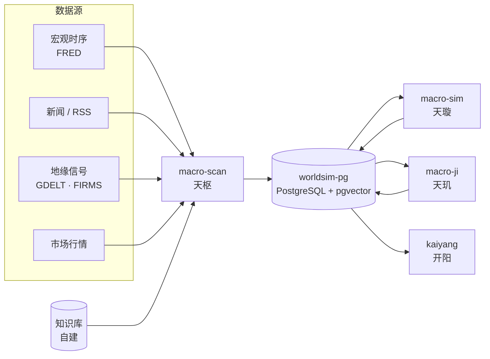

# world-sim · 世界推演系统

> 开源的宏观风险推演系统：多源数据采集 → 风险指标计算 → RAG 增强推理 → 蒙特卡洛情景推演 → 报告与可视化。

*An open-source macro risk deduction system — multi-source data collection, risk indicators, retrieval-augmented reasoning, Monte Carlo scenario simulation.*

> **本仓库开源的是「框架与逻辑」。** 知识库（研究内容）不随仓库分发，需自行建立 —— 见 [docs/KB_SETUP.md](docs/KB_SETUP.md)。
>
> **免责声明**：本系统的全部输出仅用于技术演示与研究参考，**不构成任何投资建议**。
>
> **写在前面**：这是个AI帮帮我项目。嗯。人笨，燃尽了。。。。努力优化。知识库做的时候涉及到了版权导致没法公开了，所以大家加油。。。

---

## 它能做什么

| 能力 | 说明 |
|---|---|
| 多源数据采集 | 宏观时序（FRED）、新闻（RSS / GDELT）、地缘信号（FIRMS / GDACS / Space-Track）、市场行情等 20+ 数据源 |
| 风险指标计算 | 衰退概率（probit）、金融条件指数（FCI）、地缘风险、弱信号检测 |
| 情景推演 | 蒙特卡洛模拟（5000 路径 / 12 个月）+ 多智能体演化仿真 |
| 预测闭环 | 预测落表 → 事后 outcome 校验 → 权重校准 |
| 报告生成 | 宏观分析 / 演化仿真 / 展望简报（LLM 生成 + RAG 上下文） |
| 可视化 | 3D 地球 + 经济面板 + 运行控制台 |

## 组件

| 目录 | 代号 | 职责 | 技术栈 | 端口 |
|---|---|---|---|---|
| `macro-scan/` | 天枢 | 数据采集 · 指标计算 · 报告生成 · 控制 API | Python 3.11 | 8899 / 8900 |
| `macro-sim/` | 天璇 | 多智能体情景演化仿真 | Python 3.11 | — |
| `macro-ji/` | 天玑 | 预测事后验证与校准 | Python 3.11 | — |
| `kaiyang/` | 开阳 | 可视化面板（前端） | React · Vite · Three.js | 8080 |

## 架构



## Quick Start

### 前置要求

| 依赖 | 版本 | 用途 |
|---|---|---|
| Docker | 24+ | 运行全部服务 |
| Docker Compose | v2 | 服务编排 |
| Python | 3.10+ | 运行初始化脚本 |
| Node.js | 18+ | 构建前端面板 |

> Windows 用户请在 **Git Bash** 或 **WSL** 中执行下列命令。

### 1. 获取代码

```bash
git clone https://github.com/luoxiaxiehui91-debug/world-sim.git
cd world-sim
```

### 2. 生成知识库骨架

```bash
python3 scripts/init_kb.py
```

生成 `macro-scan/知识库/` 示例骨架（14 个文件）。**内容均为占位示例**，请按 [docs/KB_SETUP.md](docs/KB_SETUP.md) 替换为你自己的研究。

### 3. 配置环境变量

```bash
cp macro-scan/.env.example macro-scan/.env
cp macro-ji/.env.example macro-ji/.env
cp macro-sim/.env.example macro-sim/.env
```

三个 `.env` 都要填，各自的必需项如下（其余变量**保持注释** —— 模板里全部变量默认注释，**解开注释并填值**才会注入容器，避免空值静默失效）：

**`macro-scan/.env`（天枢）**

| 变量 | 用途 | 获取方式 |
|---|---|---|
| `WORLDSIM_APP_PW` | 数据库应用账号密码 | 自定义任意强密码 |
| `FRED_API_KEY` | 宏观主数据源 | [FRED 申请](https://fred.stlouisfed.org/docs/api/api_key.html)（免费） |
| `SILICONFLOW_API_KEY` | LLM 与向量嵌入 | [硅基流动控制台](https://cloud.siliconflow.cn) |
| `CONTROL_TOKEN` | 控制台鉴权 | 自定义随机串 |
| `NTFY_TOPIC` / `NTFY_CMD_TOPIC` / `NTFY_CMD_SECRET` / `NTFY_URL` | ntfy 推送与指令下发（不使用可留空） | 自定义 / 默认 `https://ntfy.sh` |

**`macro-ji/.env`（天玑）**

| 变量 | 用途 |
|---|---|
| `WORLDSIM_APP_PW` | 同 macro-scan（同一个数据库账号） |
| `FRED_API_KEY` | 定量验证取数 |
| `SILICONFLOW_API_KEY` | LLM 裁判（`llm_judge.py`） |
| `NTFY_URL` | 告警推送（整串 URL，非主题名） |

**`macro-sim/.env`（天璇）**

| 变量 | 用途 |
|---|---|
| `WORLDSIM_APP_PW` | 同上 |
| `SILICONFLOW_API_KEY` | 叙事生成与 Agent 推演 |
| `NTFY_URL` | 告警推送 |

**跨项目挂载变量**（compose 插值用，必须是绝对路径）：

| 文件 | 变量 | 值 |
|---|---|---|
| `macro-ji/.env`、`macro-sim/.env` | `MACRO_SCAN_DIR` | `<绝对路径>/world-sim/macro-scan` |
| `macro-scan/.env` | `KAIYANG_DIR` | `<绝对路径>/world-sim/kaiyang` |
| `macro-scan/.env` | `KAIYANG_ORIGIN` | `http://localhost:8080`（控制 API 的 CORS 白名单来源） |

> `docker compose config` 若报 `variable is not set` 警告，说明上表中有变量未填。

### 4. 初始化数据库

```bash
bash scripts/init_db.sh
```

自动完成：创建 Docker 网络 → 启动 `pgvector/pgvector:pg16` 容器 → 建库与角色 → 执行 4 个建表 SQL（覆盖 `public` / `news` / `forecast` / `tianji` / `rag`）。

### 5. 构建前端

```bash
cd kaiyang && npm ci && npm run build && chmod -R a+rX dist && cd ..
```

`dist/` 不被 git 跟踪，需自行构建。

> `chmod -R a+rX dist` **不可省**：开阳由 nginx 容器托管，nginx 以非属主的 `nginx` 用户读取静态资源，只能走 other 权限位。若构建产物 other 位无 `r`（如 `umask 077`，或经 `git archive | tar -x` / Download ZIP 解包），`earth-blue-marble.jpg` 等地球贴图会返回 403，导致 **3D 地球不显示**。

> 若提示 `node: command not found`，说明 Node 未在 `PATH` 中（用 `node -v` 自检）。

### 6. 构建镜像

```bash
docker build -t macro-scan:v8 macro-scan/
docker build -t macro-tianji:latest macro-ji/
docker build -t macro-sim:latest macro-sim/
```

> 默认使用国内镜像加速源。海外网络请覆盖基础镜像与 pip 源：
> ```bash
> docker build --build-arg BASE_IMAGE=python:3.11-slim \
>              --build-arg PIP_INDEX_URL=https://pypi.org/simple/ \
>              -t macro-scan:v8 macro-scan/
> ```

### 7. 启动

```bash
docker compose -f macro-scan/docker-compose.yml up -d
docker compose -f macro-ji/docker-compose.yml up -d
docker compose -f macro-sim/docker-compose.yml up -d
```

### 8. 验证

| 入口 | 地址 |
|---|---|
| 运行控制台 | http://localhost:8899 |
| 可视化面板 | http://localhost:8080 |
| 控制 API | http://localhost:8900 |

```bash
docker ps --format '{{.Names}}\t{{.Status}}'    # 容器状态
docker logs -f macro-scan-macro-scan-1          # 跟踪日志
```

## 配置参考

完整变量清单与说明见 [`macro-scan/.env.example`](macro-scan/.env.example)：按「核心必需 / 数据源可选 / 代理与出网 / 高级配置」四段组织，每项附中文用途与凭证申请地址。

三条约定：

- **密钥类**必须放在 `.env`（不进 git），代码只读环境变量
- **路径类**可用 `KB_ROOT`（知识库位置）、`OPENCLAW_WORKSPACE`（项目根）覆盖
- **数据源**大多为可选，缺失只跳过该源，不影响主流程

## 知识库

本仓库**不包含**知识库内容（研究笔记、指标体系、因果链、历史案例等），这是刻意的设计：第三方内容不随仓库分发，且每个人的研究关注点不同。

首次使用：

1. `python3 scripts/init_kb.py` —— 生成骨架
2. 参照 [docs/KB_SETUP.md](docs/KB_SETUP.md) —— 目录约定与各文件格式要求
3. 知识库放在别处时，设置 `KB_ROOT=<路径>`

## 目录结构

```
world-sim/
├── macro-scan/          天枢：观测系统（核心代码 / sql / docs）
├── macro-sim/           天璇：演化仿真
├── macro-ji/            天玑：验证层
├── kaiyang/             开阳：前端面板（Vite）
├── infra/pg/            数据库部署与备份脚本
├── scripts/             初始化脚本（init_kb / init_db）
├── sql/                 建表 SQL
├── docs/                设计文档与知识库搭建指南
└── scripts/dev/         作者环境专用脚本（外部使用者无需关心）
```

## 文档

| 文档 | 内容 |
|---|---|
| [docs/KB_SETUP.md](docs/KB_SETUP.md) | **知识库搭建指南**（目录约定 / 文件格式 / 索引构建） |
| [docs/overview.md](docs/overview.md) | 系统总览（功能 / 架构 / 运维） |
| [docs/tianji-design.md](docs/tianji-design.md) | 天玑验证层设计 |
| [macro-scan/README.md](macro-scan/README.md) | 天枢子系统说明 |
| [AGENTS.md](AGENTS.md) | AI 协作入口（系统定位 / 操作约束） |
| [macro-scan/CHANGELOG.md](macro-scan/CHANGELOG.md) | 版本变更记录 |
| [CHANGELOG.md](CHANGELOG.md) | **仓库级变更记录**（子系统变更见各自 CHANGELOG） |
| [CONTRIBUTING.md](CONTRIBUTING.md) | 贡献指南（环境 / 部署模型差异 / 测试 / 提交约定） |
| [SECURITY.md](SECURITY.md) | 安全策略（私有报告渠道 / 部署者须知） |

## 开发

- `macro-scan` 的代码通过 volume 挂载（改完即生效）；`macro-ji` / `macro-sim` 为 COPY 模式，改码需重建镜像
- 提交前确认 `git status` 干净、`.env` 未被纳入版本控制（`.gitignore` 已覆盖）
- 涉及部署的改动建议在独立分支验证后再合并
- 参与开发前请先读 [CONTRIBUTING.md](CONTRIBUTING.md)；**安全问题请走 [SECURITY.md](SECURITY.md) 的私有渠道，不要开公开 issue**

## 许可证

[MIT](LICENSE)

## 声明

- 界面设计曾参考若干开源终端风格项目，**未复制任何源码**
- 系统输出由自动化流程生成，可能存在错误，**请勿作为投资或决策依据**
