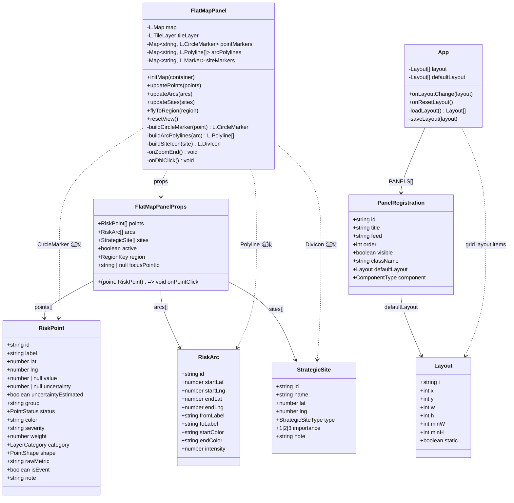
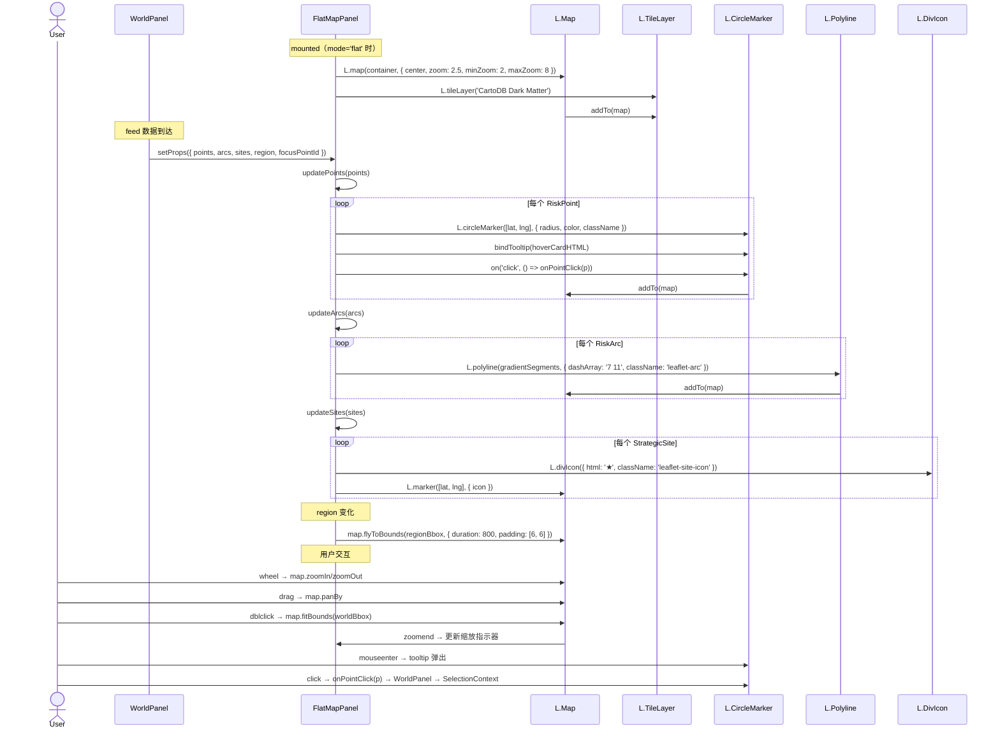
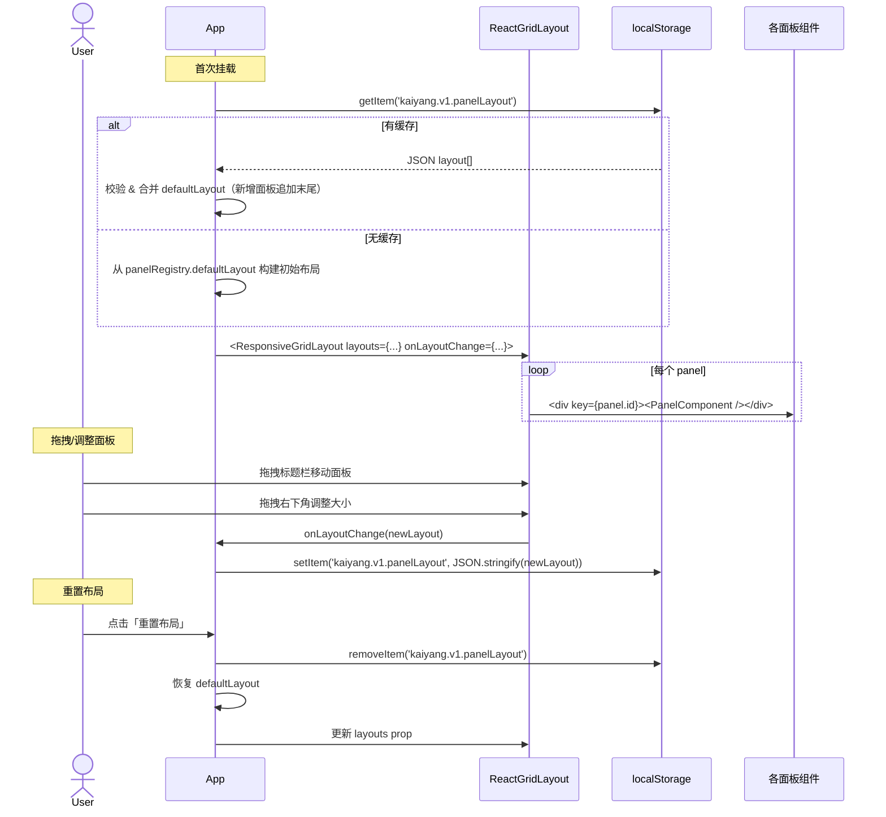
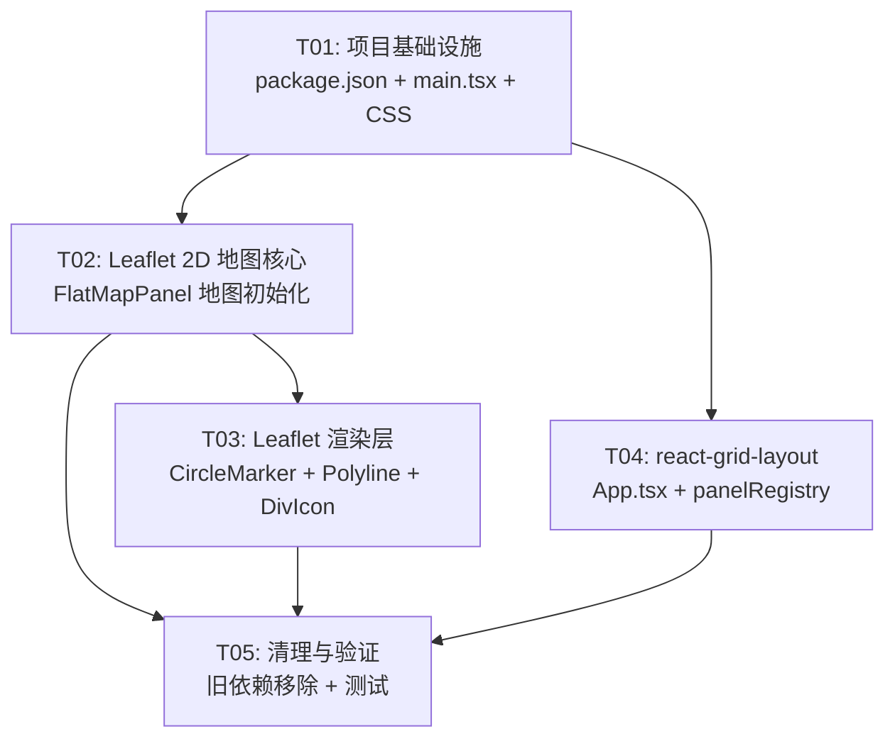

# 开阳 1.7.0 系统设计与任务分解

> 版本：ARCH_1.7.0 ｜ 作者：高见远（架构师） ｜ 日期：2026-08-04
> 关联文档：`PRD_1.7.0.md` / `system_design.md`（Wave 2 系统设计）
> 当前版本：1.6.0（297 测试通过）

---

## Part A：系统设计

### 1. 实现方案

#### 总体思路

本次升级分两条独立技术线：

**A 线 — 2D 地图从 d3-geo + SVG → Leaflet 原生渲染**：
- 用 Leaflet 的 `L.map` + CartoDB Dark Matter 瓦片替代 d3-geo 的 SVG Equirectangular 投影
- RiskPoint/RiskArc/StrategicSite 三种渲染层完整迁移到 Leaflet 原生图层（CircleMarker / Polyline / DivIcon）
- 数据契约（`RiskPoint` / `RiskArc` 类型、`MAP_THEME` / `PALETTE` 色值、`layerCategories` 类别定义、K6 只读约定）**全部不动**
- 交互从"静态图"升级为 wheel zoom + drag pan + 双击复位 + flyTo 地区切换
- d3-geo / topojson-client / world-atlas / topojson-specification / @types/d3-geo / @types/geojson / @types/topojson-client 全部移除（仅 FlatMapPanel 使用，无其他引用）

**B 线 — 面板布局从 CSS Grid → react-grid-layout 可拖拽布局**：
- 用 `react-grid-layout` 的 `Responsive` / `WidthProvider` 替换 App.tsx 的 `<main>` CSS Grid
- 8 面板可拖拽重排 + 右下角 resize handle 调整大小
- `onLayoutChange` 自动保存到 localStorage（key: `kaiyang.v1.panelLayout`）
- `panelRegistry` 的 `PanelRegistration.className` 转为初始布局推导参考（不再是布局源）

#### 核心技术难点

| 难点 | 方案 |
|------|------|
| SVG 脉冲动画 → Leaflet CSS | Pulse 用 CSS `@keyframes` 驱动 Leaflet CircleMarker 的 `className`，CSS 变量 `--ky-pulse-duration` 传入内联 style |
| 弧线渐变（SVG linearGradient） → Leaflet | Leaflet 不支持渐变 stroke。改用 `L.polyline` + 分段渐变色（按 intensity 插值），每段用单独 polyline |
| 战略要地星形 SVG → Leaflet | 用 `L.divIcon` 渲染 `★` 字符（Unicode 2605），CSS 控制颜色、大小、辉光 |
| 双击复位 | 全局 dblclick → `map.fitBounds(worldBbox)`；需与 Leaflet 默认双击 zoom 行为共存（禁用 `doubleClickZoom: false`，自行处理） |
| 面板拖拽时不触发地图拖拽 | react-grid-layout 的 drag handle 设为标题栏区域，与地图容器天然隔离 |

### 2. 框架选型

| 包名 | 版本建议 | 许可证 | 理由 |
|------|---------|--------|------|
| `leaflet` | `^1.9.4` | BSD-like | 最成熟的 Web 交互式地图库，~42KB gzip，无需 API key |
| `@types/leaflet` | `^1.9.14` | MIT | TypeScript 类型，与 leaflet 1.9.x 匹配 |
| `react-grid-layout` | `^1.4.4` | MIT | 可拖拽网格布局标准库，~18KB gzip，React 18 兼容 |
| `@types/react-grid-layout` | `^1.3.5` | MIT | TypeScript 类型 |

**移除的依赖**（经全局搜索确认仅 FlatMapPanel.tsx 引用）：

| 移除包 | 当前版本 | 引用范围 |
|--------|---------|---------|
| `d3-geo` | `^3.1.1` | 仅 FlatMapPanel.tsx |
| `topojson-client` | `^3.1.0` | 仅 FlatMapPanel.tsx |
| `world-atlas` | `^2.0.2` | 仅 FlatMapPanel（countries-110m.json） |
| `@types/d3-geo` | `^3.1.0` | 仅 FlatMapPanel 类型 |
| `@types/geojson` | `^7946.0.16` | 仅 FlatMapPanel（配合 topojson-client） |
| `@types/topojson-client` | `^3.1.5` | 仅 FlatMapPanel 类型 |
| `@types/topojson-specification` | — | 不在 package.json，但被 import；一并清理 |
| `topojson-specification` | — | 不在 package.json，但被 import（类型引用）；一并清理 |

### 3. 文件列表及相对路径

#### 新建文件

| # | 路径 | 说明 |
|---|------|------|
| 1 | `src/components/FlatMapPanel.tsx` | **重写**：Leaflet 2D 地图（替换 d3-geo SVG） |
| 2 | `src/components/FlatMapPanel.css` | FlatMapPanel 专属 Leaflet 暗色主题覆盖样式 |

#### 修改文件

| # | 路径 | 改动说明 |
|---|------|---------|
| 3 | `src/App.tsx` | 根布局：CSS Grid → react-grid-layout ResponsiveGridLayout |
| 4 | `src/panels/registry.ts` | `className` 字段保留但转为初始布局推导参考，新增 `defaultLayout` 字段 |
| 5 | `src/main.tsx` | 新增 `import 'leaflet/dist/leaflet.css'` |
| 6 | `src/index.css` | 删除 `.flat-arc` / `.flat-point-*` 动画（迁入 FlatMapPanel.css）；新增 Leaflet 控件暗色覆盖 |
| 7 | `package.json` | 新增 leaflet / react-grid-layout 等 4 个依赖；移除 d3-geo / topojson-client / world-atlas 等 3~4 个依赖 |

#### 删除文件

| # | 路径 | 原因 |
|---|------|------|
| 8 | `public/assets/countries-110m.json` | Leaflet 瓦片自带地理信息，不再需要国界 TopoJSON |

#### 不动文件（零改动）

| 文件 | 原因 |
|------|------|
| `src/components/GlobePanel.tsx` | P0-6 明确不动 |
| `src/components/WorldPanel.tsx` | Props 接口不变（FlatMapPanel 仍接受 `FlatMapPanelProps`） |
| `src/lib/mapData.ts` | 数据契约不变 |
| `src/config/theme.ts` | 色值不变 |
| `src/config/layerCategories.ts` | 类别体系不变 |
| `src/data/strategicSites.ts` | 要地数据不变 |
| `src/config/regions.ts` | 地区 bbox 不变（仅注释中 fitExtent 引用变为 fitBounds） |
| 所有 `*.test.ts` / `*.test.tsx` | 297 测试不退化 |

### 4. 数据结构和接口



**关键设计决策**：

- `FlatMapPanelProps` **接口签名不变**。Leaflet 内部实现完全替换，但对外 props 与 d3 版本完全一致，`WorldPanel` 无需任何改动。
- `Layout` 接口来自 `react-grid-layout`，新增 `defaultLayout` 字段到 `PanelRegistration`（从原 `className` col-span 推导）。
- `FlatMapPanel` 内部用 `useRef<L.Map>` 持有 Leaflet 实例，用 `useEffect` 响应 props 变化更新图层。

### 5. 程序调用流程

#### 5.1 Leaflet 2D 地图渲染流程



#### 5.2 面板布局渲染流程



### 6. 待明确事项（架构建议）

| # | PRD 问题 | 架构建议 | 理由 |
|---|---------|---------|------|
| Q1 | Leaflet CSS 导入方式 | **推荐 npm 导入**：`import 'leaflet/dist/leaflet.css'` 放入 `src/main.tsx` | 离线可用、版本锁定、随 Vite 打包优化，不依赖 CDN |
| Q2 | grid 参数 | **`cols=12, rowHeight=80px`**，面板 `minW=2, minH=2` | 与现有 12 栅格对齐，最小面板 ≈ 160px 宽 × 160px 高（足够显示面板标题+基本内容） |
| Q3 | d3-geo 依赖清理 | **全部移除**：d3-geo / topojson-client / world-atlas / @types/d3-geo / @types/geojson / @types/topojson-client。同时删除 `public/assets/countries-110m.json` | 全局搜索确认仅 FlatMapPanel.tsx 使用；`regions.ts` 的 `regionPolygon()` 也仅为此服务，标记 `@deprecated` 但不强制删除（纯数据函数无副作用） |
| Q4 | zoom 范围 | **`minZoom=2, maxZoom=8`** | zoom=2 全球可见（≈ 当前静态图视野），zoom=8 城市级细节 |
| Q5 | localStorage key 版本化 | **`kaiyang.v1.panelLayout`** | 便于未来布局结构变更时做迁移（v2 可读 v1 并升级） |
| Q6 | 新增面板处理 | **追加到布局末尾**：加载缓存时，若 `panelRegistry` 中存在缓存未记录的 `id`，按 `defaultLayout` 追加到 `y` 最大值的下一行 | 符合「用户自行拖拽调整」预期；与 panelRegistry 的「只追加不重排」约定一致 |

---

## Part B：任务分解

### 7. 依赖包列表

#### 新增

```
- leaflet@^1.9.4: 交互式地图库（BSD-like, ~42KB gzip）
- @types/leaflet@^1.9.14: Leaflet TypeScript 类型定义（MIT）
- react-grid-layout@^1.4.4: 可拖拽网格布局（MIT, ~18KB gzip）
- @types/react-grid-layout@^1.3.5: react-grid-layout TypeScript 类型（MIT）
```

#### 移除

```
- d3-geo@^3.1.1: 仅 FlatMapPanel 使用，Leaflet 替代
- topojson-client@^3.1.0: 仅 FlatMapPanel 使用
- world-atlas@^2.0.2: 仅 FlatMapPanel 使用
- @types/d3-geo@^3.1.0: 随 d3-geo 移除
- @types/geojson@^7946.0.16: 随 topojson-client 移除
- @types/topojson-client@^3.1.5: 随 topojson-client 移除
```

#### 保留（不动）

```
- globe.gl@^2.46.1: 3D 地球（零改动）
- three@0.185.1: 3D 渲染引擎（零改动）
- echarts@^5.5.1: 图表库（各面板使用）
- react@^18.3.1 / react-dom@^18.3.1: 框架
- tailwindcss@^3.4.10: CSS 框架
- vite@^5.4.8 / vitest@^2.1.9: 构建与测试
```

### 8. 任务列表

| ID | 名称 | 涉及文件 | 依赖 | 优先 |
|----|------|---------|------|------|
| T01 | 项目基础设施 | `package.json`, `src/main.tsx`, `src/index.css`（Leaflet CSS 导入 + 暗色覆盖 + 清理旧 CSS）, `src/components/FlatMapPanel.css`（新建） | — | P0 |
| T02 | Leaflet 2D 地图核心 | `src/components/FlatMapPanel.tsx`（完整重写：地图初始化 + 瓦片 + zoom/pan/flyTo/dblclick 复位 + zoom 指示器） | T01 | P0 |
| T03 | Leaflet 渲染层 | `src/components/FlatMapPanel.tsx`（续写：RiskPoint→CircleMarker + RiskArc→Polyline + StrategicSite→DivIcon + 脉冲/hover/tooltip/focus） | T02 | P0 |
| T04 | react-grid-layout 面板布局 | `src/App.tsx`, `src/panels/registry.ts`（defaultLayout 字段） | T01 | P0 |
| T05 | 清理与验证 | `package.json`（移除旧依赖）, `public/assets/countries-110m.json`（删除）, `src/index.css`（清理残留 .flat-*）, `src/config/regions.ts`（@deprecated 标记） | T02, T03, T04 | P0 |

### 9. 任务详细说明

#### T01 · 项目基础设施

**目标**：安装新依赖、导入 Leaflet CSS、新建 FlatMapPanel CSS、预清理旧 CSS。

**具体步骤**：

1. `package.json`：
   ```bash
   npm install leaflet@^1.9.4 @types/leaflet@^1.9.14 react-grid-layout@^1.4.4 @types/react-grid-layout@^1.3.5
   ```
2. `src/main.tsx` 顶部新增：
   ```ts
   import 'leaflet/dist/leaflet.css';
   ```
3. `src/index.css` 删除以下 CSS 块：
   - `.flat-arc` 及 `@keyframes flat-arc-flow`
   - `.flat-point-pulse` 及 `@keyframes flat-point-breathe`
   - `.flat-point-missing`
   - `.flat-point-pulse-rate`
   - `@media (prefers-reduced-motion: reduce)` 中的对应引用
   - 保留 `:root` 中的 `--ky-pulse-*` 变量（Leaflet 渲染层继续使用）
4. `src/index.css` 新增 Leaflet 控件暗色覆盖：
   - `.leaflet-control-zoom a` → 暗色背景 + 青绿边框
   - `.leaflet-control-attribution` → 暗色文字
5. `src/components/FlatMapPanel.css` 新建（约 100 行）：
   - `.leaflet-arc` 弧线流动虚线动画
   - `.leaflet-point-pulse` 点位脉冲呼吸（复用 `--ky-pulse-duration`）
   - `.leaflet-point-missing` 缺失态灰+虚线
   - `.leaflet-site-icon` 战略要地星标样式
   - `.leaflet-zoom-indicator` 缩放级别指示器样式
   - `.flat-map-container` 容器暗色背景

#### T02 · Leaflet 2D 地图核心

**目标**：重写 FlatMapPanel 的地图初始化、瓦片加载、视图控制。

**具体步骤**：

1. 完全重写 `src/components/FlatMapPanel.tsx`——第一阶段（地图容器层）：
   - 删除所有 d3-geo / topojson 相关 import
   - 新增 `import L from 'leaflet'`
   - 新增 `import './FlatMapPanel.css'`
   - `containerRef` → 创建 `L.map(containerRef.current, { zoomControl: false, attributionControl: false })`
   - 配置：`center: [22, 70]`, `zoom: 2.5`, `minZoom: 2`, `maxZoom: 8`, `zoomControl: true`
   - `L.tileLayer('https://{s}.basemaps.cartocdn.com/dark_all/{z}/{x}/{y}{r}.png', { attribution: '...', subdomains: 'abcd' }).addTo(map)`
   - `map.doubleClickZoom.disable()` — 禁用默认双击 zoom
   - `map.on('dblclick', () => map.fitBounds(worldBbox))` — 双击复位到全球
   - `map.on('zoomend', () => setZoomLevel(map.getZoom()))` — P1 缩放指示器
   - `map.on('moveend', () => { /* 按需更新 */ })`
   - ResizeObserver → `map.invalidateSize()`
   - cleanup：`map.remove()`
   - `active` prop 为 false 时：容器隐藏，不操作 map
2. **region prop** → `useEffect`：
   - `world` → `map.fitBounds([[ -90, -180 ], [ 90, 180 ]], { padding: [6, 6] })`
   - 其他地区 → `map.flyToBounds(regionBbox, { duration: 800, padding: [6, 6] })`
   - 使用 `regions.ts` 的 `regionBbox(key)` 获取 `[[minLat, minLng], [maxLat, maxLng]]`

#### T03 · Leaflet 渲染层

**目标**：将 RiskPoint / RiskArc / StrategicSite 完整迁移到 Leaflet 原生图层。

**具体步骤**：

在 T02 基础上续写 `FlatMapPanel.tsx`——第二阶段（渲染层）：

1. **RiskPoint → CircleMarker**：
   - 用 `L.layerGroup().addTo(map)` 管理，更新时 `clearLayers()` 后重建
   - 每个 point 创建 `L.circleMarker([lat, lng], { radius, fillColor, color, fillOpacity, weight, className })`
   - `radius` 计算：`(2.6 + weight * 3.4) * (isEvent ? 1.25 : 1)`（与 d3 公式一致）
   - `shape === 'diamond'` → 用 `L.polygon` 模拟菱形（4 顶点坐标）
   - `status === 'missing'` → `className: 'leaflet-point-missing'`，灰色
   - 高风险 highlight：`className: 'leaflet-point-pulse'`，`style.setProperty('--ky-pulse-duration', ...)`
   - `bindTooltip(pointTooltipHtml(p), { direction: 'top', offset: [0, -radius], className: 'leaflet-tooltip-dark' })`
   - `on('click', () => onPointClick?.(p))`
   - `focusPointId` 匹配：额外画一个 `L.circle` 虚线聚焦圈

2. **RiskArc → Polyline**：
   - 用 `L.layerGroup().addTo(map)` 管理
   - Leaflet 不支持 SVG `linearGradient`。替代方案：将大圆弧按 intensity 插值颜色分段
   - 使用 `L.polyline` + `dashArray: '7 11'` + `className: 'leaflet-arc'`
   - `color` 取 `startColor`（简化，保留 dash 流动动画）
   - CSS `@keyframes` 驱动 `stroke-dashoffset` 动画（同 d3 的 `.flat-arc` 动画逻辑）
   - `bindTooltip(...)` 弧线信息
   - 跨 180° 经线处理：Leaflet 自动处理（比 d3 更健壮）

3. **StrategicSite → DivIcon**：
   - `L.marker([lat, lng], { icon: L.divIcon({ html: '★', className: 'leaflet-site-icon', iconSize: [size, size] }) })`
   - `iconSize` 按 `SITE_STAR_RADIUS * siteScale(importance) * 2` 计算
   - CSS：`color: #fbbf24; text-shadow: 0 0 8px #fbbf24; font-size: ...`
   - `bindTooltip(siteTooltipText(s), ...)`
   - `siteLabelsVisible` 逻辑：在 Leaflet 中标签永显（无「拉远隐藏」概念，与 3D 不同）

4. **Hover tooltip**：
   - 复用现有 tooltip HTML 结构（样式一致）
   - 使用 Leaflet 原生 `bindTooltip` + `{ sticky: false, direction: 'top' }`
   - CSS 覆盖 `.leaflet-tooltip` 为暗色玻璃拟态（border + 色值沿用现有 hover 卡片）

5. **缩放级别指示器（P1-1）**：
   - 在 `FlatMapPanel.tsx` return 中渲染一个绝对定位的 `<div className="leaflet-zoom-indicator">z={zoomLevel}</div>`
   - `useState` 持有 `zoomLevel`，`map.on('zoomend')` 更新

#### T04 · react-grid-layout 面板布局

**目标**：替换 App.tsx 的 CSS Grid 为可拖拽布局，持久化到 localStorage。

**具体步骤**：

1. `src/panels/registry.ts`：
   - `PanelRegistration` 新增字段：
     ```ts
     /** react-grid-layout 初始布局（由 className col-span 推导 + 人力微调） */
     defaultLayout: { w: number; h: number; minW: number; minH: number };
     ```
   - 8 个面板的 `defaultLayout` 从现有 `className` 推导：
     - `lg:col-span-2` → `w=2, h=4`
     - `lg:col-span-7` → `w=7, h=5`（世界视图面积最大）
     - `lg:col-span-3` → `w=3, h=4`
     - `lg:col-span-5` → `w=5, h=4`
     - `lg:col-span-9` → `w=9, h=4`
     - `lg:col-span-4` → `w=4, h=4`
   - 行排列保持原 4 行：第一行 y=0, 第二行 y=4, 第三行 y=8, 第四行 y=12

2. `src/App.tsx`：
   - 删除 `<main className="grid grid-cols-1 gap-4 p-4 lg:grid-cols-12">`
   - 新增：
     ```tsx
     import { Responsive, WidthProvider } from 'react-grid-layout';
     import 'react-grid-layout/css/styles.css';
     const ResponsiveGridLayout = WidthProvider(Responsive);
     ```
   - `useState<Layout[]>` 管理布局状态
   - `useCallback(onLayoutChange)` → `localStorage.setItem('kaiyang.v1.panelLayout', ...)`
   - `useCallback(onResetLayout)` → 清除 localStorage + 恢复 defaultLayout
   - 渲染：
     ```tsx
     <ResponsiveGridLayout
       className="layout"
       layouts={{ lg: layout }}
       breakpoints={{ lg: 1024, md: 768, sm: 0 }}
       cols={{ lg: 12, md: 1, sm: 1 }}
       rowHeight={80}
       draggableHandle=".panel-drag-handle"
       onLayoutChange={(l) => onLayoutChange(l)}
       compactType="vertical"
     >
       {panels.map(p => (
         <div key={p.id}>
           <div className="panel-drag-handle">{/* 标题栏 */}</div>
           <p.component />
         </div>
       ))}
     </ResponsiveGridLayout>
     ```
   - 每个面板包裹一层 `glass-panel` 外观（保留现有视觉）
   - 窄屏 (`<lg`)：`cols={{ lg: 12, md: 1 }}` 自动降级单列
   - 「重置布局」按钮（P1-2）：放在 footer 区域或右上角固定位置

3. **localStorage 版本化**：
   ```ts
   const STORAGE_KEY = 'kaiyang.v1.panelLayout';
   function loadLayout(): Layout[] { ... }
   function saveLayout(layout: Layout[]): void { ... }
   // Q6 处理：新增面板追加到末尾
   function mergeWithDefaults(saved: Layout[], defaults: Layout[]): Layout[] { ... }
   ```

#### T05 · 清理与验证

**目标**：移除旧依赖、删除残留文件、清理 CSS、运行测试。

**具体步骤**：

1. `package.json`：执行卸载
   ```bash
   npm uninstall d3-geo topojson-client world-atlas @types/d3-geo @types/geojson @types/topojson-client
   ```
2. 删除 `public/assets/countries-110m.json`
3. `src/index.css` 完成清理（已在 T01 标记）
4. `src/config/regions.ts` 的 `regionPolygon` 和 `BboxPolygon` 标记 `@deprecated Since 1.7.0 — Leaflet 迁移后不再需要 d3-geo fitExtent；保留以兼容旧测试但不建议新代码使用`
5. 运行全量测试：`npm test`（297 测试应全部通过）
6. 检查 TypeScript 编译：`npx tsc --noEmit`
7. 检查 Vite 构建：`npm run build`

### 10. 共享知识

以下约定跨文件生效，工程师实现时应注意：

| # | 约定 | 说明 |
|---|------|------|
| K1 | **颜色只从 PALETTE/CATEGORY_PALETTE 引用** | 不允许任何硬编码 hex 色值。所有 Leaflet 渲染层通过 `point.color`（构建层预计算）取色 |
| K2 | **useFeed 不变** | `WorldPanel` 的 data fetching 逻辑零改动；FlatMapPanel 仍然接收处理好的 `points`/`arcs`/`sites` |
| K3 | **SelectionContext 不变** | `focusPointId` / `selectSignal` / `clearFocus` 接口不变；Leaflet CircleMarker click → `onPointClick` 回调链路不变 |
| K4 | **K6 渲染器只读约定不变** | FlatMapPanel 不 import `layerCategories`，只读 `p.color/p.weight/p.shape/p.status` |
| K5 | **降级红线不变** | 任何异常路径不抛错、不白屏。Leaflet 初始化失败 → 显示错误提示；瓦片加载失败 → 保留深色背景 |
| K6 | **FlatMapPanelProps 签名不变** | `WorldPanel` 零改动。Leaflet 实例生命周期由 FlatMapPanel 内部管理 |
| K7 | **本地化优先** | Leaflet CSS npm 导入（非 CDN）；CartoDB 瓦片是唯一的外部网络依赖 |
| K8 | **localStorage key 登记** | `kaiyang.v1.panelLayout` — 面板布局；`kaiyang.worldViewMode` — 视图模式（已有，不动）；`kaiyang.layerVisibility` — 图层显隐（已有，不动） |
| K9 | **Leaflet marker 默认图标修复** | `import L from 'leaflet'` 后需修复默认图标路径（Vite 打包时 Leaflet 默认 icon URL 会失效）：设置 `L.Icon.Default.mergeOptions({ iconRetinaUrl: ..., iconUrl: ... })` 或使用 DivIcon 完全替代 |
| K10 | **react-grid-layout CSS 覆盖** | `react-grid-layout/css/styles.css` 自带样式需要暗色主题覆盖：`.react-grid-item` 背景透明、`.react-resizable-handle` 改为青绿色 |

### 11. 任务依赖图



**执行顺序**：T01 → {T02 + T04（并行）} → {T03（续 T02）} → T05

---

> 文档结束。请主理人查阅，确认后可交由工程师按 T01→T05 顺序实现。
