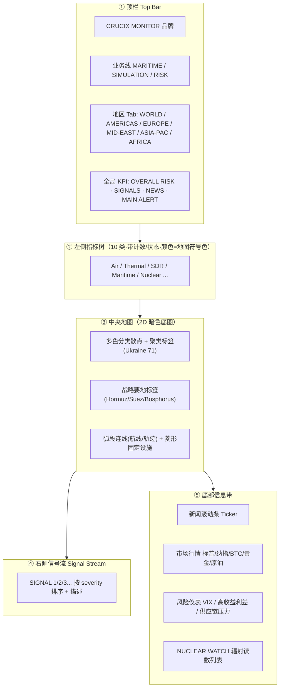
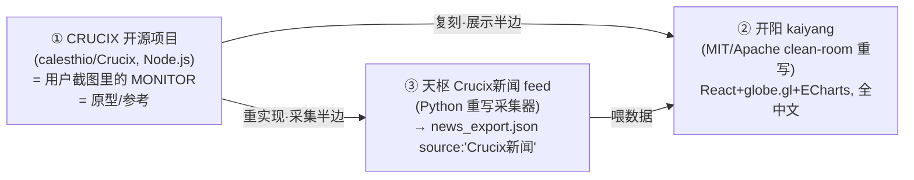
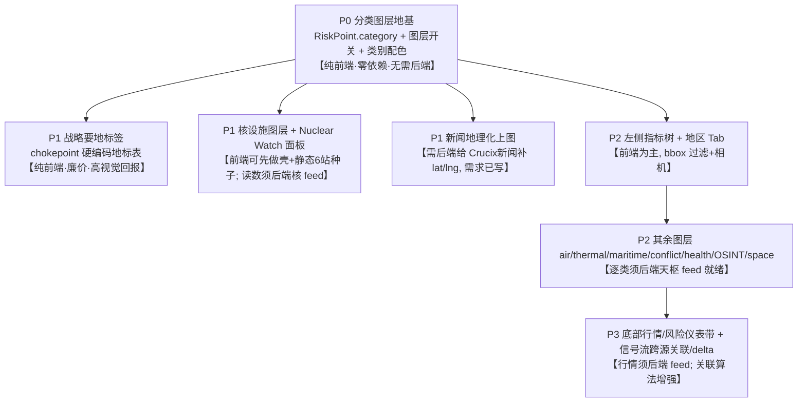

> ## ⚠️ DEPRECATED · crucix 项目已退场（2026-08-12）
> 本文件为开阳对标 **crucix（calesthio/Crucix）** 的历史分析/参考文档。crucix 信号总线已于 2026-08-12 退场（G0 切断验证 PASS + D1 gscpi 改 NY Fed CSV 唯一源；G1 同日停 `crucix-crucix-1` 容器）。本文档仅作历史参考，**不代表现役实现**；开阳实际信号以 `DATA_CONTRACT.md` 与现役 `src/` 代码为准。
>
# 开阳对标 CRUCIX MONITOR · 竞品 / 参考分析

> 作者：许清楚（产品经理）｜日期：2026-08-01｜配套：[`archive/CRUCIX_BENCHMARK_OPEN_QUESTIONS.md`](./archive/CRUCIX_BENCHMARK_OPEN_QUESTIONS.md) / [`DESIGN.md`](./DESIGN.md) / [`DATA_CONTRACT.md`](./DATA_CONTRACT.md)
>
> 性质：分析 / 调研文档，**不含代码、不做实现**。所有"后端应提供 X"的结论均落到开阳扩展标准（`dataSources.ts` 登记 + `DATA_CONTRACT.md` 更新 + `schema_version`）语境。

---

## TL;DR（给主理人的三句话）

1. **身份已基本定性**：截图里的 "CRUCIX MONITOR" **既不是竞品、也不是咱们后端 Crucix 模块的产出**，而是**开源项目 `calesthio/Crucix`（GitHub ~1.09 万 star，Node.js/Express，端口 3117）的原始仪表盘**——也正是 `DESIGN.md §2` 白纸黑字写明"开阳 clean-room 复刻其展示半边"的那个**原型**。所谓"对标升级"，本质是**把当年就规划好的复刻，从当前只投影 GRV 一类，扩展到 crucix 的 9~10 类多图层全量形态**。
2. **开阳的底子比想象中厚**：开阳**已经有 2D 平面地图 + 3D 地球双视图切换**（`WorldPanel`，d3-geo/topojson/world-atlas **依赖已装**）、**已经有右侧信号流面板**、**已经是多面板大屏布局**。真正缺的不是"2D 地图能力"，而是**多类别图层体系（点位分类着色 + 图层开关）+ 核设施图层 + 底部行情带 + 左侧指标树**。
3. **建议**：优先走**路线 A（在现有双视图上加"分类图层"体系）**，前端可**立即启动**（纯前端重构 `RiskPoint` 模型，零新依赖）；核设施 / 新闻上图 / 战略要地标签可作为**最小可用**先落地；其余 5~6 类图层与行情带**须后端天枢先产出契约文件**才能接。**动手前建议先让用户一句话确认："对标 = 继续复刻开源 crucix 的展示大屏，对吗？"**——避免范围误判。

---

## 0. 方法与证据来源

| 证据 | 来源 | 用途 |
|------|------|------|
| CRUCIX 界面文字转述 | 主理人转述用户截图 | 界面结构拆解 |
| CRUCIX 是开源项目 | Web 检索：`calesthio/Crucix`、`crucix.live`、多个 fork | 身份定性（关键） |
| 开阳定位"clean-room 复刻 crucix" | `docs/DESIGN.md §2` | 身份定性（关键，内部实证） |
| 开阳现有能力 | 通读 `src/`（`WorldPanel`/`FlatMapPanel`/`GlobePanel`/`SignalStreamPanel`/`mapData.ts`/`grvDimensions.ts`/`theme.ts`/`contracts.ts`/`registry.ts`/`package.json`） | 现状对比（实证） |
| 扩展标准 | `AGENTS.md §4` / `DATA_CONTRACT.md §3` | 后端需求落地口径 |

> ⚠ 未能从截图/检索直接确认、标注"**需后端/用户确认**"者，全文不臆造数据源与读数。

---

## 1. CRUCIX MONITOR 界面信息架构拆解

### 1.1 五大区结构

**设计范式提炼**（crucix 的"套路"，也是开阳复刻要吃透的）：
- **单屏 Jarvis 式指挥中心**：一屏之内"地图为核心 + 四周环绕面板"，信息高密度、无需翻页。
- **图层×类别双维度**：每类指标 = 一个可开关图层 + 一种专属颜色 + 一种符号形状（散点/菱形/弧线），**左侧树的颜色 = 地图符号色**，形成"图例即导航"。
- **地区过滤 = 相机动作**：切 Tab 不是换页，而是**旋转地球 / 缩放平面图**到该地区并过滤点位。
- **聚类降噪**：同一地区大量点聚合为"地区名 + 计数"标签（如 `Ukraine 71`）。
- **战略要地硬编码锚点**：Bosphorus / Gibraltar / Suez / Hormuz 等 chokepoint 是**固定地标**（非数据驱动），叠加在数据点之上。
- **跨源关联 + 变化增量**：右侧信号流是"跨 27 源关联 + 相较上次 sweep 的 delta（新增/升级/降级）"，不是简单新闻列表。
- **底部行情带**：把宏观/市场/风险仪表压成一条滚动带，与地图并置。

### 1.2 10 类指标 → CRUCIX 真实数据源映射

> 依据 web 检索到的 crucix README（27 源 / 5 层 / "9 marker types"）反推。**截图为 10 类，README 为 9 类**——差异见 §3 待验证项。

| 截图指标 | 计数 | 颜色 | 对应 CRUCIX 数据源（开源实证） | 上游性质 | 天枢现有对应？ |
|----------|------|------|-------------------------------|----------|----------------|
| Air Activity 空域活动 | 604 / 10 theaters | 青绿 | OpenSky + ADS-B Exchange（含军机航迹） | 开源航迹 API | ❓需后端确认 |
| Thermal Spikes 热异常 | 3,786（1,658 夜间） | 红 | NASA **FIRMS**（VIIRS 卫星火点） | 卫星红外 | ❓需后端确认 |
| SDR Coverage 软件定义雷达 | 780 | 蓝 | SDR 接收站网络（如 KiwiSDR） | 开源测站 | ❓需后端确认 |
| Maritime Watch 海上监视 | 9 chokepoints | 紫 | AIS / 海事 + **硬编码要冲点** | AIS + 硬编码 | ❓需后端确认 |
| **Nuclear Sites 核设施** | **6 monitors** | **黄** | **Safecast + EPA RadNet**（辐射） | 开源辐射网 | ❌ 无（用户最关心） |
| Conflict Events 冲突事件 | 0 fatalities | 红 | **ACLED**（武装冲突） | 开源冲突库 | ❓需后端确认 |
| Health Watch 卫生监视 | 0 WHO alerts | 绿 | WHO / NOAA 健康告警 | 官方告警 | ❌ 无 |
| World News 地理新闻 | 50 geolocated | 青 | **GDELT + RSS**（地理定位后） | 新闻事件库 | ⚠ **近似**：开阳 `source:"Crucix新闻"` |
| OSINT Feed 开源情报 | 0 urgent | 橙 | Telegram / Bluesky / Reddit 舆情 | 社交爬取 | ❌ 无 |
| Space Activity 太空活动 | 24 / 435 new 30d | 紫 | **CelesTrak**（发射/ISS/军星/星座） | 目录 API | ❌ 无 |

> **底部 NUCLEAR WATCH 列表**（Zaporizhzhia / Chernobyl / Fukushima 读数）= 同上 Safecast + EPA RadNet。
> **底部行情**（S&P/NASDAQ/BTC/Gold/Oil）= Yahoo Finance；**风险仪表**（VIX / 高收益利差 / 供应链压力 GSCPI）= FRED/EIA/衍生计算。

### 1.3 地图符号体系

| 符号 | 语义 | 数据模型要求 |
|------|------|--------------|
| 分类散点（多色） | 各类事件点，颜色=类别 | 点需带 `category` + `lat/lng` + 值 |
| 聚类标签（Ukraine 71） | 地区聚合计数 | 前端按 bbox 聚合，或后端预聚合 |
| 战略要地标签 | Bosphorus/Suez/Hormuz/Gibraltar | **前端硬编码地标表**（非数据驱动） |
| 弧段连线 | 航线 / 轨迹 | 弧需 `start/end lat-lng` + 类型 |
| 菱形符号 | 固定设施（核站/测站） | 点带 `shape:'diamond'` + `fixed:true` |

---

## 2. 与开阳现状能力对比

> **重要认知纠偏**：交接材料称"开阳当前地图能力：3D globe 仅投影 GRV"。**实际代码显示开阳已具备更多**——已有 2D 平面图、双视图切换、信号流、多面板大屏。下表以**代码实证**为准。

| 能力维度 | CRUCIX MONITOR | 开阳现状（实证） | 缺口 |
|----------|----------------|------------------|------|
| **2D / 3D 地图** | 2D 暗色底图为主 + 3D globe 切换 | ✅ **已有 3D globe + 2D 平面图切换**（`WorldPanel`，d3-geo/topojson/world-atlas 依赖已装） | 无——2D 能力**已具备**（此前被低估） |
| **地图点位分类** | 9~10 类，按类别着色/符号 + 图层开关 | ⚠ 仅 GRV 地理维度 + 事件柱；点位按**严重度**着色，**无类别维度** | **核心缺口**：`RiskPoint` 缺 `category`/`layer` 字段与图层开关 |
| **核设施监测** | Nuclear Sites 图层 + Nuclear Watch 读数 | ❌ 完全没有 | **高优缺口**（用户最关心的"核"） |
| **信号流** | 右侧 SIGNAL，跨源关联 + sweep delta | ✅ **已有 `SignalStreamPanel`**（news→三色脉冲，按 severity 排序，取 40 条） | 中：缺"跨源关联/变化增量"算法，缺点击联动地图 |
| **新闻地理化** | 50 条 RSS geolocated 上图 | ⚠ Crucix新闻**只在文字卡片**（无 lat/lng）；已写需求文档待后端 | 低：需后端补 `lat/lng`（前端约 25 行，已评估） |
| **市场行情带** | Yahoo Finance 行情 + 风险仪表 | ⚠ 有 FRED 经济面板（宏观序列），**无实时行情/风险仪表带** | 中：需后端天枢产出行情/仪表 feed（开阳不可自连 Yahoo） |
| **战略要地聚类** | chokepoint 硬编码 + 地区聚类标签 | ❌ 无地标层、无聚类 | 中：地标可**前端硬编码**（廉价）；聚类需前端聚合逻辑 |
| **左侧指标树** | 10 类计数 + 状态灯 + 颜色导航 | ❌ 无（有 `RiskSummaryPanel`/`StatusMiniPanel` 小卡但非图层树） | 中：随分类图层体系一并建 |
| **地区 Tab** | 6 大区，切换=相机动作+过滤 | ❌ 无 | 中：前端可实现（bbox 过滤 + 相机） |
| **多面板大屏** | 五区环绕布局 | ✅ **已是 12 栅格多面板**（摘要+世界+信号 / GRV+经济 / 状态+新闻） | 低：布局骨架已在，缺"顶栏+左树+底带"三件套 |
| **实时刷新** | SSE 每 15 分钟 | ❌ 静态 fetch 快照，无 SSE | 低（非本次重点，铁律：开阳只读契约） |
| **弧线/轨迹** | 航线弧 + 菱形设施 | ✅ 有地缘联动弧（GRV_ARCS）；❌ 无航线/菱形 | 低-中：弧模型已在，缺类别扩展 |

**缺口总结（按重要度）**：
1. 🔴 **分类图层体系**（`RiskPoint.category` + 图层开关 + 类别配色/符号）——**一切多图层能力的地基**，纯前端。
2. 🔴 **核设施图层 + Nuclear Watch 面板**——用户最关心，需后端核 feed（或先静态种子 6 站 + 降级读数）。
3. 🟠 **左侧指标树 + 地区 Tab + 战略要地标签**——大屏形态的"门面"，多为前端。
4. 🟠 **底部行情/风险仪表带**——需后端行情 feed（开阳禁自连 Yahoo）。
5. 🟡 **新闻地理化上图**——需求已写，等后端补坐标。
6. 🟡 **信号流升级（跨源关联/delta/点击联动）**——增量增强。

---

## 3. 身份定性分析（最关键）

### 3.1 结论（高置信）

> **"CRUCIX MONITOR" = 开源项目 `calesthio/Crucix` 的原始仪表盘（jarvis.html），即开阳设计上的"原型/参考"，不是竞品、也不是咱们后端 Crucix 模块的产出。**

### 3.2 证据链

| # | 证据 | 指向 |
|---|------|------|
| E1 | `DESIGN.md §2` 明写："**展示半边 → 开阳 clean-room 重写**……视觉继承 crucix 的玻璃拟态 + 青绿酷感"；"crucix 开源协议 AGPL-3.0" | 开阳诞生即为复刻 crucix |
| E2 | Web 实证：`calesthio/Crucix`（~1.09 万 star，Node.js/Express，**端口 3117**）；开阳部署端口 **:3118**（DESIGN §7，刻意相邻） | crucix 是外部开源原型 |
| E3 | crucix README："3D WebGL globe(**Globe.gl**) + **flat map toggle**、**9 marker types**、**Nuclear watch(Safecast+RadNet)**、**Space watch(CelesTrak)**、region filters(World/Americas/Europe/Mid-East/Asia-Pac/Africa)" | 与截图**逐项吻合** |
| E4 | 开阳技术栈 globe.gl + 2D flat toggle + 青绿玻璃拟态 + 地区无关投影 | 复刻痕迹明确 |
| E5 | 开阳 `source:"Crucix新闻"` = 天枢用 Python 重实现 crucix 的**新闻采集器**后的产出标签 | 命名撞车的根源 |

### 3.3 三个"Crucix"辨析（消除命名混淆）

- **①** = 用户想对标的那张大屏（外部开源）。
- **②** = 咱们自己（本项目），**当前只复刻了 crucix 展示半边的一小部分（GRV 一类 + 双视图外壳）**。
- **③** = 天枢已重实现的 crucix 新闻采集器，产出流入开阳新闻面板——**与①同名不同物**。

> 所以"对标升级"= **把 ② 从"复刻了 10%"推进到"复刻了 crucix 的 9~10 类多图层全量形态"**，而所需数据由 **③ 类的天枢重实现采集器**逐类补齐。这与 `DESIGN.md §2` 的既定策略**完全一致，不是新方向**。

### 3.4 仍需验证的证据（请后端/用户确认）

| # | 待验证 | 为何重要 | 如何取证 |
|---|--------|----------|----------|
| V1 | 截图是**开源 crucix 本体**、其 **fork**、还是托管站 `crucix.live`？ | 截图为 10 类，README 为 9 marker types，可能是**更新版/托管变体** | 请用户确认截图来源 URL / 版本 |
| V2 | crucix 实际 LICENSE 是否确为 AGPL-3.0？ | 决定"能否引用其代码/资源"（clean-room 已按最坏假设，仅未来分发才受限） | 核对 repo `LICENSE` 文件 |
| V3 | 天枢是否已重实现 crucix 的其余采集器（air/thermal/nuclear/space...）？ | 决定哪些图层"后端已就绪、可直接接" | 请后端出**天枢 fetcher 清单 × crucix 27 源映射表** |
| V4 | 核设施数据（Safecast/RadNet）天枢能否落盘为契约文件？精度/频率？ | 决定核图层能否落地、实时还是日更 | 请后端实测数据源可用性 |
| V5 | 是否要求 SSE 实时（crucix 每 15 分钟 sweep）？ | 影响架构（开阳当前静态 fetch） | 用户拍板；建议 Wave 后置 |

---

## 4. 升级方向建议（方向，非完整 PRD）

### 4.1 三条路线

| 路线 | 做法 | 利 | 弊 | 工作量量级 | 新依赖 |
|------|------|----|----|-----------|--------|
| **A. 增强现有双视图 + 分类图层体系（推荐主线）** | 扩 `RiskPoint` 加 `category`；`mapData.ts`/`theme.ts` 加类别配色/符号；新增图层开关 + 左侧指标树；globe.gl & flat 图同步渲染多类别 | 复用已有 3D+2D+信号流+布局；**零新依赖**；风险最低；符合 clean-room 既定策略 | 单图交互（地区缩放/聚类）需自造，比专业地图库费手 | 触碰约 5~6 个既有文件 + 3~4 个新文件 | **0** |
| **B. 引入 2D 地图库并存（Leaflet / MapLibre）** | 在 A 之上，为 2D 视图换用专业地图库，获得平滑 pan/zoom、地区 Tab 相机、marker 聚类（Ukraine 71） | 地区过滤/聚类/瓦片体验贴近 crucix | +1 前端依赖（**需用户批准**，违反"技术栈钉死"须解锁）；与现有 d3-geo flat 图二选一或并存增复杂度 | 新增 1 个地图组件（与 FlatMapPanel 平级）+ 适配层 | **+1（Leaflet 或 MapLibre）** |
| **C. 全量大屏重构（Wave3/4）** | 重写 `App.tsx` 布局为 crucix 式：顶栏(区Tab+KPI) + 左指标树 + 中地图 + 右信号 + 底行情带，1:1 复刻 | 形态最接近截图；一步到位 | 工作量最大；与 Wave2 控制面并行会抢资源；须后端多 feed 就绪才有数据 | 几乎触碰全部布局 + 大量新组件 | 视是否叠加 B 而定 |

> **推荐**：以 **A 为骨架立即启动**；**B 作为可选增强**（仅当用户明确要"地区缩放+聚类"体验时再解锁依赖）；**C 作为终局**，待后端图层 feed 陆续就绪后，在独立 Wave（不与 Wave2 控制面抢道）推进。

### 4.2 最小可用（MVP）优先级阶梯

### 4.3 前端可先行 vs 后端须先就绪（清晰切割）

| 可**立即前端启动**（不阻塞后端） | 须**后端天枢先产出契约文件**才能接 |
|--------------------------------|-----------------------------------|
| 分类图层模型 + 图层开关 + 类别图例 | 核设施辐射读数（Safecast/RadNet 重实现） |
| 战略要地硬编码标签 | Air/Thermal/Maritime/Conflict/Health/OSINT/Space 各图层点位 |
| 左侧指标树 UI（先接空/mock，降级渲染） | Crucix 新闻 `lat/lng`（补坐标） |
| 地区 Tab（bbox 过滤 + 相机动作） | 市场行情 + 风险仪表带（禁自连 Yahoo/FRED，须后端 feed） |
| Nuclear Watch 面板**壳** + 6 站静态种子 | sweep delta / 跨源关联信号 |

> 后端每新增一类图层，均须遵循开阳扩展标准：**`config/dataSources.ts` 登记一个 feed + `DATA_CONTRACT.md` 补字段定义（含 `lat/lng` 精度约定）+ 带 `schema_version` + 缺字段降级渲染**。开阳侧多为"加一个面板注册项 + 图层构建函数"，布局不动。

---

## 5. 回填「待明确清单」（逐条 PM 初判 + 推荐追问）

> 对应 `archive/CRUCIX_BENCHMARK_OPEN_QUESTIONS.md` A~H。格式：**【PM 初判】** + **【建议追问后端/用户】**。

### A. CRUCIX 身份与归属
- **是竞品还是自家系统？**【PM 初判】**都不是**——是开源原型 `calesthio/Crucix`，开阳本就是它的 clean-room 复刻（见 §3）。
- **是否允许借鉴图层/交互？**【PM 初判】设计范式可借鉴（clean-room 已在做）；**代码/资源不得直接拷贝**（AGPL），全中文自研 UI。【追问用户】"是否认可‘继续复刻 crucix 展示大屏’这一方向？"
- **由哪个子系统产出？**【PM 初判】不适用（外部项目）；其**采集器**由天枢按 crucix 27 源逐一 Python 重实现。【追问后端】给出天枢 fetcher × crucix 源映射表（V3）。
- **能否获取高清原图/版本？**【追问用户】提供截图来源 URL（本体/fork/crucix.live）以定版本（V1）。

### B. 10 类指标数据来源
- 【PM 初判】已反推出每类对应 crucix 开源源（见 §1.2 表）。**天枢是否已重实现各源、精度/频率/历史如何 = 全部标"需后端确认"**。
- 【追问后端】按 §1.2 表逐行回答"天枢现有对应？有→feed 名/schema；无→是否新增/优先级"。

### C. 核设施 / Nuclear Watch（用户最关心）
- **数据源？**【PM 初判】crucix 用 Safecast + EPA RadNet；实时/日更**需后端实测**（V4）。
- **与"核指数新闻"是否同源？**【PM 初判】**不同**——核指数是叙事关键词信号（文字），Nuclear Watch 是**辐射读数（数值+坐标）**，是两套数据。【追问后端】确认是否两个独立 feed。
- **谁提供坐标+读数？**【追问后端】天枢能否落盘 `nuclear_sites.json`（含 `lat/lng` + `reading` + `unit` + `updated`）；不能则开阳先用**6 站静态种子 + 读数降级为"—"**。
- **合规？**【PM 初判】个人内部研究，读开源辐射网无出口问题；以数据源实际可用性为准。

### D. 地图可视化方向
- **改 2D / 增强 globe / 双视图？**【PM 初判】**开阳已双视图并存**（纠正认知）；主线走**路线 A 增强**，不推翻。是否加专业地图库（路线 B）留待用户就"地区缩放+聚类"体验拍板。
- **多图层+图例+聚类如何实现？**【PM 初判】图层/图例走 A（`category` 模型）；聚类前端 bbox 聚合或后端预聚合（【追问后端】倾向哪种）。
- **战略要地硬编码 vs 数据驱动？**【PM 初判】crucix 是**硬编码**；开阳同样**前端硬编码地标表**最省且稳定。
- **弧段连线数据模型？**【追问后端】航线/轨迹若要上图，需 feed 提供 `start/end lat-lng + 类型`；否则先复用现有地缘弧。

### E. 信号流 / 告警
- **排序与 severity 算法？**【PM 初判】开阳已有 severity 三档排序（`SignalStreamPanel`）；crucix 额外有"跨源关联 + sweep delta"。【追问后端】delta/关联是否由后端算好推来（开阳只展示），还是要开阳前端算。
- **点开联动地图？**【PM 初判】建议做（点击信号→地图定位/高亮），前端即可，列为 P2 增强。

### F. 底部信息带
- **行情数据源？**【PM 初判】crucix 用 Yahoo Finance；**开阳铁律禁自连**，须**后端天枢产出行情 feed**（如 `market_latest.json`）。开阳 FRED 面板可扩，但实时行情/VIX/利差须新 feed。【追问后端】能否提供行情+风险仪表 feed。
- **新闻滚动条 vs World News RSS 关系？**【PM 初判】同源（GDELT+RSS），一份数据两种呈现（滚动带 + 地图点）。

### G. 范围、阶段与优先级
- **全量重构 vs 最小可用？**【PM 初判】**先最小可用**（P0 分类地基 + 核图层壳 + 要地标签 + 新闻上图），全量大屏（路线 C）后置独立 Wave。
- **与 Wave2 控制面冲突？**【PM 初判】**避免并行抢资源**；建议 Wave2 控制面收尾后再开"大屏 Wave"。【追问用户】两者优先级排序。
- **是否引入新前端依赖？**【PM 初判】路线 A **零新依赖**；路线 B 才需 +1 地图库，**须用户批准解锁"技术栈钉死"**。

### H. 数据与契约
- **新 feed 登记规则？**【PM 初判】每类图层 = 1 feed，按 §4.3 走 `dataSources.ts` + `DATA_CONTRACT.md` + `schema_version` 标准，**无例外**。
- **哪些 feed 需 lat/lng？精度？**【PM 初判】除宏观/行情/健康计数外，**几乎所有图层点位都需 `lat/lng`**（建议统一小数 4 位 ≈ 11m 精度即够）。【追问后端】统一坐标精度约定。
- **降级渲染如何延伸到 10 类？**【PM 初判】沿用现有铁律——**任一图层字段缺失→该图层"数据缺失"占位 + 状态条告警，不白屏**；`buildEventBars` 式的"空数组即不渲染"模式可直接套用到每类图层。

---

## 6. 结论与下一步

**一句话结论**：所谓"对标 CRUCIX MONITOR 升级"，实为**继续执行 `DESIGN.md` 早已写定的"复刻开源 crucix 展示大屏"策略**——把开阳从"复刻 GRV 一类"推进到"crucix 9~10 类多图层全量形态"；开阳的双视图/信号流/大屏骨架**已具备**，真正要补的是**分类图层体系 + 核设施 + 底部行情带 + 左树/区Tab**，且多数新图层**受后端天枢逐类产出契约文件所门控**。

**给主理人的 5 条建议**：
1. **先让用户一句话确认身份**（"对标 = 继续复刻开源 crucix 展示大屏，对吗？"）——这是所有后续投入的前提，避免把外部原型误当竞品或自家后端。
2. **要一份"天枢 fetcher × crucix 27 源"映射表**（V3）——它直接决定哪些图层"后端已就绪可接"、哪些要新建，是排期的硬输入。
3. **主线定路线 A（零依赖增强）**，先落 **P0 分类图层地基**（纯前端），再叠 **核设施壳 + 战略要地标签 + 新闻上图** 三个最小可用件；**路线 B 的新地图库暂不解锁**，除非用户点名要地区缩放+聚类。
4. **核设施优先级提前**（用户最关心的"核"）：即使后端核 feed 未就绪，也可先上 **6 站静态种子 + 读数降级为"—"** 的图层与 Nuclear Watch 面板壳，等后端补读数。
5. **与 Wave2 控制面错峰**：建议控制面收尾后开独立"大屏 Wave"，避免并行抢资源；C 全量重构留到后端多 feed 就位再启动。

---

> 附：本分析已就绪，可作为后续"开阳大屏升级 PRD"与"给后端的图层 feed 需求清单"的输入底稿。需要我继续产出其中任一份，请告知。
