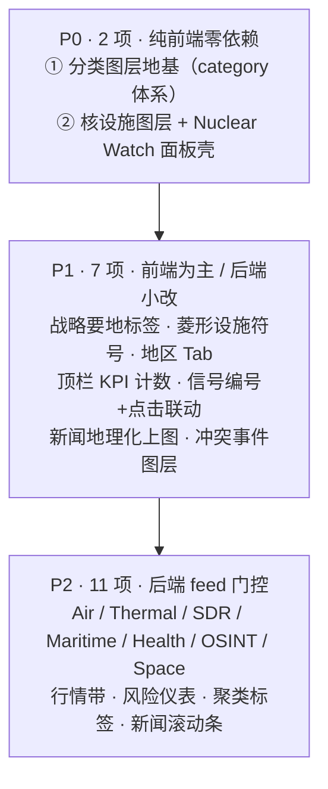

# 开阳前端显示需求清单 · 对标 crucix 展示大屏

> 作者：许清楚（产品经理）｜日期：2026-08-01
> 母本：[`CRUCIX_ANALYSIS.md`](./CRUCIX_ANALYSIS.md)｜相关：[`DATA_CONTRACT.md`](./DATA_CONTRACT.md) / [`DESIGN.md`](./DESIGN.md)
>
> **用途**：把 crucix 展示大屏逐层拆成"开阳要显示什么"，供前端直接排活。**不是 PRD**，不含代码、不改 `src/`。
> **派生**：末尾 §7 是"后端 feed 需求清单"的打底汇总。

---

## 0. 阅读指引

### 0.1 已核实的前置事实（决定了什么算"缺口"）

开阳**已经具备**以下能力，本清单一律标 **`复用既有`**，**不计入缺口**：

| 已有能力 | 载体 | 说明 |
|---|---|---|
| 2D 平面地图 | `FlatMapPanel` | d3-geo + topojson-client + world-atlas，**依赖已装**，离线国界数据已本地化 |
| 3D 地球 | `GlobePanel` | globe.gl + three，星空/大气/经纬网/光环/常驻标签 |
| 3D↔2D 双视图切换 | `WorldPanel` | localStorage 记忆，两图共享同一份 points/arcs，始终挂载避免 WebGL 重建 |
| 右侧信号流 | `SignalStreamPanel` | news→三色脉冲，按 severity 排序，取前 40 条 |
| 顶栏状态条 | `StatusBar` | 品牌 + 综合指数 + 各 feed 时间戳 + schema 版本 + 缺失告警 + 控制台入口 |
| 12 栅格多面板大屏 | `App.tsx` + `panels/registry.ts` | 新增面板只加注册项，布局不动 |
| 弧线（地缘联动） | `mapData.buildRiskArcs` + `GRV_ARCS` | 渐变色 + 流动虚线，3D/2D 同源 |
| 事件触发式告警柱 | `mapData.buildEventBars` | `grv_latest.json` → `events[]`，空数组即不渲染（**可直接套用到新图层**） |
| 缺失降级机制 | `useFeed` / `StatusContext` | 字段缺失→占位 + 状态条告警，不白屏 |

> 用户口径：**开阳比 crucix 多不少东西（控制面等），"借鉴/复刻没区别"**——本清单只吸收 crucix 的**展示能力**，**不触碰**开阳已有的控制抽屉、天枢运维等额外模块。

### 0.2 字段口径

| 列 | 取值 | 含义 |
|---|---|---|
| **开阳现状** | `已有` / `部分` / `无` | `部分` = 有相近机制但语义/字段不匹配 |
| **补法** | `复用既有` / `纯前端壳` / `纯前端` / `需后端feed` | `纯前端壳` = 前端先做 UI 与降级，数据后补 |
| **优先级** | `P0` / `P1` / `P2` | 见下 |
| **后端依赖** | feed 名 + 数据源 | 空 = 不依赖后端 |

**优先级定义**（本清单专用，非通用 MoSCoW）：

| 级别 | 含义 | 判据 |
|---|---|---|
| **P0** | 地基 / 用户点名 | 前端**立即可动、零新依赖**；不做则后面全堵 |
| **P1** | 高价值先行 | 前端为主，或后端只需**小改既有 feed**（补字段） |
| **P2** | 后端门控 / 体验增强 | 必须**后端新建 feed** 才有数据，或属锦上添花 |

---

## 1. 总览

| 分组 | 总项 | 已有/部分 | 无 | 需后端 |
|---|:--:|:--:|:--:|:--:|
| 10 类指标图层（§2） | 10 | 2 | 8 | 9 |
| 地图符号体系（§3） | 5 | 1 | 4 | 1 |
| 信号流 / 顶栏 / 底部带 / 核面板（§4） | 9 | 5 | 4 | 4 |
| **合计** | **24** | **8** | **16** | **14** |

---

## 2. 主表 A · 10 类指标图层

> 计数为截图实测值，仅作规模参考。颜色为 crucix 原配色，开阳可在 `theme.ts` 另定中式配色，但**须保持"左树颜色 = 地图符号色"的一致性**。

| crucix 元素 | 开阳现状 | 缺口 | 补法 | 优先级 | 后端依赖（feed / 数据源） |
|---|:---:|---|---|:---:|---|
| **Nuclear Sites 核设施**（6 monitors，黄） | 无 | 无核设施图层；无辐射读数概念 | **纯前端壳**：图层 + 菱形符号 + 6 站静态种子坐标，读数降级为「—」；后端就绪后接真实读数 | **P0** | `nuclear_sites.json` / Safecast + EPA RadNet |
| **World News RSS 地理新闻**（50 geolocated，青） | **部分** | 有 `source:"Crucix新闻"` 文字卡片，但**无 lat/lng**，不上图 | **需后端feed**（小改）：既有 `news_export.json` 补可选 `lat/lng`；前端加"新闻类"图层 | P1 | 改既有 `news_export.json` 补 `lat`/`lng` / GDELT + RSS（需求已发，见 `archive/开阳Crucix新闻地理坐标需求-给后端.md`） |
| **Conflict Events 冲突事件**（0 fatalities，红） | **部分** | 已有事件柱机制（`events[]`），但只认 `climate`/`disaster`，**无 conflict 语义** | **需后端feed**：可扩 `events[].type` 加 `'conflict'`，或独立 feed；前端复用 `buildEventBars` 模式 | P1 | `conflict_events.json`（或扩 `grv_latest.json` events type）/ ACLED |
| **Maritime Watch 海上监视**（9 chokepoints，紫） | 无 | 无海事图层；无要冲点位 | **拆两半**：要冲**地标**走 §3「战略要地标签」纯前端硬编码（P1）；**AIS 实况**需后端（P2） | P1(地标) / P2(实况) | `maritime_watch.json` / AIS + 硬编码要冲清单 |
| **Air Activity 空域活动**（604 / 10 theaters，青绿） | 无 | 无空域图层；无航迹弧 | **需后端feed**：点位 + 可选航线弧 | P2 | `air_activity.json` / OpenSky + ADS-B Exchange |
| **Thermal Spikes 热异常**（3,786 / 1,658 夜间，红） | 无 | 无热点图层；**量级最大（数千点）**，需抽稀/聚类 | **需后端feed**：建议后端预聚合或前端抽稀（见 §5.3 性能注意） | P2 | `thermal_spikes.json` / NASA FIRMS (VIIRS) |
| **Space Activity 太空活动**（24 / 435 新增 30d，紫） | 无 | 无太空图层；卫星星下点/发射场语义未定 | **需后端feed**：先做"发射场/ISS 星下点"静态点，轨道动画后置 | P2 | `space_activity.json` / CelesTrak |
| **Health Watch 卫生监视**（0 WHO alerts，绿） | 无 | 无卫生图层 | **需后端feed** | P2 | `health_watch.json` / WHO + NOAA 告警 |
| **OSINT Feed 开源情报**（0 urgent，橙） | 无 | 无 OSINT 图层 | **需后端feed**；⚠ 社交爬取合规性须后端评估（开阳禁自连） | P2 | `osint_feed.json` / Telegram + Bluesky + Reddit |
| **SDR Coverage 软件定义雷达**（780，蓝） | 无 | 无测站图层 | **需后端feed**；**展示价值最低**（仅基础设施覆盖），建议排最后 | P2 | `sdr_coverage.json` / KiwiSDR 等测站网 |

---

## 3. 主表 B · 地图符号体系

| crucix 元素 | 开阳现状 | 缺口 | 补法 | 优先级 | 后端依赖 |
|---|:---:|---|---|:---:|---|
| **多色散点（按类别着色）** | **部分** | `RiskPoint` 仅有 `group: string`（自由文本，仅用于 tooltip 文案）；着色走 `severityColor()` **按严重度**（青/琥珀/红/灰 4 色）。**无 category 枚举、无按类配色、无类别图例、无按类开关** | **纯前端**：见 §5.1「P0 分类图层地基」 | **P0** | 无 |
| **战略要地标签**（Bosphorus / Gibraltar / Suez / Hormuz / CSS…） | 无 | 无地标层 | **纯前端**：硬编码地标常量表（crucix 本身也是硬编码）；成本极低、视觉回报高 | P1 | 无 |
| **菱形符号（固定设施）** | 无 | 3D/2D 均只画圆点（`pointRadius` / `<circle>`） | **纯前端**：`RiskPoint` 加 `shape` 字段；2D 用 SVG `polygon`，3D 用 `htmlElementsData` 自定义节点（已有该 API 的能力探测） | P1（随核设施一起） | 无 |
| **弧段连线（航线/轨迹）** | **部分** | 已有地缘联动弧（`GRV_ARCS`，渐变+流动虚线，3D/2D 同源），但**弧是配置硬编码的维度两两连线**，无"数据驱动的航线/轨迹"语义 | **需后端feed**：弧模型已在，只需扩 `RiskArc` 加 `category`，数据由航空/海事 feed 提供 | P2 | 随 `air_activity` / `maritime_watch` 提供弧数据 |
| **聚类标签**（Ukraine 71 / Middle East 178） | 无 | 无聚合逻辑；点少时不需要，**热点图层上线后必需** | **纯前端**（bbox 聚合）或后端预聚合——**须先定归属**（见 §6 待定项） | P2 | 可选：后端预聚合字段 |

---

## 4. 主表 C · 信号流 / 顶栏 / 底部带 / 核面板

| crucix 元素 | 开阳现状 | 缺口 | 补法 | 优先级 | 后端依赖 |
|---|:---:|---|---|:---:|---|
| **右侧信号流主体**（SIGNAL 列表 + severity） | **已有** | — | **复用既有** `SignalStreamPanel`（三色 + severity 排序 + 40 条上限） | — | 无 |
| ├ SIGNAL 序号编号 | 无 | 无 `SIGNAL 1/2/3` 序号感 | **纯前端**：列表加序号前缀 | P1 | 无 |
| ├ 点击信号 → 地图定位高亮 | 无 | 信号与地图无联动 | **纯前端**：信号携带 lat/lng 时点击驱动相机 + 高亮点位 | P1 | 依赖各图层点位有坐标 |
| └ 跨源关联 / sweep delta（新增·升级·降级） | 无 | 无变化增量概念（开阳读静态快照） | **需后端feed**：建议后端算好 delta 推来，开阳只展示 | P2 | `signal_delta.json`（或并入既有 feed）/ 后端 sweep 比对 |
| **顶栏 · 品牌 + 全局状态** | **已有** | — | **复用既有** `StatusBar` | — | 无 |
| ├ OVERALL RISK 总风险 | **已有** | — | **复用既有**：`global_composite` 头条数字已在状态条与风险摘要面板呈现 | — | 无 |
| ├ SIGNALS / NEWS / MAIN ALERT 计数 | **部分** | 有「缺失告警 N」，无「信号数 / 新闻数 / 主告警」三计数 | **纯前端**：从既有 feed 派生计数 chip | P1 | 无 |
| └ **地区 Tab**（World/Americas/Europe/Mid-East/Asia-Pac/Africa） | 无 | 无地区过滤；无相机联动。⚠ `FlatMapPanel` 当前是 `fitExtent` **固定全图投影**，需改造才能区域缩放 | **纯前端**：地区 bbox 常量表 → 过滤点位 + 3D `pointOfView` / 2D 投影 `fitExtent(bbox)` | P1 | 无 |
| **Nuclear Watch 面板**（各核站辐射读数列表） | 无 | 无该面板 | **纯前端壳**：新增面板注册项 + 6 站种子行，读数列降级「—」；后端就绪后接真实读数 | **P0** | 同 `nuclear_sites.json` |
| **底部 · 市场行情带**（标普/纳指/BTC/黄金/原油） | 无 | 无实时行情；⚠ **铁律：开阳禁自连 Yahoo 等第三方** | **需后端feed** | P2 | `market_quotes.json` / 后端代取（crucix 用 Yahoo Finance） |
| **底部 · 风险仪表**（VIX / 高收益利差 / 供应链压力 GSCPI） | **部分** | 已有 FRED 经济面板（历史序列折线），但**无仪表盘式即时读数带** | **需后端feed**：可在既有 `fred_history/manifest.json` 增序列（最省），或新建仪表 feed | P2 | 扩 `fred_history/manifest.json` 序列 / FRED + EIA + GSCPI |
| **底部 · 新闻滚动条 ticker** | **部分** | 有 `NewsPanel` 卡片式，无横向滚动带 | **纯前端**：复用 `news` feed 换一种呈现 | P2 | 无 |

---

## 5. P0 两项详解（前端可立即启动）

### 5.1 P0-① 分类图层地基（一切多图层能力的地基）

**现状问题**：`RiskPoint` 的 `group` 是自由文本（`'地缘' / '能源' / '非传统' / '气候' / '自然灾害'`），**只进 tooltip 文案，不驱动任何渲染**；颜色统一由 `severityColor(value)` 按严重度给（4 色）。所以今天即使塞 10 类数据进去，地图上也是**同一套四色圆点，分不出类别**。

**要补的四件事**：

| # | 内容 | 落点 |
|---|---|---|
| 1 | `RiskPoint` 增加 **`category` 枚举**（10 类 + 既有 GRV/事件类）与可选 `shape` | 数据模型层（`mapData.ts` / `contracts.ts`） |
| 2 | **类别配色表**（约 10 个可区分色）+ 类别图例 | `theme.ts` |
| 3 | **按类开关**（图层显隐状态）+ 左侧指标树（类名 + 计数 + 状态灯 + 色块） | 新增面板 / 状态管理 |
| 4 | 3D 与 2D **两图同步**按 category 着色与过滤 | `GlobePanel` / `FlatMapPanel` |

**关键设计决策（须先拍板，否则返工）**：**颜色到底编码"类别"还是"严重度"？** crucix 用颜色编类别；开阳现用颜色编严重度。两者冲突。

| 方案 | 做法 | 评价 |
|---|---|---|
| **A（推荐）** | **色相 = 类别**，**严重度 = 尺寸 + 光环脉冲 + 亮度** | 贴近 crucix；既有 `HIGHLIGHT_THRESHOLD` 光环/常驻标签机制可直接承接严重度表达 |
| B | 保持颜色 = 严重度，**符号形状 = 类别** | 保留现有语义，但 10 种形状难辨识，2D/3D 实现成本高 |
| C | 双通道：填充色 = 类别，描边色 = 严重度 | 信息量最大，但小尺寸点位下描边几乎不可见 |

> 现有 `SEVERITY_LEGEND`（低/中/高/缺失）需与新的**类别图例**并存——建议图例区分两栏：「类别」+「严重度」。

### 5.2 P0-② 核设施图层 + Nuclear Watch 面板（用户最关心的"核"）

| 部分 | 前端可先做 | 需后端 |
|---|---|---|
| 地图图层 | 菱形符号 + 黄色类别 + 6 站静态种子坐标（Zaporizhzhia / Chernobyl / Fukushima 等公开坐标） | 真实站点清单（数量/坐标可能多于 6） |
| Nuclear Watch 面板 | 面板壳 + 站名列 + 读数列（降级「—」）+ 排序 | 辐射读数 `reading` + `unit` + `updated` + 阈值分级 |
| 告警联动 | 读数超阈 → 信号流 + 地图脉冲 | 阈值口径由后端给或前端约定 |

> **降级铁律沿用**：feed 缺失 → 图层不渲染 + 面板显示「数据缺失」+ 状态条告警，**不白屏**（与 `buildEventBars` 空数组即不画同一模式）。

### 5.3 性能注意（Thermal Spikes 上线前必须解决）

Thermal Spikes 量级 **3,786 点**，远超当前地图（十几个点）。3D `pointsData` 与 2D SVG `<circle>` 逐点渲染在千级会明显掉帧。**上线该图层前须先定抽稀/聚类方案**（前端抽稀 or 后端预聚合，见 §6 待定项）。

---

## 6. 待定项（需主理人/用户/后端拍板，前端排活前应确认）

| # | 待定 | 影响 | 建议 |
|---|---|---|---|
| D1 | 颜色编码：类别 vs 严重度（§5.1） | P0 返工风险最高 | 推荐方案 A（色相=类别，严重度=尺寸+脉冲） |
| D2 | 聚类归属：前端 bbox 聚合 vs 后端预聚合 | 影响 §3 聚类标签与热点性能 | 点数 < 500 前端做；热点图层建议后端预聚合 |
| D3 | 图层 feed 粒度：**每类一个文件** vs 一个聚合大文件 | 影响 `dataSources.ts` 登记数量与降级粒度 | 推荐**每类一个**（与天枢 fetcher 一一对应，单类失败不拖垮全图） |
| D4 | 是否需要 SSE 实时（crucix 每 15 分钟 sweep） | 影响架构（开阳当前静态 fetch 快照） | 建议本轮**不做**，维持读契约快照 |
| D5 | 是否解锁新前端依赖（Leaflet/MapLibre） | 技术栈钉死约束 | 本清单**全部条目零新依赖即可实现**，建议不解锁 |
| D6 | 地区 Tab 的 2D 投影改造 | `FlatMapPanel` 现为固定 `fitExtent` 全图 | 改为按地区 bbox 重算 `fitExtent`，不引入 pan/zoom 库 |

---

## 7. 派生后端清单（预览）

> 仅汇总上表标了 **`需后端feed`** 的行，作为后续《给天枢的 feed 需求清单》打底。**此处不展开字段级契约**。

### 7.1 新建 feed（9 项）

| # | 对应展示元素 | 建议 feed 名 | 建议数据源（crucix 开源源反推） | 优先级 |
|---|---|---|---|:---:|
| 1 | Nuclear Sites + Nuclear Watch 面板 | `nuclear_sites.json` | **Safecast + EPA RadNet** | **P0** |
| 2 | Conflict Events | `conflict_events.json` | **ACLED** | P1 |
| 3 | Maritime Watch（AIS 实况部分） | `maritime_watch.json` | AIS + 硬编码要冲清单 | P2 |
| 4 | Air Activity | `air_activity.json` | **OpenSky + ADS-B Exchange** | P2 |
| 5 | Thermal Spikes | `thermal_spikes.json` | **NASA FIRMS (VIIRS)** | P2 |
| 6 | Space Activity | `space_activity.json` | **CelesTrak** | P2 |
| 7 | Health Watch | `health_watch.json` | WHO + NOAA | P2 |
| 8 | OSINT Feed | `osint_feed.json` | Telegram + Bluesky + Reddit（⚠ 合规待评估） | P2 |
| 9 | SDR Coverage | `sdr_coverage.json` | KiwiSDR 等测站网 | P2 |

### 7.2 改既有 feed（3 项，成本更低，建议优先谈）

| # | 对应展示元素 | 改动 | 数据源 |
|---|---|---|---|
| 10 | World News 地理化上图 | 既有 `news_export.json` 的 Crucix 条目补**可选** `lat` / `lng` | GDELT + RSS（需求文档已发） |
| 11 | 底部风险仪表（VIX / 利差 / GSCPI） | 既有 `fred_history/manifest.json` **增序列**即可，经济面板无需改动 | FRED + EIA + GSCPI |
| 12 | 信号流 sweep delta | 既有 feed 增 delta 字段，或新建 `signal_delta.json` | 后端 sweep 比对 |

### 7.3 独立新建（1 项，受铁律约束）

| # | 对应展示元素 | 建议 feed 名 | 说明 |
|---|---|---|---|
| 13 | 底部市场行情带 | `market_quotes.json` | ⚠ **开阳禁自连 Yahoo 等第三方**，必须由后端代取落盘 |

### 7.4 对后端的统一要求（无例外）

每个新 feed 均须符合开阳扩展标准：

1. 在 `src/config/dataSources.ts` 的 `FEEDS` **登记一项**（读取层 `useFeed`/`readLayer` 无需改动）；
2. 在 `DATA_CONTRACT.md` **补字段定义**；
3. 携带 **`schema_version`**（首版 `1.0`，breaking change 须 bump）；
4. **点位类 feed 必须带 `lat` / `lng`**（建议统一小数 4 位 ≈ 11m 精度）；
5. 支持**空数组 / 文件缺失**——开阳按既有铁律降级（不渲染 + 状态条告警，不白屏）。

> **建议向后端索取的第一份材料**：《天枢现有 fetcher × crucix 27 源》映射表——它直接决定上面 13 项里哪些"其实已经有了"，是排期的硬输入。

---

## 8. 建议落地节奏

| 阶段 | 内容 | 是否阻塞于后端 |
|---|---|:---:|
| **第 1 步** | 拍板 D1（颜色编码方案）→ 做 **P0-① 分类图层地基** | 否 |
| **第 2 步** | **P0-② 核设施图层 + Nuclear Watch 面板壳**（静态种子 + 读数降级） | 否 |
| **第 3 步** | P1 前端批：战略要地标签 · 菱形符号 · 地区 Tab · 顶栏 KPI 计数 · 信号编号+点击联动 | 否 |
| **第 4 步** | P1 后端小改批：新闻补 `lat/lng` 上图 · 冲突事件图层 | **是**（小改） |
| **第 5 步** | P2 逐类接入（按 §7.1 优先级），每接一类走一遍扩展标准 | **是**（新建 feed） |

> 与 Wave2 控制面**错峰**推进，避免并行抢资源。

---

> 本清单可直接作为前端排活输入；§7 可直接派生为《给天枢的 feed 需求清单》。需要我继续产出后者，请告知。
