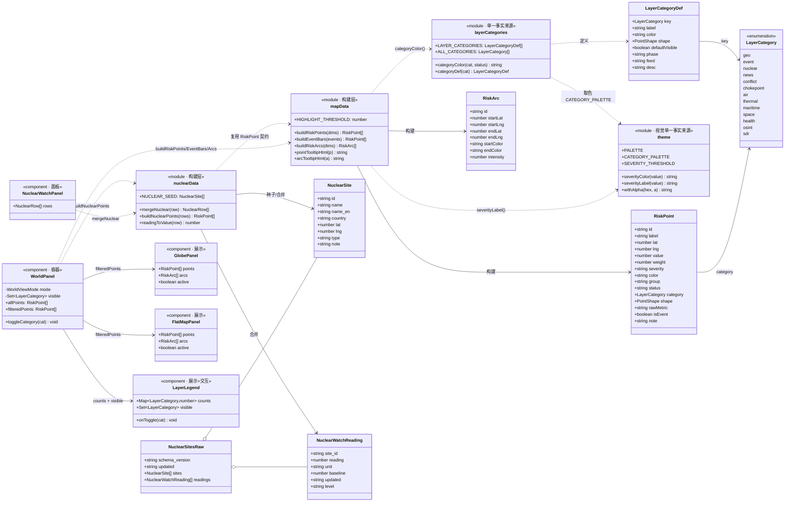
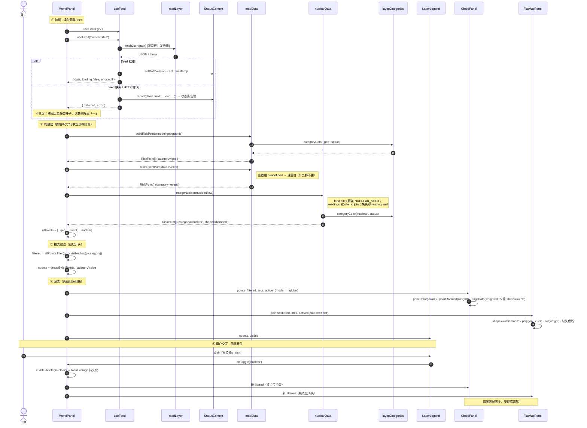
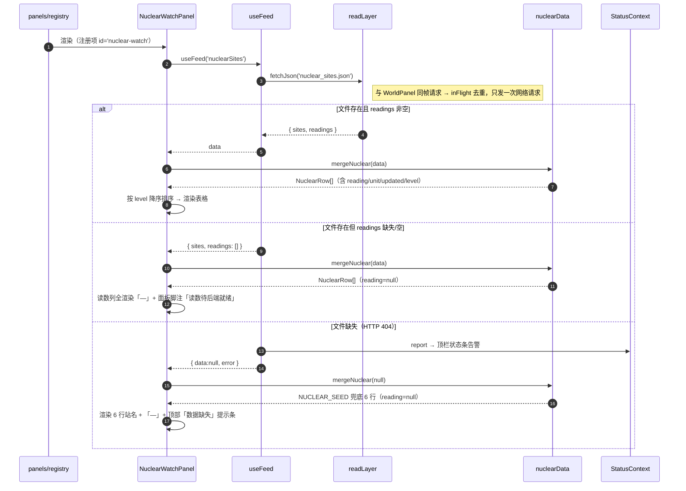
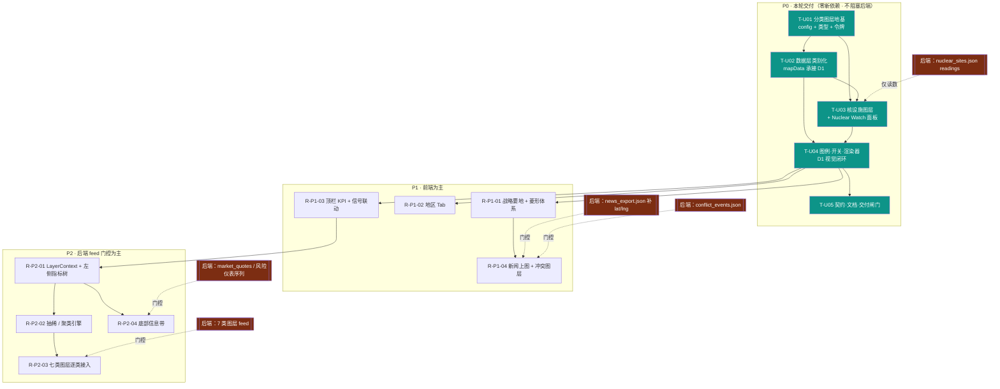

> ## ⚠️ DEPRECATED · crucix 项目已退场（2026-08-12）
> 本文件为开阳对标 **crucix** 升级的历史系统设计文档。crucix 信号总线已于 2026-08-12 退场（G0 切断验证 PASS + D1 gscpi 改 NY Fed CSV 唯一源；G1 同日停 `crucix-crucix-1` 容器）。本文档仅作历史参考，**不代表现役实现**；开阳实际架构以 `DATA_CONTRACT.md` / `DESIGN.md` 与现役 `src/` 代码为准。
>
# 开阳对标 CRUCIX MONITOR 升级 · 系统设计与任务分解

> 作者：高见远（架构师）｜日期：2026-08-01｜版本：v1（P0 完整设计 + P1/P2 路线图）
> 上游输入：[`CRUCIX_LAYER_REQUIREMENTS.md`](./CRUCIX_LAYER_REQUIREMENTS.md) / [`CRUCIX_ANALYSIS.md`](./CRUCIX_ANALYSIS.md) / [`archive/CRUCIX_BENCHMARK_OPEN_QUESTIONS.md`](./archive/CRUCIX_BENCHMARK_OPEN_QUESTIONS.md)
> 约束依据：[`AGENTS.md`](../AGENTS.md) §1/§4/§5 · [`DATA_CONTRACT.md`](./DATA_CONTRACT.md) §3 · [`DESIGN.md`](./DESIGN.md) §2/§3
>
> **性质**：设计 + 任务分解文档。**不含实现代码，不改动 `src/` 任何文件**（本文件是本轮唯一落盘产出）。
> **既定前提**：路线 A（零新依赖）+ 决策 D1（色相=类别、严重度=尺寸+光环脉冲）已由主理人拍板。
>
> 🔒 **P0 规格锁定声明（2025-08-01）**：N1→C1-A、N2→C2-A 已获主理人拍板，C3 设计稿已采用。**本文件即 P0 锁定规格，P0 范围不再变更**，可直接移交工程师从 T-U01 开工。N3~N12 维持【可边做边定】，不阻塞 P0；P1/P2 仅作落点登记，细化待各自阶段启动前再拆。

---

## 0. 阅读指引 / TL;DR（给主理人的五句话）

1. **D1 可落地，三处冲突已全部拍板**（§2）：① `RiskPoint.severity` 字段名已被占用 → **C1-A**：不新增数值字段，`weight`(0~1) 作唯一强度驱动，`severity` 保留为纯展示标签；② 色相=类别后缺失灰被顶掉 → **C2-A**：缺失强制 slate 灰 + 虚线，优先级高于类别色；③ 色板两组同色 → **C3-A**：热异常→橙、太空→靛（已在 §3.2 采用）。
2. **好消息：P0 的渲染器改动远小于预期**。因为 `RiskPoint.color` 是**在数据层预计算**、渲染器只读 `'color'` 字段，所以"按类着色"**几乎不需要改 `GlobePanel`/`FlatMapPanel`**；"按类开关"也只是在 `WorldPanel` 上游过滤数组。真正的改动集中在 `mapData.ts` 一个文件 + 两个新组件。
3. **严重度不需要新字段**：既有 `value`(0~100) → `weight`(0~1) → `pointRadius`/`pointAltitude`/`ringMaxRadius` 的链路**已经就是"严重度=尺寸"**；`HIGHLIGHT_THRESHOLD=55` 已经就是"严重度=光环脉冲"的闸门。D1 的严重度通道**已存在**，本轮只需**微调曲线 + 让脉冲速率随严重度变化**。
4. **零新依赖成立**，P0 全部 24 项改动无一需要新包；`d3-geo`/`topojson-client`/`world-atlas`/`globe.gl` 均已装。**本设计不引入 Leaflet/MapLibre。**
5. **P0 = 5 个有序任务（T-U01…T-U05）**，触碰 11 个既有文件 + 新增 6 个文件；与 Wave2 控制面的**文件交集只有 4 个**（`index.css` / `registry.ts` / `theme.ts` / `CHANGELOG+VERSION`），§9 给出错峰规则。

---

## 1. 实现方案与框架选型

### 1.1 路线确认

| 项 | 结论 |
|---|---|
| 路线 | **A —— 在现有 3D/2D 双视图上增建"分类图层"体系** |
| 新前端依赖 | **0（零）**。见 §7 |
| 是否引入 Leaflet / MapLibre | **否**（D5 维持不解锁；地区缩放在 P1 用 `fitExtent(bbox)` 自造） |
| 是否引入 SSE | **否**（D4 维持读契约快照） |
| 是否重构 `App.tsx` 布局 | **否**。P0 通过"面板注册项 + 面板内挂载"完成，符合 AGENTS.md §4 扩展标准 |

### 1.2 复用的既有能力（一件不新造）

| 能力 | 载体（既有） | 本轮如何复用 |
|---|---|---|
| 3D 地球渲染 | `globe.gl ^2.46.1` / `three 0.185.1` · `GlobePanel.tsx` | 直接复用；`pointColor('color')` 读预计算色，**类别着色零改动** |
| 2D 平面地图 | `d3-geo ^3.1.1` + `topojson-client` + `world-atlas` · `FlatMapPanel.tsx` | 直接复用；SVG 逐点渲染，加 `<polygon>` 菱形分支即可 |
| 双视图切换 + 记忆 | `WorldPanel.tsx` + localStorage | 直接复用；图层开关状态沿用同一 localStorage 模式 |
| 严重度→尺寸 | `weight` → `pointRadius` / `pointAltitude` / SVG `r` | **就是 D1 的严重度通道**，只微调系数 |
| 严重度→光环脉冲 | `HIGHLIGHT_THRESHOLD=55` → `ringsData` / `.flat-point-pulse` | **就是 D1 的脉冲通道**，只增加"速率随严重度" |
| 事件式图层降级 | `buildEventBars()`（空数组即不渲染） | **新图层一律照抄此模式**（§8 降级规范） |
| 统一读取 + 告警 | `useFeed` / `readLayer`（同路径并发去重）/ `StatusContext` | 新 feed 只在 `dataSources.ts` 登记一项，读取层不动 |
| 面板注册 | `panels/registry.ts` | Nuclear Watch 只加一条注册项，`App.tsx` 不动 |
| 视觉令牌 | `config/theme.ts`（单一事实来源）+ `index.css`（CSS 侧镜像） | 类别色板加进 `theme.ts`，CSS 变量镜像 |
| 图表 | `echarts ^5.5.1` | 本轮 P0 不涉及；P2 底部风险仪表带时复用 |

### 1.3 架构模式

沿用既有的 **"配置 → 适配 → 构建 → 展示"四层单向数据流**，本轮只在「构建层」横向加类别维度，不动分层：

```
config/（层定义·色板·种子·feed 登记）
   ↓
hooks/useFeed（统一读取 + schema 校验 + 告警上报）
   ↓
lib/（适配 + 构建：grvAdapter / mapData / nuclearData）  ← 类别与配色在此层"预计算"进 RiskPoint
   ↓
components/（纯展示：Globe / FlatMap / Legend / NuclearWatch）  ← 渲染器不做业务判断
```

> **关键设计约束（沿用既有并强化）**：颜色、尺寸、形状、类别一律在**构建层预计算**成 `RiskPoint` 的扁平字段，渲染器只做 `p.color` / `p.weight` / `p.shape` 的直读。这是"3D 与 2D 观感永远一致"的既有保证机制，本轮**不得破坏**。

---

## 2. ⚠ 三处必须先拍板的冲突（D1 与既有实现的硬碰撞）

> 主理人指令要求"若发现 D1 与既有渲染冲突无法调和，明确写出并给备选，不要静默将就"。以下三项即是。

### 冲突 C1 · `severity` 字段名已被占用 → ✅ **已决议 C1-A（用户拍板）**

> ✅ **2025-08-01 主理人拍板**：采纳 **C1-A**。
> - **不新增任何数值 `severity` 字段**；
> - **`weight`(0~1) 为唯一数值强度驱动源**（尺寸 / 环半径 / 高度全部只认 `weight`）；`value`(0~100) 仅是 `weight` 的 100 倍展示形态，二者同源，禁止新增第三个强度字段；
> - 既有 `severity`（string `'低'|'中'|'高'|'缺失'`）**保留为纯展示标签**；
> - **硬性编码要求**：在 `src/lib/mapData.ts` 的 `RiskPoint` 接口定义处，于 `severity` 与 `weight` 字段各加一行注释，原文为：`// severity = 展示标签，勿用于着色数学；weight = 唯一数值强度`。该注释列入 T-U02 的验收清单。

**实证**：`src/lib/mapData.ts:24` —— `RiskPoint.severity` **已存在，且类型是 `string`**，取值来自 `severityLabel(v)` = `'低' | '中' | '高' | '缺失'`。它被 `FlatMapPanel.tsx:320`、`mapData.ts:158/172`、`mapData.test.ts` 共 4 处消费。

直接按指令"加 `severity` 数值字段"会**类型冲突 + 破坏 4 处调用点 + 破坏 8 条既有测试断言** —— 现已被决议排除。

| 方案 | 做法 | 成本 | 评价 |
|---|---|---|---|
| **C1-A（推荐）** | **不新增数值字段**。明确 `value`(0~100) 即严重度数值、`weight`(0~1) 即其归一化形态、`severity`(string) 正名为"严重度**等级标签**" | 0 行破坏性改动 | 既有链路**已经**满足 D1 的"严重度驱动尺寸+脉冲"；新增字段纯属冗余，且冗余字段必然产生"两个真相"的不同步风险 |
| C1-B | 把既有 `severity: string` 重命名为 `severityLabel`，腾出 `severity` 给数值 | 改 4 处调用 + 8 条测试；无功能收益 | 命名更干净，但为零功能收益付出回归风险 |
| C1-C | 新增 `severityScore: number` 与 `value` 并存 | 低 | **反对**：与 `value` 语义 100% 重合，是典型的双真相隐患 |

**决议结论：C1-A 已拍板，无需退路方案**。T-U02 按此实现，`severity` 仅作标签、`weight` 作唯一强度。

> **配套约定（无论选哪个方案都必须定）**：**所有图层的原生度量必须由各自的构建函数归一化进 `value` 的 0~100 量纲**（如核辐射 µSv/h、冲突死亡人数、热异常 FRP 各有量纲）。否则 `HIGHLIGHT_THRESHOLD=55` 这个全局阈值对新图层完全失效。见 §8-K3。

### 冲突 C2 · 色相=类别之后，"数据缺失灰"没地方站了 → ✅ **已决议 C2-A（用户拍板）**

> ✅ **2025-08-01 主理人拍板**：采纳 **C2-A**。缺失态**强制 `PALETTE.slate` 灰 + 虚线描边 + 不参与光环/常驻标签**，优先级高于任何类别色；该规则在 `categoryColor()` 内以 `if (status==='missing') return slate+dotted` 作为**第一道分支**实现（见 §3.2），保证不被任何类别色覆盖。

**实证**：现 `severityColor(null)` 返回 `PALETTE.slate` 灰，是"该维度上游没给数"的唯一视觉信号；`WorldPanel` 底部 `SEVERITY_LEGEND` 也把"缺失"作为第四色列出。改成色相=类别后，一个缺数的核设施点会被涂成"核黄"，与有数的核设施**看不出区别**——而开阳的降级铁律恰恰要求缺失可见。

| 方案 | 做法 | 评价 |
|---|---|---|
| **C2-A（推荐）** | **缺失态覆盖类别色**：`status==='missing'` 或 `value===null` → 强制 `PALETTE.slate`，并加**虚线描边 + 不参与光环/常驻标签** | 缺失是"元状态"，优先级高于类别，语义正确；实现成本 ~5 行 |
| C2-B | 保留类别色，用 30% 透明度 + 虚线表达缺失 | 暗底 + 小点位下透明度差异几乎不可辨，实测风险高 |
| C2-C | 缺失点直接不渲染 | 违反"缺失要可见"的降级铁律，且会让"图层有几个站"数不对 |

**决议结论：C2-A 已拍板**。同时 `LayerLegend` 分两栏：左"类别"（N 色）、右"严重度/状态"（低·中·高·**缺失灰**），"缺失灰"在两栏中只出现在右栏。

### 冲突 C3 · D1 给定色板存在两组同色 → ✅ **已决议 C3-A（设计稿已采用，用户确认）**

**实证**：主理人给定 `热异常=红 / 冲突=红`、`海上=紫 / 太空=紫`。这是 crucix 原配色的照搬——但 crucix 靠**左侧指标树 + 图层开关**辅助区分，而开阳 P0 阶段左树尚未建成，一旦两类同色，地图上就是"分不出类别"，等于 D1 的目标落空。

| 方案 | 做法 | 评价 |
|---|---|---|
| **C3-A（推荐）** | **微调色相拉开距离**：热异常红→**橙** `#fb923c`（火点语义更贴切）、太空紫→**靛紫** `#818cf8`；冲突保持红、海上保持紫 | 保留 crucix 色系家族感，同时可区分；改的是尚未上线的 P2 图层，零回归成本 |
| C3-B | 保持同色，靠符号形状区分（冲突=圆、热异常=小方块） | 千级热点下形状不可辨；且 P1 才做形状体系 |
| C3-C | 保持同色，靠图层开关"同时只开一个"来回避 | 把设计缺陷转嫁成操作负担，不可取 |

**架构师建议：C3-A**，完整色板见 §3.2。

> 另有**三组"相邻但可接受"的色对**（核黄 vs 事件琥珀、热异常橙 vs 事件琥珀、空域绿 vs 地缘青绿），因两方在**形状/图标/密度**上天然不同（核=菱形、事件=⚠圆柱、热异常=海量小点），判定为**可接受**，但列入 §10 视觉验收项，须在实机上复检。

---

## 3. 数据结构调整

### 3.1 类别枚举（单一事实来源：`src/config/layerCategories.ts`）

```ts
/** 图层类别枚举。新增图层类别的唯一登记处（单一事实来源）。 */
export type LayerCategory =
  // ── 既有数据的类别化（P0 就位，不新增数据）────────────
  | 'geo'         // 地缘风险（GRV geographic 常驻维度）
  | 'event'       // 气候 / 自然灾害事件（grv_latest.json events[]）
  // ── P0 新增 ────────────────────────────────────────
  | 'nuclear'     // 核设施 / 辐射监测
  // ── P1 规划 ────────────────────────────────────────
  | 'news'        // 地理化新闻
  | 'conflict'    // 冲突事件
  | 'chokepoint'  // 战略要地（前端硬编码地标）
  // ── P2 规划（后端 feed 门控）─────────────────────────
  | 'air'         // 空域活动
  | 'thermal'     // 热异常
  | 'maritime'    // 海上监视
  | 'space'       // 太空活动
  | 'health'      // 卫生监视
  | 'osint'       // 开源情报
  | 'sdr';        // SDR 覆盖

/** 点位符号形状。P0 只实现 circle / diamond，其余为 P1+ 预留。 */
export type PointShape = 'circle' | 'diamond' | 'triangle' | 'square';

export interface LayerCategoryDef {
  key: LayerCategory;
  /** 中文显示名（图例 / 左树 / tooltip 共用） */
  label: string;
  /** 类别色（色相 = 类别，D1）。取自 theme.ts 的 CATEGORY_PALETTE */
  color: string;
  /** 默认符号形状 */
  shape: PointShape;
  /** 首次加载时是否可见（无 localStorage 记录时的默认值） */
  defaultVisible: boolean;
  /** 落地阶段，仅用于图例分组与文档 */
  phase: 'P0' | 'P1' | 'P2';
  /** 关联 feed 名（dataSources.FEEDS 的键）；null = 派生自既有 feed，无独立文件 */
  feed: string | null;
  /** 图例悬停说明 */
  desc: string;
}

export const LAYER_CATEGORIES: LayerCategoryDef[] = [ /* 见 §3.2 表 */ ];

/** 类别 → 色。缺失态覆盖类别色（冲突 C2-A 决议）。 */
export function categoryColor(
  category: LayerCategory | undefined,
  status: 'ok' | 'missing' = 'ok',
): string;

/** 类别 → 定义；未知类别返回 undefined（调用方降级为 'geo'）。 */
export function categoryDef(category: LayerCategory | undefined): LayerCategoryDef | undefined;

/** 全部类别键（供图例遍历、开关初始化）。 */
export const ALL_CATEGORIES: LayerCategory[];
```

### 3.2 类别 → 色相映射表（D1 色板 · 已按 C3-A 调整）

> 色值常量定义在 `src/config/theme.ts` 的 `CATEGORY_PALETTE`（保持"theme.ts 是视觉单一事实来源"的既有约定）；`layerCategories.ts` **引用** `theme.ts` 取色，不自建色值。CSS 侧在 `index.css` 以 `--ky-cat-*` 变量镜像。

| key | 中文 | 色值 | 色名 | 形状 | crucix 原色 | 调整说明 | 阶段 |
|---|---|---|---|---|---|---|:--:|
| `geo` | 地缘风险 | `#5eead4` | 青绿 teal | circle | —（开阳特有） | 品牌主色，GRV 常驻维度 | 已有 |
| `event` | 气候/灾害事件 | `#fbbf24` | 琥珀 amber | circle + ⚠ | —（开阳特有） | 沿用既有事件柱观感 | 已有 |
| `nuclear` | 核设施 | `#facc15` | 明黄 | **diamond** | 黄 ✓ | 与 event 琥珀相邻 → 靠**菱形**区分 | **P0** |
| `news` | 地理新闻 | `#22d3ee` | 青 cyan | circle | 青 ✓ | 一致 | P1 |
| `conflict` | 冲突事件 | `#f87171` | 红 | circle | 红 ✓ | 一致 | P1 |
| `chokepoint` | 战略要地 | `#e2e8f0` | 近白 | **diamond** | 白/灰 ✓ | 地标层，常驻标签 | P1 |
| `air` | 空域活动 | `#34d399` | 翡翠绿 | triangle | 青绿 ✓ | 与 geo 青绿相邻 → 靠**三角+航迹弧**区分 | P2 |
| `thermal` | 热异常 | `#fb923c` | 橙 | circle(小) | 红 ⚠ | **C3-A 调整**：红→橙，避开 conflict 红 | P2 |
| `maritime` | 海上监视 | `#c084fc` | 紫 | circle | 紫 ✓ | 一致 | P2 |
| `space` | 太空活动 | `#818cf8` | 靛紫 | triangle | 紫 ⚠ | **C3-A 调整**：紫→靛紫，避开 maritime 紫 | P2 |
| `health` | 卫生监视 | `#a3e635` | 黄绿 lime | circle | 绿 ⚠ | **C3-A 调整**：绿→黄绿，避开 air 翡翠绿 | P2 |
| `osint` | 开源情报 | `#f472b6` | 玫红 | square | 橙 ⚠ | **C3-A 调整**：橙位已给 thermal，改玫红拉开 | P2 |
| `sdr` | SDR 覆盖 | `#60a5fa` | 蓝 | square(小) | 蓝 ✓ | 一致 | P2 |
| *(元状态)* | *数据缺失* | `#64748b` | 灰 slate | 虚线描边 | — | **覆盖类别色**（C2-A）；不进类别图例，只进状态图例 | 全局 |

**相邻色对与区分手段（视觉验收清单，见 §10-N4）**：

| 相邻对 | 色相差 | 区分手段 |
|---|:--:|---|
| `nuclear` 明黄 ↔ `event` 琥珀 | ~6° | **形状**（菱形 vs 圆）+ **图标**（无 vs ⚠）+ 图例 |
| `thermal` 橙 ↔ `event` 琥珀 | ~18° | **密度**（海量小点 vs 稀疏大柱）+ ⚠ 图标 |
| `air` 翡翠绿 ↔ `geo` 青绿 | ~12° | **形状**（三角 vs 圆）+ 航迹弧 |
| `health` 黄绿 ↔ `air` 翡翠绿 | ~58° | 可辨，无需额外手段 |

### 3.3 `RiskPoint` 扩展（`src/lib/mapData.ts`）

```ts
export interface RiskPoint {
  // ── 既有字段（全部保留，不做破坏性改动）──────────────
  id: string;              // ⚠ 语义收紧：须带类别命名空间前缀，见 §8-K1
  label: string;
  lat: number;             // 4 位小数约定，见 §8-K2
  lng: number;
  value: number | null;    // ★ 严重度数值（0~100 归一化量纲），驱动尺寸 + 脉冲
  uncertainty: number | null;
  uncertaintyEstimated: boolean;
  group: string;           // ★ 保留兼容：自由文本，仅供 tooltip 文案与既有 GRV 语义
  status: 'ok' | 'missing';
  color: string;           // ★ 语义变更：由 severityColor(value) → categoryColor(category, status)
  severity: string;        // ★ 正名（不改类型）：严重度「等级标签」'低|中|高|缺失'（冲突 C1-A）；
                            //   ⚠ 注释硬要求：severity = 展示标签，勿用于着色数学；weight = 唯一数值强度
  weight: number;          // ★ 唯一数值强度驱动源(0~1)：尺寸/高度/环半径/脉冲速率只认本字段
                            //   （value 为 weight×100 的展示形态，二者同源，禁止新增第三个强度字段）
  isEvent?: boolean;
  note?: string;

  // ── 本轮新增 ─────────────────────────────────────
  /** 图层类别（D1 色相载体）。缺省视为 'geo'，保证旧数据不炸 */
  category: LayerCategory;
  /** 符号形状；缺省取 categoryDef(category).shape */
  shape?: PointShape;
  /** 类别内的原生度量原文（如 "0.12 µSv/h" / "37 人死亡"），仅供 tooltip 展示，不参与计算 */
  rawMetric?: string;
}
```

**变更影响面（实证盘点）**：

| 变更 | 影响文件 | 说明 |
|---|---|---|
| `color` 改由 `categoryColor` 计算 | `mapData.ts` 内部 3 处（`buildRiskPoints` / `buildEventBars` / 新 `buildNuclearPoints`） | 渲染器读 `'color'` 字段**不变**，无需改 |
| `category` 新增（必填） | `mapData.ts` 三个构建函数 + `mapData.test.ts` | 现有 GRV 点 → `'geo'`；事件点 → `'event'` |
| `severity` 保持 string | 无 | C1-A 决议下零破坏 |
| `RiskArc` | **P0 不动** | 弧线仍走 `severityColor`，见 §10-N3 |

### 3.4 核设施类型（`src/types/contracts.ts` 新增）

```ts
/** 核设施站点（nuclear_sites.json 的 sites[]；后端未就绪时用前端静态种子）。 */
export interface NuclearSite {
  /** 站点唯一 id（英文 kebab，如 'zaporizhzhia'） */
  id: string;
  /** 中文站名（显示用） */
  name: string;
  /** 英文/原文名（可选，tooltip 副标题） */
  name_en?: string;
  /** 国家/地区中文名 */
  country: string;
  /** 纬度，小数 4 位（≈11m） */
  lat: number;
  /** 经度，小数 4 位 */
  lng: number;
  /** 站点类型：npp=核电站 / monitor=辐射监测站 / legacy=事故遗址 */
  type?: 'npp' | 'monitor' | 'legacy';
  /** 补充说明 */
  note?: string;
}

/** 核设施辐射读数（nuclear_sites.json 的 readings[]；后端未就绪时整段缺失，前端降级「—」）。 */
export interface NuclearWatchReading {
  /** 关联 NuclearSite.id */
  site_id: string;
  /** 辐射读数；null / 字段缺失 = 无数据，面板显示「—」 */
  reading: number | null;
  /** 读数单位，如 'µSv/h' | 'nSv/h' | 'CPM'。缺失时面板不显示单位 */
  unit?: string;
  /** 本底参考值（可选，用于算倍数） */
  baseline?: number | null;
  /** 该读数的观测时间，ISO 8601 UTC */
  updated?: string;
  /** 后端给出的分级；缺失时前端按 baseline 倍数推断，再缺失则 'unknown' */
  level?: 'normal' | 'elevated' | 'alert' | 'unknown';
}

/** nuclear_sites.json 顶层（sites / readings 均可选：整文件缺失或空数组均须优雅降级）。 */
export interface NuclearSitesRaw {
  schema_version?: string;
  updated?: string;
  sites?: NuclearSite[];
  readings?: NuclearWatchReading[];
}
```

**静态种子 6 站（`src/config/nuclearSites.ts`）** —— 后端未就绪时的兜底数据源：

| id | 中文站名 | 国家/地区 | lat | lng | type | 说明 |
|---|---|---|---:|---:|---|---|
| `zaporizhzhia` | 扎波罗热核电站 | 乌克兰 | 47.5122 | 34.5853 | npp | 欧洲最大核电站，战区 |
| `chernobyl` | 切尔诺贝利核电站 | 乌克兰 | 51.3892 | 30.0994 | legacy | 1986 事故遗址 |
| `fukushima-daiichi` | 福岛第一核电站 | 日本 | 37.4211 | 141.0328 | legacy | 2011 事故 / 处理水排放 |
| `bushehr` | 布什尔核电站 | 伊朗 | 28.8296 | 50.8856 | npp | 中东核议题焦点 |
| `yongbyon` | 宁边核设施 | 朝鲜 | 39.7975 | 125.7550 | npp | 半岛核议题焦点 |
| `three-mile-island` | 三里岛核电站 | 美国 | 40.1531 | -76.7247 | legacy | 1979 事故 / 重启议题 |

> ⚠ **坐标性质声明**：以上为**公开百科级近似坐标**，仅作占位种子，精度足够上图但**不作权威**。后端 `nuclear_sites.json` 就绪后，**feed 数据一律覆盖种子**（种子只在 feed 缺失/空数组时生效）。站点清单是否为这 6 站、坐标是否需校正，列入 §10-N7 待确认。

**核读数 → `value`(0~100) 归一化（前端约定，后端可覆盖）**：

```
若 backend 给了 level         → 直接映射 normal=20 / elevated=55 / alert=85 / unknown=null
否则若 reading 与 baseline 齐全 → ratio = reading / baseline
                                 value = clamp(0, 100, 20 + (ratio - 1) * 40)
否则若仅有 reading（无 baseline）→ value = null（状态 'missing'，灰点，不参与光环）
否则                            → value = null
```
> 阈值口径归属未定（§10-N8）：**建议后端给 `level`，前端只展示**，避免前端沉淀领域判断逻辑（与"开阳不实现后端业务逻辑"铁律一致）。上表的前端推断只作后端未给 `level` 时的兜底。

### 3.5 数据结构类图



---

## 4. 文件清单

### 4.1 P0 · 必改 / 必增（本轮交付范围）

| # | 相对路径 | 改/新 | 改动要点 | 规模 |
|:--:|---|:--:|---|:--:|
| 1 | `src/config/layerCategories.ts` | **新** | 类别枚举 + `LAYER_CATEGORIES` 元数据 + `categoryColor()` + `categoryDef()` + `ALL_CATEGORIES` | 中 |
| 2 | `src/config/theme.ts` | 改 | 新增 `CATEGORY_PALETTE` 常量（13 色 + missing）；**既有 `severityColor`/`SEVERITY_LEGEND` 全部保留不动**（严重度轴仍在用） | 小 |
| 3 | `src/index.css` | 改 | 新增 `--ky-cat-*` CSS 变量镜像；新增 `.flat-point-pulse` 速率变量化、`.flat-point-missing` 虚线态 | 小 |
| 4 | `src/types/contracts.ts` | 改 | 新增 `NuclearSite` / `NuclearWatchReading` / `NuclearSitesRaw` | 小 |
| 5 | `src/lib/mapData.ts` | 改 | `RiskPoint` 加 `category`/`shape`/`rawMetric`；三处 `color` 改走 `categoryColor`；`pointTooltipHtml` 增类别行与 `rawMetric` 行 | **中** |
| 6 | `src/config/nuclearSites.ts` | **新** | 6 站静态种子常量 `NUCLEAR_SEED` | 小 |
| 7 | `src/lib/nuclearData.ts` | **新** | `mergeNuclear(raw)`（feed 覆盖种子 + 读数 join）、`readingToValue()`、`buildNuclearPoints()` | 中 |
| 8 | `src/config/dataSources.ts` | 改 | `FEEDS` 登记 `nuclearSites`（`nuclear_sites.json`，schema `1.0`） | 小 |
| 9 | `src/components/LayerLegend.tsx` | **新** | 双栏图例（类别栏 + 严重度/状态栏）+ 类别开关 chip + 每类计数 + 全开/全关 | 中 |
| 10 | `src/components/NuclearWatchPanel.tsx` | **新** | 站名/国家/读数/单位/更新时间/等级列；读数缺失显示「—」；整 feed 缺失显示「数据缺失」 | 中 |
| 11 | `src/components/WorldPanel.tsx` | 改 | 挂载 `LayerLegend`（替换现底部单栏图例）；`visibleCategories` state + localStorage；合并核点位；按类过滤后传给两图 | **中** |
| 12 | `src/components/GlobePanel.tsx` | 改（**小**） | ①光环脉冲速率随 `weight`；②缺失点不进 rings/labels；③`htmlElementsData` 标签加类别色边 | 小 |
| 13 | `src/components/FlatMapPanel.tsx` | 改（**小**） | ①`shape==='diamond'` 走 `<polygon>` 分支；②缺失点虚线描边；③脉冲时长随 `weight`（CSS 变量） | 小 |
| 14 | `src/components/SignalStreamPanel.tsx` | 改（**小**） | 左侧色条改用**类别色**（news 类=青），右侧脉冲点与文字等级**保持严重度色**——双轴各归各位，见 §10-N11 | 小 |
| 15 | `src/panels/registry.ts` | 改 | 追加 `nuclear-watch` 注册项（`order:8`，`lg:col-span-4`；`App.tsx` 不动） | 极小 |
| 16 | `src/lib/mapData.test.ts` | 改 | 既有 `color` 断言随类别色变更；补 `category` / 缺失覆盖 / id 前缀断言 | 小 |
| 17 | `src/config/layerCategories.test.ts` | **新** | 枚举完整性、色值唯一性、`categoryColor` 缺失覆盖、`defaultVisible` 合法性 | 小 |
| 18 | `src/lib/nuclearData.test.ts` | **新** | feed 缺失→种子生效；空 readings→全「—」；feed 覆盖种子；`readingToValue` 边界 | 小 |
| 19 | `public/data/nuclear_sites.json` | **新** | 开发快照：`schema_version:"1.0"` + 6 站 sites + **空 readings 数组**（本地不报红） | 小 |
| 20 | `docs/DATA_CONTRACT.md` | 改 | §1 Feed 注册表加一行；§2 新增 `2.5 nuclear_sites.json` 字段定义 | 小 |
| 21 | `CHANGELOG.md` | 改 | 追加本轮条目（改了什么/为什么/不动什么）——AGENTS.md §5 铁律 | 极小 |
| 22 | `VERSION` + `package.json` | 改 | `1.1.0` → `1.2.0`（新增图层体系，非 breaking） | 极小 |

> **P0 合计：改 11 个既有文件 + 新增 8 个文件（含 3 个测试 + 1 个数据快照）。**

### 4.2 P1 / P2 · 路线图（本轮不实现，仅登记落点）

| 阶段 | 相对路径 | 改/新 | 用途 |
|:--:|---|:--:|---|
| P1 | `src/config/chokepoints.ts` | 新 | 战略要地硬编码地标表（Hormuz/Suez/Bosphorus/Gibraltar/Malacca/Panama…） |
| P1 | `src/config/regions.ts` | 新 | 6 大区 bbox 常量（World/Americas/Europe/Mid-East/Asia-Pac/Africa） |
| P1 | `src/components/RegionTabs.tsx` | 新 | 地区 Tab 组件 |
| P1 | `src/components/FlatMapPanel.tsx` | 改 | `fitExtent` 改为按地区 bbox 重算（**不引 pan/zoom 库**） |
| P1 | `src/components/GlobePanel.tsx` | 改 | `pointOfView(bbox 中心)` 相机联动 + 高亮 API |
| P1 | `src/components/SignalStreamPanel.tsx` | 改 | SIGNAL 序号前缀 + 点击联动地图定位 |
| P1 | `src/components/StatusBar.tsx` | 改 | 顶栏 KPI 计数 chip（SIGNALS / NEWS / MAIN ALERT） |
| P1 | `src/lib/newsGeo.ts` | 新 | 新闻 `lat/lng` → `RiskPoint`（**后端须先补坐标**） |
| P1 | `src/lib/conflictData.ts` | 新 | 冲突事件图层构建（**后端须先就绪**） |
| P2 | `src/state/LayerContext.tsx` | 新 | 图层可见性从 WorldPanel 局部 state 提升为全局（左树/顶栏/区Tab 联动时才需要） |
| P2 | `src/components/LayerTreePanel.tsx` | 新 | 左侧指标树（类名 + 计数 + 状态灯 + 色块） |
| P2 | `src/lib/pointCluster.ts` | 新 | 海量点抽稀/聚类引擎（thermal 3,786 点前置件） |
| P2 | `src/lib/{air,thermal,maritime,space,health,osint,sdr}Data.ts` | 新 ×7 | 七类图层构建函数（**逐类后端 feed 门控**） |
| P2 | `src/components/MarketTickerPanel.tsx` / `RiskGaugePanel.tsx` / `NewsTickerPanel.tsx` | 新 ×3 | 底部信息带（**行情须后端 feed，禁自连**） |

---

## 5. 程序调用流程（时序图）

### 5.1 主流程：feed → 构建 → 渲染 → 图例过滤



### 5.2 支线：Nuclear Watch 面板（独立注册面板，与地图同源）



---

## 6. 任务列表

### 6.1 P0 任务（5 个，按实现顺序）

---

#### **T-U01 · 分类图层地基（配置 + 类型 + 令牌）**

| 项 | 内容 |
|---|---|
| **依赖** | 无（起点） |
| **优先级** | P0 |
| **涉及文件** | 新 `src/config/layerCategories.ts`、新 `src/config/layerCategories.test.ts`、改 `src/config/theme.ts`、改 `src/index.css`、改 `src/types/contracts.ts` |
| **内容** | ① `theme.ts` 加 `CATEGORY_PALETTE`（13 色，§3.2 表，**含 C3-A 调整**）；② `layerCategories.ts` 定义 `LayerCategory` / `PointShape` / `LayerCategoryDef` / `LAYER_CATEGORIES` / `ALL_CATEGORIES` / `categoryColor()` / `categoryDef()`；③ `categoryColor` 实现**缺失覆盖**（C2-A）；④ `index.css` 加 `--ky-cat-*` 变量镜像；⑤ `contracts.ts` 加三个 Nuclear 类型 |
| **验收点** | 1. `npm run build` 绿（`tsc --noEmit` 通过）<br/>2. 单测：13 个类别键唯一、13 个色值唯一（无重复 hex）<br/>3. 单测：`categoryColor('nuclear','missing') === PALETTE.slate`<br/>4. 单测：`ALL_CATEGORIES.length === LAYER_CATEGORIES.length`<br/>5. `severityColor` / `SEVERITY_LEGEND` **未被删改**（严重度轴完好）<br/>6. 本任务**不触碰任何 component**，UI 零变化 |

---

#### **T-U02 · 数据层类别化改造（`mapData` 承接 D1）**

| 项 | 内容 |
|---|---|
| **依赖** | T-U01 |
| **优先级** | P0 |
| **涉及文件** | 改 `src/lib/mapData.ts`、改 `src/lib/mapData.test.ts` |
| **内容** | ① `RiskPoint` 加 `category`(必填) / `shape?` / `rawMetric?`；② `buildRiskPoints` 产出 `category:'geo'`、`color: categoryColor('geo', status)`；③ `buildEventBars` 产出 `category:'event'`；④ **id 加命名空间前缀**（§8-K1）；⑤ `pointTooltipHtml` 增"类别"行与可选 `rawMetric` 行，缺失点文案保持"数据缺失"；⑥ 更新受影响的既有测试断言 |
| **验收点** | 1. `npm run test` 全绿（既有 30+ 条断言修正后不减项）<br/>2. GRV 点 `category==='geo'` 且 `color==='#5eead4'`；`value===null` 时 `color==='#64748b'`<br/>3. 事件点 `category==='event'` 且 `isEvent===true`<br/>4. `buildEventBars(undefined) / ([])` 仍返回 `[]`（降级铁律不回退）<br/>5. `severity` 仍为字符串等级标签（C1-A）<br/>6. `weight` 计算逻辑**未改**（严重度尺寸链路不动）<br/>7. `RiskArc` / `buildRiskArcs` **未改**（§10-N3） |

---

#### **T-U03 · 核设施图层 + Nuclear Watch 面板（P0-②）**

| 项 | 内容 |
|---|---|
| **依赖** | T-U01、T-U02 |
| **优先级** | P0 |
| **涉及文件** | 新 `src/config/nuclearSites.ts`、新 `src/lib/nuclearData.ts`、新 `src/lib/nuclearData.test.ts`、新 `src/components/NuclearWatchPanel.tsx`、新 `public/data/nuclear_sites.json`、改 `src/config/dataSources.ts`、改 `src/panels/registry.ts` |
| **内容** | ① 6 站种子常量；② `mergeNuclear()`（feed 覆盖种子 + `site_id` join + 缺失降级）；③ `readingToValue()`（§3.4 归一化）；④ `buildNuclearPoints()` 产出 `category:'nuclear'`/`shape:'diamond'`/`rawMetric:"0.12 µSv/h"`；⑤ 面板组件（表格 + 「—」降级 + 「数据缺失」提示条）；⑥ `FEEDS` 登记；⑦ registry 追加注册项；⑧ 开发快照 JSON（sites 全 + readings 空） |
| **验收点** | 1. 删掉 `public/data/nuclear_sites.json` 后：地图仍出现 6 个黄色菱形，面板仍出 6 行且读数全「—」，顶栏状态条出现一条告警，**页面不白屏**<br/>2. `readings:[]` 时：无告警、6 行「—」、面板脚注提示"读数待后端就绪"<br/>3. feed 给了 sites 时：**种子被完全覆盖**（不出现重复站点）<br/>4. 单测覆盖上述 3 种降级路径 + `readingToValue` 边界（null/无 baseline/超界）<br/>5. `App.tsx` **未被改动**（只加注册项） |

---

#### **T-U04 · 图例、开关与渲染器承接（D1 视觉闭环）**

| 项 | 内容 |
|---|---|
| **依赖** | T-U02、T-U03 |
| **优先级** | P0 |
| **涉及文件** | 新 `src/components/LayerLegend.tsx`、改 `src/components/WorldPanel.tsx`、改 `src/components/GlobePanel.tsx`、改 `src/components/FlatMapPanel.tsx`、改 `src/components/SignalStreamPanel.tsx` |
| **内容** | ① `LayerLegend` 双栏（类别栏含色块+中文名+计数+开关态；严重度栏保留低/中/高/**缺失**）+ 全开/全关；② `WorldPanel` 加 `visibleCategories` state（`Set<LayerCategory>`）+ localStorage(`kaiyang.layerVisibility`) + 合并核点位 + 过滤后下发 + 替换底部旧图例；③ `GlobePanel` 脉冲速率随 weight、缺失点排除出 rings/labels、标签边框取类别色；④ `FlatMapPanel` 菱形 polygon 分支 + 缺失虚线 + 脉冲时长变量化；⑤ `SignalStreamPanel` 左色条改类别色（双轴分离，§10-N11） |
| **验收点** | 1. 关闭「核设施」→ **3D 与 2D 同时**消失核点位；重新打开恢复<br/>2. 刷新页面后图层开关状态**被记住**（localStorage）<br/>3. 图例计数 = 该类实际点数（含被关闭的类，计数不随开关变化）<br/>4. 严重度高的点**明显更大且光环更快**；缺失点为灰色虚线且**无光环无常驻标签**<br/>5. 3D↔2D 切换时同一个点的**颜色/大小/形状一致**<br/>6. 全部类别关闭时：地图只剩底图与弧线，**不报错、不白屏**<br/>7. `App.tsx` / `registry.ts` 布局未变，12 栅格不塌 |

---

#### **T-U05 · 契约、文档与交付闸门**

| 项 | 内容 |
|---|---|
| **依赖** | T-U01 ~ T-U04 |
| **优先级** | P0 |
| **涉及文件** | 改 `docs/DATA_CONTRACT.md`、改 `CHANGELOG.md`、改 `VERSION`、改 `package.json` |
| **内容** | ① `DATA_CONTRACT.md` §1 Feed 注册表加 `nuclearSites` 行、§2 新增 `2.5 nuclear_sites.json` 完整字段定义（含 lat/lng 4 位小数约定与"空数组/缺文件降级"说明）；② `CHANGELOG.md` 追加条目（改了什么 / 为什么 / **不动什么**）；③ `VERSION` + `package.json` 同步 `1.2.0`；④ 执行完整交付闸门 |
| **验收点** | 1. `npm run build` 绿（`tsc --noEmit` + `vite build`）<br/>2. `npm run test` 全绿<br/>3. 降级自测清单逐条过（feed 缺失 / 空数组 / 字段缺失 / 全图层关闭 / 国界数据加载失败 五种路径均不白屏）<br/>4. `VERSION` 与 `CHANGELOG.md` 头一致（AGENTS.md §5 铁律）<br/>5. **无新增 npm 依赖**：`git diff package.json` 的 `dependencies` 段**只应有 version 行变化** |

---

### 6.2 P1 路线图（不细化，待 P0 落地后再拆）

| ID | 名称 | 依赖 | 后端门控 | 一句话范围 |
|---|---|---|:--:|---|
| **R-P1-01** | 战略要地标签 + 菱形符号体系 | T-U04 | 否 | `chokepoints.ts` 硬编码地标表 + `chokepoint` 类别落地；菱形能力已在 T-U04 打通，此处只是复用 |
| **R-P1-02** | 地区 Tab（bbox 过滤 + 相机联动） | T-U04 | 否 | `regions.ts` 6 区 bbox；2D 改 `fitExtent(bbox)`、3D 走 `pointOfView`；**边界风险见 §10-N6** |
| **R-P1-03** | 顶栏 KPI 计数 + 信号编号 + 点击联动地图 | T-U04 | 否 | `StatusBar` 加三计数 chip；`SignalStreamPanel` 加序号与点击回调；需在 `WorldPanel` 暴露 focus API |
| **R-P1-04** | 新闻地理化上图 + 冲突事件图层 | R-P1-01 | **是** | 新闻须后端补 `lat/lng`（需求已发）；冲突须 `conflict_events.json` 或扩 `events[].type` |

### 6.3 P2 路线图（不细化，后端 feed 门控为主）

| ID | 名称 | 依赖 | 后端门控 | 一句话范围 |
|---|---|---|:--:|---|
| **R-P2-01** | 图层状态提升为 `LayerContext` + 左侧指标树 | R-P1-03 | 否 | 当图层开关需被左树/顶栏/区Tab 三方共享时，把 `WorldPanel` 局部 state 提升为 Context（**在此之前不要提前抽象**） |
| **R-P2-02** | 海量点抽稀 / 聚类引擎 | R-P2-01 | 否/部分 | `pointCluster.ts`；**Thermal(3,786 点) 上线的硬前置**，方案待定见 §10-N5 |
| **R-P2-03** | 七类图层逐类接入（air/thermal/maritime/space/health/osint/sdr） | R-P2-02 | **是（各自 feed）** | 每类走一遍扩展标准：`dataSources` 登记 + `DATA_CONTRACT` 补字段 + `schema_version` + 构建函数 + 降级 |
| **R-P2-04** | 底部信息带（行情 / 风险仪表 / 新闻 ticker） | R-P2-01 | **是（行情/仪表）** | ⚠ 铁律：开阳禁自连 Yahoo/FRED，必须后端代取落盘 |

### 6.4 任务依赖图



> **注意 T-U03 与后端的关系**：核设施图层的**结构（6 站菱形 + 面板壳）零后端依赖**，仅**辐射读数**受 `nuclear_sites.json.readings[]` 门控。所以 T-U03 可以立即做完、立即验收，读数到位后无需改代码（数据驱动）。

---

## 7. 依赖包列表

### **新增第三方依赖：0（零）**

| 需求 | 是否需要新包 | 用既有什么解决 |
|---|:--:|---|
| 类别色板 / CSS 变量 | ❌ | 纯常量 + 既有 Tailwind |
| 3D 分类着色 / 尺寸 / 光环 | ❌ | `globe.gl ^2.46.1`（已装）— `pointColor`/`pointRadius`/`ringsData` 均为既有 API |
| 2D 菱形符号 | ❌ | 原生 SVG `<polygon>`，无需库 |
| 2D 投影 / 国界 | ❌ | `d3-geo ^3.1.1` + `topojson-client ^3.1.0` + `world-atlas ^2.0.2`（**均已装**） |
| 图层开关状态 | ❌ | React `useState` + `localStorage`（与既有视图模式记忆同款）；**不引状态库** |
| 表格（Nuclear Watch） | ❌ | 原生 `<table>` + Tailwind；**不引表格库** |
| 单元测试 | ❌ | `vitest ^2.1.9`（已装，devDependency） |
| 地区缩放（P1） | ❌ | `d3-geo` 的 `fitExtent(bbox)` 重算；**不引 Leaflet/MapLibre**（D5 维持） |
| 聚类（P2） | ❌ | 自造网格聚合 `pointCluster.ts`；若届时需 `supercluster` 等库 → **须用户批准解锁** |

> 🔴 **警示（仅登记，P0 不触发）**：唯一可能需要"用户批准解锁技术栈"的场景是 **P2 的 Thermal 聚类**（若自造网格聚合性能不达标，可能想引 `supercluster`）。**P0/P1 全部条目确认零新依赖。** 届时若真要引，须走 §10-N5 拍板流程，不得由工程师自行决定。

**唯一的 `package.json` 变更**：`"version": "1.1.0" → "1.2.0"`（`dependencies` / `devDependencies` 两段一字不动，作为 T-U05 的验收硬指标）。

---

## 8. 共享知识（跨文件约定 · 工程师必读）

### K1 · 类别枚举单一事实来源

- 枚举与元数据的**唯一定义处** = `src/config/layerCategories.ts`。
- **色值常量**的唯一定义处 = `src/config/theme.ts` 的 `CATEGORY_PALETTE`（保持 theme.ts 既有"视觉单一事实来源"注释所声明的契约）；`layerCategories.ts` **引用** theme 取色，**不自建 hex**。
- `src/index.css` 的 `--ky-cat-*` 是 **CSS 侧镜像**，与 `theme.ts` 手工保持一致（沿用文件头既有注释的既定模式）。
- ❌ **禁止**：在任何 component 里出现 `#facc15` 之类的类别硬编码色；一律 `categoryColor(cat, status)`。

### K2 · `RiskPoint.id` 命名空间前缀（**新约定，必须遵守**）

多图层合并进同一个数组后，两个 feed 出现同名 id 会导致 **React key 重复 + globe.gl 点位错乱**。约定：

```
id = `${category}:${原始id}`
例：geo:taiwan_strait · event:evt-1 · nuclear:zaporizhzhia · news:gdelt-88213
```
- `buildRiskPoints` / `buildEventBars` / `buildNuclearPoints` **各自负责加前缀**。
- 需要原始 id 时用 `id.slice(id.indexOf(':') + 1)`，**不要**再存一个 `rawId` 字段（避免双真相）。

### K3 · 严重度量纲统一（**跨图层硬契约**）

- `value` 恒为 **0~100 的归一化严重度**，`weight = clamp(0, 1, value/100)`。
- 各图层的**原生度量**（µSv/h、死亡人数、FRP、航班数…）**必须在各自的构建函数里归一化**进 `value`；原文放 `rawMetric` 仅供 tooltip 展示。
- 全局阈值 `HIGHLIGHT_THRESHOLD = 55` 对所有图层生效（光环 + 常驻标签闸门）。**新图层若觉得 55 不合适，改的是自己的归一化函数，不是这个常量。**
- `value === null` ⇒ `weight = 0` ⇒ 灰点、无光环、无常驻标签。

### K4 · 坐标精度

- 所有点位 `lat` / `lng` **统一小数 4 位**（≈11m），前端种子与后端 feed 一致。
- 前端**不做**坐标补全/地理编码（禁自连的延伸：地理编码属采集侧，归天枢）。
- 坐标非有限数（`NaN`/`Infinity`/`undefined`/`null`）⇒ **跳过该点**（沿用 `buildEventBars` 的 `Number.isFinite` 双校验模式）。

### K5 · 降级规范（分四级，全部沿用既有铁律）

| 情形 | 行为 | 状态条 |
|---|---|---|
| **文件缺失 / HTTP 错误** | 该图层走静态种子（若有）或不渲染；面板显示「数据缺失」提示条 | ✅ 告警（`useFeed` 已自动 report） |
| **字段存在但为空数组** | 该图层不渲染任何点；面板显示空态文案 + 脚注说明 | ❌ 不告警（空是合法业务态） |
| **单点字段缺失**（坐标/数值） | 坐标缺 → 跳过该点；数值缺 → 灰点 + 「数据缺失」+ 无光环 | ❌ 不告警（GRV 维度缺失除外，沿用既有 report） |
| **`schema_version` 不符** | 照常渲染 | ✅ 告警（`useFeed` 已自动比对） |

> **绝对红线**：任何降级路径都**不得白屏、不得抛未捕获异常**。每个新构建函数的第一行就是入参 nullish 检查。

### K6 · 渲染层职责边界

- 渲染器（`GlobePanel` / `FlatMapPanel`）**只读** `p.color` / `p.weight` / `p.shape` / `p.status`，**不得**在渲染器内 `import layerCategories` 做类别判断。
- 过滤（图层开关）在 **`WorldPanel` 上游完成**，渲染器收到的永远是"已经该显示的点"。
- 这条约束保证：新增一个类别时，**两个渲染器一行都不用改**。

### K7 · 视觉层叠顺序（z-order）

数组顺序即绘制顺序（后画的在上）。约定合并顺序：

```
[...海量点(thermal/air/sdr), ...常规点(geo/news/conflict/...), ...事件点(event), ...固定设施(nuclear/chokepoint)]
```
理由：固定设施与事件是"必须能点到"的，压在最上层；海量点垫底避免遮挡。

### K8 · localStorage 键位登记

| 键 | 用途 | 归属 |
|---|---|---|
| `kaiyang.worldViewMode` | 3D/2D 视图记忆 | 既有 |
| `kaiyang.layerVisibility` | 图层可见性（JSON 数组存可见的 category 键） | **本轮新增** |
| `kaiyang.region`（P1） | 地区 Tab 记忆 | 预留 |

> 读取一律 `try/catch` 兜底（隐私模式写入会抛），沿用 `WorldPanel.readInitialMode()` 既有写法。
> **前向兼容**：读取时用 `ALL_CATEGORIES` 过滤掉未知键，并把**新出现的类别按 `defaultVisible` 补入**——否则未来加新图层时，老用户的 localStorage 会让新图层永久不可见（隐蔽 bug）。

### K9 · 面板注册与布局

- 新面板只加 `registry.ts` 一条注册项，**`App.tsx` 一律不动**（AGENTS.md §4）。
- Nuclear Watch 建议 `order: 8` / `className: 'lg:col-span-4'`（追加到第四行，不挤压既有三行栅格）。

### K10 · 提交闸门（AGENTS.md §5 铁律，不可跳过）

1. `npm run build` 绿（`tsc --noEmit` + `vite build`）；
2. `npm run test` 全绿；
3. bump `VERSION` + 追加 `CHANGELOG.md`（写清"不动什么"）；
4. 接口/架构变动同步 `docs/DATA_CONTRACT.md`。

---

## 9. 与 Wave2 控制面的错峰说明

### 9.1 文件交集盘点（实证）

| 领域 | Wave2 控制面触碰 | 本轮大屏升级触碰 | 冲突 |
|---|---|---|:--:|
| 控制模块 | `src/control/*`（9 文件）、`hooks/useControlApi.ts`、`hooks/useOperationPolling.ts`、`state/ControlContext.tsx`、`lib/controlApi.ts`、`lib/operationLog.ts`、`config/controlConfig.ts`、`types/control.ts` | — | 无 |
| 地图/图层 | — | `components/{World,Globe,FlatMap,LayerLegend,NuclearWatch}Panel`、`lib/{mapData,nuclearData}`、`config/{layerCategories,nuclearSites,dataSources}`、`types/contracts.ts` | 无 |
| **共用文件** | `src/index.css`、`src/panels/registry.ts`、`src/config/theme.ts`、`CHANGELOG.md` + `VERSION` + `package.json` | 同左 | **⚠ 4 处** |

### 9.2 错峰规则

**首选：串行推进** —— 按 `CRUCIX_LAYER_REQUIREMENTS.md §8` 与 `CRUCIX_ANALYSIS.md §6-5` 的既有建议，**Wave2 控制面收尾后再开本轮大屏升级**，交集归零，最省心。

**若必须并行**，对 4 处共用文件执行以下硬约定：

| 共用文件 | 并行约定 |
|---|---|
| `src/index.css` | 已有 `/* ═══ 控制面板样式（Wave 2 新增）═══ */` 分区注释。本轮**在文件末尾另起** `/* ═══ 分类图层样式（大屏升级 Wave 新增）═══ */` 区块，**只追加不穿插**，`:root` 变量段两边各自只加自己的行 |
| `src/panels/registry.ts` | 控制面不新增面板（走抽屉覆盖层，不进栅格）；本轮**只追加一行** `nuclear-watch`。约定：**追加到 `PANELS` 数组末尾**，不重排既有 `order` |
| `src/config/theme.ts` | 控制面若需色值，**只读不改**；本轮**只追加** `CATEGORY_PALETTE` 常量，**不改动** `PALETTE` / `SEVERITY_*` / `MAP_THEME` 任一既有导出 |
| `CHANGELOG.md` / `VERSION` / `package.json` | 各自追加**独立条目**（标注所属 Wave）；`VERSION` 由**后合并方**统一 bump，避免版本号打架。合并前先 `git pull --rebase` |

### 9.3 资源错峰建议

- **人力**：本轮 P0 五个任务是**强线性依赖**（T-U01→T-U02→T-U03/T-U04→T-U05），并行收益低，**建议单人串行完成**，不投入第二个工程师抢 review 资源。
- **验收**：本轮的 D1 视觉验收（§10-N4 相邻色对）需要主理人**在实机上看一眼**才能定，建议**排在控制面演示之后**，不与控制面的操作演示挤同一个时间窗。
- **后端**：本轮 P0 **零后端门控**（核读数是"锦上添花"而非阻塞），因此**不占用天枢排期**；给后端的 13 项 feed 需求（`§7` 派生清单）建议**独立成单**发出，不与控制面接口需求混在同一封。

---

## 10. 待明确事项

> 格式：**【需用户拍板】** = 影响返工，动手前必须有答案；**【可边做边定】** = 有合理默认值，做的过程中确认即可。

### 10.1 承接自需求清单 §6 的六项待定

| # | 待定 | 本设计的处置 | 状态 |
|---|---|---|---|
| **D1** | 颜色编码：类别 vs 严重度 | **已拍板方案 A**，本设计全面承接（§2/§3） | ✅ 已定 |
| **D2** | 聚类归属：前端 bbox 聚合 vs 后端预聚合 | P0 不涉及；P2 的 Thermal 前置件（R-P2-02）。**倾向：点数<500 前端做，热点类要求后端预聚合** | 【需用户拍板】**但可推迟到 P2 启动前** |
| **D3** | 图层 feed 粒度：每类一文件 vs 聚合大文件 | 本设计**按"每类一个文件"设计**（`nuclear_sites.json` 已如此），与天枢 fetcher 一一对应，单类失败不拖垮全图 | 【可边做边定】默认每类一个 |
| **D4** | 是否需要 SSE 实时 | 本设计**不做**，维持静态快照 | ✅ 已定（不做） |
| **D5** | 是否解锁新前端依赖 | 本设计 P0/P1 **确认零新依赖**；唯一潜在解锁点在 P2 聚类（§7 警示） | ✅ 已定（不解锁） |
| **D6** | 地区 Tab 的 2D 投影改造 | P1（R-P1-02）。**方案：`fitExtent(bbox)` 重算，不引 pan/zoom 库**；边界风险见 N6 | 【可边做边定】方案已定，细节待实施 |

### 10.2 本轮新发现的实现风险与待定项

| # | 事项 | 影响 | 建议处置 | 状态 |
|---|---|---|---|---|
| **N1** | **`severity` 字段名冲突**（既有为字符串等级标签） | P0 返工 / 8 条测试 | **已决议 C1-A**：不新增数值字段；`weight`(0~1)=唯一数值强度；`severity`=纯展示标签（接口定义处加硬注释） | ✅ **已决议（用户拍板 · 2025-08-01）** |
| **N2** | **缺失态是否覆盖类别色** | 降级铁律的可见性 | **已决议 C2-A**：缺失强制 `PALETTE.slate` 灰 + 虚线 + 不参与光环，优先级高于任何类别色 | ✅ **已决议（用户拍板 · 2025-08-01）** |
| **N3** | **弧线是否跟随类别色** | 视觉一致性 | **P0 不动**（弧线仍走 `severityColor`）。理由：现有弧是"GRV 维度两两连线"，本身没有类别语义；P1 有了航线/轨迹数据再给 `RiskArc` 加 `category` | 🟡【可边做边定】默认不动 |
| **N4** | **相邻色对的实机可辨性**（核黄↔事件琥珀、热异常橙↔事件琥珀、空域绿↔地缘青绿） | D1 目标能否达成 | 靠形状/图标/密度区分（§3.2 表）。**须在 T-U04 完成后由主理人在实机上看一眼定夺**，不可辨则微调 hex | 🟡【可边做边定】列为 T-U04 视觉验收项 |
| **N5** | **千级点抽稀方案**（Thermal 3,786 点） | P2 能否上线 | 三选一：① 后端预聚合（推荐，最省前端）② 前端网格抽稀（`pointCluster.ts`，零依赖）③ 引 `supercluster`（**须批准解锁**）。**P0 先埋一个 `MAX_POINTS_PER_LAYER` 护栏常量，超限时告警 + 截断，避免未来某个 feed 突然打爆帧率** | 🟡【可边做边定】P2 启动前拍板 |
| **N6** | **地区 bbox 缩放的边界情形** | P1 地区 Tab 正确性 | 三个已知坑：① **跨 180° 经线**（Asia-Pac 若含白令海会导致 `fitExtent` 反向拉伸）；② **极区变形**（等距圆柱投影下高纬 bbox 会被严重拉长）；③ **3D/2D 相机语义不对齐**（2D 是矩形裁切，3D 是球面视角，同一个 bbox 观感不同）。建议 P1 实施时**先用 6 个 bbox 常量做静态验证**再接 UI | 🟡【可边做边定】P1 实施时处理 |
| **N7** | **6 站种子清单与坐标权威性** | 核图层可信度 | 本设计给的是**公开百科级近似坐标**（§3.4）。需确认：① 就用这 6 站还是换/加站？② crucix 的 "6 monitors" 具体是哪 6 个？③ 坐标是否需校正？**feed 就绪后一律以 feed 为准，种子只兜底** | 🟡【可边做边定】但建议尽早问后端 |
| **N8** | **核辐射阈值口径归属** | 告警准确性 | **建议后端给 `level` 字段，前端只展示**（符合"不在开阳实现后端业务逻辑"铁律）。前端 §3.4 的推断公式仅作后端未给时的兜底，**不作权威** | 🟡【可边做边定】随 feed 需求一起发给后端 |
| **N9** | **图例空间占用** | 布局是否塌 | 双栏图例（13 类 + 4 状态）在 `lg:col-span-7` 的 WorldPanel 底部**可能换行 2~3 行**，挤压地图高度。缓解：P0 只显示**已启用阶段的类别**（P0 阶段只有 geo/event/nuclear 三类，不显示未上线的 P2 类别），随阶段推进逐步显示 | 🟡【可边做边定】T-U04 按此实现 |
| **N10** | **常驻标签数量上限** | 3D 可读性 | 现 `htmlElementsData` 对所有 `value≥55` 的点出常驻标签。图层多了标签会糊成一片。建议加 `MAX_LABELS = 20`（按 value 降序取前 20），**P0 即埋** | 🟡【可边做边定】T-U04 顺手加 |
| **N11** | **信号流的"类别色对齐"到底怎么对** | 主理人指令的落地形态 | 信号流的三色（警报/注意/观察）是**严重度轴**，而 D1 的色相是**类别轴**，二者正交，直接把三色换成类别色会**丢失严重度信息**。本设计给出的方案：**左侧色条 = 类别色（news 类=青）、右侧脉冲点与文字等级 = 保持严重度色**，两轴各归各位。**若主理人本意是"整行换类别色"，请明示** | 🟡【可边做边定】默认按双轴分离实现 |
| **N12** | **可选 feed 的告警噪音** | 状态条体验 | `nuclear_sites.json` 在 NAS 上若后端未产出，`useFeed` 会持续报一条告警。本设计的处置：**提供 `public/data` 开发快照使本地不报红**；NAS 上的告警**视为预期行为**（提醒运维补数据）。若觉得吵，可给 `FeedConfig` 加 `optional?: boolean` —— 但这**触及读取层**（`useFeed`），与"新增 feed 不改读取层"的扩展标准有张力，**不建议在本轮做** | 🟢【可边做边定】默认不加 optional 标志 |

---

## 11. 附录：P0 完成后的可见效果（验收基线）

主理人可用这张表在实机上逐条对照，判断 P0 是否达标：

| 序 | 现象 | 对应需求 |
|:--:|---|---|
| 1 | 地图上的 GRV 点位**全部变成青绿色**（不再按严重度变青/黄/红） | D1 色相=类别 |
| 2 | 高风险点位**明显更大、光环脉冲更快**；低风险点小而安静 | D1 严重度=尺寸+脉冲 |
| 3 | 数据缺失的点是**灰色虚线圈**，没有光环，也没有常驻标签 | C2-A + 降级铁律 |
| 4 | 地图上出现 **6 个黄色菱形**（核设施），3D 和 2D 都有 | P0-② 核图层 |
| 5 | 大屏下方多出 **Nuclear Watch 面板**，6 行站名，读数列全是「—」 | P0-② 面板壳 |
| 6 | 地图底部图例分**两栏**：左「类别」（地缘/事件/核设施），右「严重度」（低/中/高/缺失） | P0-① 类别图例 |
| 7 | 点击图例的「核设施」，**3D 和 2D 的菱形同时消失**；再点恢复 | P0-① 按类开关 |
| 8 | 刷新页面，图层开关状态**被记住** | K8 localStorage |
| 9 | 把 `public/data/nuclear_sites.json` 删掉，页面**照常显示 6 个菱形和 6 行「—」**，只是顶栏多一条告警 | K5 降级铁律 |
| 10 | 3D↔2D 来回切，同一个点的**颜色/大小/形状完全一致** | 既有"两图同源"保证未被破坏 |
| 11 | `npm run build` 与 `npm run test` **全绿**，`package.json` 的依赖段**一字未动** | §7 零新依赖 |

---

> **本设计状态：P0 规格已锁定 ✅**。§10.2 中原标 🔴 的 **N1、N2** 已于 2025-08-01 经主理人拍板（C1-A / C2-A），C3 已在色板采用。除上述三处外，**P0 范围不再变更**，工程师可从 **T-U01** 直接开工。
> 其余 N3~N12 仍按【可边做边定】推进，不阻塞 P0。P1/P2 仅变更落点登记，细化待各自阶段启动前再拆。
