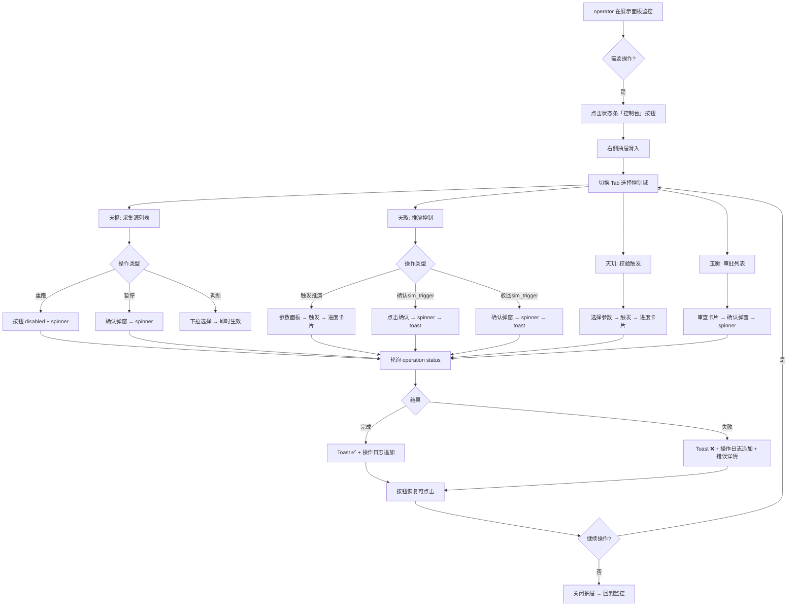

# 开阳控制面板 · 交互概念 PRD

> 版本：v1.0 ｜ 日期：2026-07-31 ｜ 作者：许清楚（产品经理）
> 关联文档：`DESIGN.md`（设计总纲） / `DATA_CONTRACT.md`（数据契约）

---

## 1. 项目信息

| 项 | 值 |
|---|---|
| Language | 中文（无 i18n） |
| Programming Language | React + Vite + TypeScript + Tailwind CSS |
| Project Name | `kaiyang_control_panel` |
| 原始需求 | 为开阳操作面板新增**控制侧 UI**（Wave 1 仅完成展示侧），覆盖天枢/天璇/天玑/玉衡四域操作指令下发，含进度反馈与防重复提交 |

---

## 2. 产品定义

### 2.1 产品目标

1. **操作可达**：operator 在监控展示面板的同时，能快速、无阻塞地触达四域控制操作，不破坏现有监控视野。
2. **反馈可信**：对耗时操作（推演/校验等涉及 LLM 的任务）提供实时进度反馈，消除 operator 的「卡死焦虑」。
3. **操作安全**：通过防重复提交 + 高危确认 + 操作日志，确保每条指令可追溯、不误触。

### 2.2 用户故事

| # | 用户故事 |
|---|---|
| US1 | 作为 operator，我希望在监控 GRV 面板时发现某个 fetcher 数据过期，能**直接在当前界面重跑该 fetcher**，并看到重跑进度，而不需要切换到其他系统。 |
| US2 | 作为 operator，我希望在收到 sim_trigger 告警后，能**在面板内审查触发原因并一键确认或驳回**推演，操作后能看到确认结果。 |
| US3 | 作为 operator，我希望触发推演前能**选择场景、调整关键参数**（如 horizon、agent 数量），点击触发后有明确的进度条，防止我误以为系统卡死而重复点击。 |
| US4 | 作为 operator，我希望所有我发出的操作指令都有**统一的操作日志**可回查，包括时间、操作类型、目标、结果。 |
| US5 | 作为运维 operator，我希望能**批量暂停/恢复采集源**，并在暂停后看到明确的状态标识。 |

---

## 3. 核心设计决策（回答 7 个核心问题）

### Q1：操作入口放哪？ → **右侧可收折控制抽屉（Control Drawer）**

**理由**：
- 现有布局为 12 栅格 3 行面板网格 + 顶部状态条，已饱和。若强行挤入新面板会破坏现有监控视野。
- 左侧边栏不适合——人类阅读习惯从左到右，展示（左）→ 控制（右）符合心智模型。
- 右键菜单不适合——控制操作有参数面板、有列表，远超右键菜单承载能力。
- 浮动命令面板（Ctrl+K）可作**辅助快捷入口**，但不作为主入口。

**交互形态**：
- 顶部状态条右侧新增一个「控制台」toggle 按钮（icon + 文字），点击展开右侧抽屉。
- 抽屉宽度 380px（lg 断点），带玻璃拟态 + 扫描线，与现有面板风格一致。
- 抽屉内部使用 Tab 切换四个控制域（天枢 / 天璇 / 天玑 / 玉衡）。
- 小屏（<lg）抽屉变为全屏 Bottom Sheet。

```
顶部状态条：[开阳 WAVE 1] [综合指数] [GRV时间] [GDELT时间] ... [🔧 控制台] ← 新增
```

### Q2：展示区和控制区怎么分区？ → **覆盖式抽屉，不改变网格**

- 展示区（7 面板网格）**保持原样**，不做任何布局改动。
- 控制抽屉打开时，从右侧滑入，**覆盖**在网格上方（z-index 提升），不影响展示面板渲染。
- 抽屉关闭时，展示区完全等同于当前 Wave 1 界面。
- 这符合扩展标准 #2（面板注册表驱动、不改布局）的精神——控制 UI 不走 panelRegistry，因为它不是「面板」而是「操作台覆盖层」。

### Q3：进度反馈的交互形态？ → **三层反馈体系**

| 层级 | 形态 | 触发场景 |
|---|---|---|
| L1：即时反馈 | 按钮变为 loading spinner + disabled | 任何操作触发后立即生效 |
| L2：过程反馈 | 抽屉内嵌「运行中」卡片，含进度条 + 状态文本 | LLM 耗时操作（推演/校验/fetcher 重跑） |
| L3：终态反馈 | Toast 通知（成功绿/失败红）+ 操作日志追加 | 所有操作完成/失败时 |

**协议层期望**：
- 前端发起操作 → 后端立即返回 `{ operation_id, status: "accepted" }`
- 前端用 `operation_id` 轮询 `GET /api/v1/operations/{operation_id}/status`，返回 `{ status: "running"|"completed"|"failed", progress: 0-100, message }`
- 协议选型建议：**轮询**作为 Wave 2 首选（实现简单、无连接管理负担）；SSE/WebSocket 留待 Wave 3 优化。

### Q4：防双击的实现策略？ → **Button disabled + 幂等 token**

- 每个操作按钮点击后立即 `disabled + spinner`，直到收到 `accepted` 或 `error` 响应。
- 每个操作请求体携带 `idempotency_key`（前端生成的 UUID v4），后端以此去重。
- 全局操作锁**不采用**——不同域的操作应可并行（如同跑一个 fetcher 重跑 + 推演触发），不需要互相阻塞。
- 抽屉级别锁：同一操作域内同一类型操作不可重复提交（如同一个 fetcher 不能同时发两个重跑）。

### Q5：每个操作域的交互原型

#### 天枢（macro-scan · 观测层运维）

```
┌─ 天枢 · 采集源管理 ──────────────────────────┐
│ 🔍 搜索 fetcher...                    [批量重跑] │
│                                                │
│ ┌─ fetcher: gdelt_v1 ──────────────────────┐  │
│ │ ● 运行中  · 频率: 3600s  · 上次: 12分钟前  │  │
│ │ [重跑] [暂停] [频率 ⏷]                    │  │
│ └──────────────────────────────────────────┘  │
│ ┌─ fetcher: fred_v1 ───────────────────────┐  │
│ │ ● 运行中  · 频率: 86400s · 上次: 3小时前   │  │
│ │ [重跑] [暂停] [频率 ⏷]                    │  │
│ └──────────────────────────────────────────┘  │
│ ┌─ fetcher: news_v1 ───────────────────────┐  │
│ │ ◐ 暂停中  · 频率: 1800s  · 上次: 2天前    │  │
│ │ [重跑] [恢复] [频率 ⏷]                    │  │
│ └──────────────────────────────────────────┘  │
└────────────────────────────────────────────────┘
```

- **交互形式**：卡片列表，每个 fetcher 一张卡片，显示状态指示灯(●/◐/○) + 元信息 + 操作按钮组。
- **重跑**：点击后按钮变 spinner，完成后 toast；支持多选批量重跑（勾选框 + 顶部批量按钮）。
- **暂停/恢复**：toggle 按钮，暂停需确认弹窗（「确定暂停 xxx？暂停后该采集源将停止更新」）。
- **调整频率**：下拉选择（预设：1h/6h/12h/24h/自定义），选择后即时生效 toast。

#### 天璇（macro-sim · 推演层）

```
┌─ 天璇 · 推演控制 ────────────────────────────┐
│                                                │
│ 当前场景：[基准场景 v2.3 ⏷]                    │
│                                                │
│ ┌─ 推演参数 ─────────────────────────────────┐ │
│ │ horizon:     [====○========] 12 步          │ │
│ │ agent_count: [========○====] 8              │ │
│ │ temperature: [===○===========] 0.7          │ │
│ │ seed:        [42          ] [🎲 随机]       │ │
│ └────────────────────────────────────────────┘ │
│                                                │
│ [▶ 触发推演]  ← 主按钮，点击后展开进度卡片     │
│                                                │
│ ┌─ sim_trigger 待处理 ──────────────────────┐  │
│ │ ⚠ 2026-07-31 14:22                        │  │
│ │ 中美战略竞争指数突破阈值 (82.3 → 91.7)      │  │
│ │ level: HIGH                                │  │
│ │ [✓ 确认触发]  [✗ 驳回]                     │  │
│ └────────────────────────────────────────────┘  │
└────────────────────────────────────────────────┘
```

- **触发推演**：参数面板（slider + 数值输入）+ 一键触发按钮。点击后展开内嵌进度卡片。
- **切换场景**：下拉选择，切换后参数面板同步刷新默认值。
- **调整参数**：slider 拖动，实时预览但不提交；点击「触发推演」时一并发送。
- **sim_trigger 审批**：卡片列表（可能有多个待处理），每条显示触发原因 + 等级 + 时间，一键确认/驳回。确认后按钮变 spinner 等待后端 ACK。

#### 天玑（校验层）

```
┌─ 天玑 · 校验 ────────────────────────────────┐
│                                                │
│ 校验目标：[最近一次推演结果 ⏷]                  │
│ 校验范围：[全部维度 ⏷]                         │
│                                                │
│ [▶ 运行校验]                                   │
│                                                │
│ ┌─ 最近校验记录 ─────────────────────────────┐ │
│ │ 2026-07-31 10:15  · ✅ 通过 · 耗时 47s      │ │
│ │ 2026-07-30 22:08  · ❌ 未通过 · 耗时 89s    │ │
│ └────────────────────────────────────────────┘  │
└────────────────────────────────────────────────┘
```

- **触发校验**：简单的目标 + 范围选择 → 一键触发 → 进度卡片。
- **历史记录**：最近 5 条校验记录，含通过/未通过状态和耗时。

#### 玉衡（审批层）

```
┌─ 玉衡 · 权重矩阵审批 ─────────────────────────┐
│                                                │
│ ┌─ 待审批 #1 ────────────────────────────────┐ │
│ │ 变更类型：权重矩阵更新                       │ │
│ │ 提交人：天璇 auto-tune · 2026-07-31 09:00   │ │
│ │ 变更摘要：地缘政治权重 +5%, 经济权重 -3%     │ │
│ │ [查看详情]  [✓ 批准]  [✗ 驳回]              │ │
│ └────────────────────────────────────────────┘  │
│                                                │
│ ┌─ 已批准 #0 ────────────────────────────────┐ │
│ │ 权重矩阵更新 · 批准人：operator-张 ·        │ │
│ │ 2026-07-28 · ✅ 已生效                      │ │
│ └────────────────────────────────────────────┘  │
└────────────────────────────────────────────────┘
```

- **审批卡片**：pending 列表在上，每张卡片含变更摘要 + 查看详情（展开 diff）+ 批准/驳回按钮。
- **批准/驳回**：需填写审批意见（可选），点击后二次确认弹窗，之后 spinner。

### Q6：操作安全性？

| 安全措施 | 适用场景 | 实现方式 |
|---|---|---|
| **高危确认弹窗** | 暂停采集源、驳回 sim_trigger、批量操作 | Modal 弹窗，需显式点击确认，不可回车误触 |
| **二次确认** | 批准/驳回审批 | 弹窗 + 可选审批意见输入 |
| **操作日志** | 所有操作 | 不可篡改的前端日志（存 localStorage + 抽屉内可查看） |
| **权限预留** | 未来分级 | UI 层面预留 `disabled + tooltip「无权限」` 状态，按钮不隐藏仅置灰，让 operator 知晓功能存在 |

### Q7：操作历史和状态追踪？

```
┌─ 操作日志 ────────────────────────────────────┐
│ 2026-07-31 14:25  ✅ 重跑 fetcher gdelt_v1     │
│ 2026-07-31 14:23  ✅ 确认 sim_trigger #42       │
│ 2026-07-31 14:20  ❌ 触发推演 失败：超时       │
│ 2026-07-31 14:15  ✅ 暂停 fetcher news_v1       │
│ ...                                            │
│                              [清空日志] [导出]  │
└────────────────────────────────────────────────┘
```

- 操作日志作为控制抽屉的**第四个固定 Tab**（天枢/天璇/天玑/玉衡 + 日志）。
- 每条日志：时间戳 + 状态图标 + 操作描述 + 操作域标签。
- 存储：前端 localStorage（50 条滚动上限），后续 Wave 可接入后端审计日志。
- 失败条目可点击展开错误详情。

---

## 4. 整体交互流程



---

## 5. 需求池（P0/P1/P2）

### P0 — 必须实现（Wave 2 交付底线）

| ID | 需求 | 描述 |
|---|---|---|
| P0-1 | 右侧控制抽屉框架 | 可收折抽屉 + 四域 Tab 切换 + 玻璃拟态风格 |
| P0-2 | 天璇：触发推演 | 场景选择 + 参数面板 + 触发按钮 + 进度卡片 |
| P0-3 | 天璇：sim_trigger 确认/驳回 | 待处理卡片列表 + 一键确认/驳回 |
| P0-4 | 防重复提交机制 | button disabled + loading spinner + idempotency_key |
| P0-5 | 进度反馈 | 操作发起后轮询 status + 进度条 + toast 终态通知 |
| P0-6 | 操作日志 | 所有操作记录追加到日志 Tab，localStorage 持久化 |

### P1 — 应该实现（Wave 2 完整交付）

| ID | 需求 | 描述 |
|---|---|---|
| P1-1 | 天枢：fetcher 卡片列表 + 重跑 | 展示所有 fetcher 状态，支持单个/批量重跑 |
| P1-2 | 天枢：暂停/恢复采集源 | toggle 按钮 + 确认弹窗 |
| P1-3 | 天枢：调整采集频率 | 下拉选择预设频率 |
| P1-4 | 天玑：触发校验 | 目标/范围选择 + 触发 + 进度 + 最近记录 |
| P1-5 | 高危操作确认弹窗 | 暂停、驳回、批量操作二次确认 |
| P1-6 | 操作日志导出 | JSON 导出操作日志 |

### P2 — 可以延后（Wave 3+）

| ID | 需求 | 描述 |
|---|---|---|
| P2-1 | 玉衡：权重矩阵审批 | 审批卡片列表 + 批准/驳回 + 意见填写 |
| P2-2 | 权限分级 UI 预留 | 按钮置灰 + tooltip「无权限」 |
| P2-3 | 浮动命令面板（Ctrl+K） | 快捷搜索操作入口 |
| P2-4 | SSE/WebSocket 实时进度 | 替代轮询，减少请求数 |
| P2-5 | 批量操作进度聚合 | 多 fetcher 重跑的聚合进度视图 |
| P2-6 | 操作撤销 | 部分操作（如暂停）支持一键撤销 |

---

## 6. 协议接口形状清单

> 以下为前端期望的接口形状。端点 / 鉴权 / 权限分级由后端闭环确定，此处仅定义**交互所需的请求-响应结构**。

### 6.1 通用

#### 轮询操作状态

```
GET /api/v1/operations/{operation_id}/status

Response 200:
{
  "operation_id": "op_abc123",
  "type": "fetcher_rerun | simulation_trigger | verification_run | ...",
  "status": "accepted | running | completed | failed",
  "progress": 0-100,          // 0-100, running 时递增
  "progress_message": "正在加载 GDELT 数据...",  // 人类可读
  "result": { ... } | null,   // completed 时填充
  "error": { "code": "...", "message": "..." } | null,
  "created_at": "ISO8601",
  "completed_at": "ISO8601" | null
}
```

### 6.2 天枢（macro-scan · 观测层运维）

#### 获取 fetcher 列表

```
GET /api/v1/tianshu/fetchers

Response 200:
{
  "fetchers": [
    {
      "id": "gdelt_v1",
      "name": "GDELT 采集器",
      "status": "running | paused | error",
      "interval_seconds": 3600,
      "last_run_at": "ISO8601" | null,
      "last_status": "success | failed | null",
      "description": "..."
    }
  ]
}
```

#### 重跑 fetcher

```
POST /api/v1/tianshu/fetchers/rerun
Body:
{
  "fetcher_ids": ["gdelt_v1", "fred_v1"],  // 单个或批量
  "idempotency_key": "uuid-v4"
}

Response 202:
{
  "operation_id": "op_abc123",
  "status": "accepted",
  "affected_fetchers": ["gdelt_v1", "fred_v1"]
}
```

#### 暂停/恢复 fetcher

```
POST /api/v1/tianshu/fetchers/{fetcher_id}/pause
POST /api/v1/tianshu/fetchers/{fetcher_id}/resume
Body:
{
  "idempotency_key": "uuid-v4"
}

Response 200:
{
  "fetcher_id": "gdelt_v1",
  "status": "paused | running",
  "updated_at": "ISO8601"
}
```

#### 调整采集频率

```
PUT /api/v1/tianshu/fetchers/{fetcher_id}/config
Body:
{
  "interval_seconds": 7200,
  "idempotency_key": "uuid-v4"
}

Response 200:
{
  "fetcher_id": "gdelt_v1",
  "interval_seconds": 7200,
  "updated_at": "ISO8601"
}
```

### 6.3 天璇（macro-sim · 推演层）

#### 获取场景列表

```
GET /api/v1/tianxuan/scenarios

Response 200:
{
  "scenarios": [
    {
      "id": "baseline_v2.3",
      "name": "基准场景 v2.3",
      "description": "...",
      "is_active": true,
      "default_parameters": {
        "horizon": 12,
        "agent_count": 8,
        "temperature": 0.7,
        "seed": null
      }
    }
  ]
}
```

#### 触发推演

```
POST /api/v1/tianxuan/simulations
Body:
{
  "scenario_id": "baseline_v2.3",
  "parameters": {
    "horizon": 12,
    "agent_count": 8,
    "temperature": 0.7,
    "seed": 42
  },
  "idempotency_key": "uuid-v4"
}

Response 202:
{
  "operation_id": "op_def456",
  "simulation_id": "sim_789",
  "status": "accepted"
}
```

#### 获取 sim_trigger 列表

```
GET /api/v1/tianxuan/triggers?status=pending

Response 200:
{
  "triggers": [
    {
      "id": "trig_42",
      "triggered_at": "ISO8601",
      "level": "HIGH | MEDIUM | LOW",
      "reason": "中美战略竞争指数突破阈值",
      "metrics": { "...": "..." },
      "status": "pending"
    }
  ]
}
```

#### 确认/驳回 sim_trigger

```
POST /api/v1/tianxuan/triggers/{trigger_id}/confirm
POST /api/v1/tianxuan/triggers/{trigger_id}/reject
Body:
{
  "operator_note": "手动确认，符合预期",  // 可选
  "idempotency_key": "uuid-v4"
}

Response 200:
{
  "trigger_id": "trig_42",
  "status": "confirmed | rejected",
  "updated_at": "ISO8601"
}
```

### 6.4 天玑（校验层）

#### 触发校验

```
POST /api/v1/tianji/verifications
Body:
{
  "target": "latest_simulation | simulation_id",
  "target_id": "sim_789" | null,  // target=simulation_id 时必填
  "scope": "all | dimensions[]",
  "idempotency_key": "uuid-v4"
}

Response 202:
{
  "operation_id": "op_ghi789",
  "verification_id": "ver_012",
  "status": "accepted"
}
```

#### 获取最近校验记录

```
GET /api/v1/tianji/verifications?limit=5

Response 200:
{
  "verifications": [
    {
      "id": "ver_012",
      "target": "sim_789",
      "status": "passed | failed",
      "duration_seconds": 47,
      "created_at": "ISO8601",
      "summary": "..."
    }
  ]
}
```

### 6.5 玉衡（审批层）

#### 获取审批列表

```
GET /api/v1/yuheng/approvals?status=pending

Response 200:
{
  "approvals": [
    {
      "id": "appr_001",
      "type": "weight_matrix_update",
      "submitter": "天璇 auto-tune",
      "submitted_at": "ISO8601",
      "summary": "地缘政治权重 +5%, 经济权重 -3%",
      "detail": { "before": {...}, "after": {...} },
      "status": "pending"
    }
  ]
}
```

#### 批准/驳回审批

```
POST /api/v1/yuheng/approvals/{approval_id}/approve
POST /api/v1/yuheng/approvals/{approval_id}/reject
Body:
{
  "comment": "同意变更",  // 可选
  "idempotency_key": "uuid-v4"
}

Response 200:
{
  "approval_id": "appr_001",
  "status": "approved | rejected",
  "operator": "operator-张",  // 由后端从鉴权中获取
  "updated_at": "ISO8601"
}
```

---

## 7. UI 集成要点

### 7.1 与现有系统的衔接点

| 衔接点 | 改动 |
|---|---|
| `App.tsx` | 新增 `<ControlDrawer>` 组件，与 `<StatusBar>` 同级 |
| `StatusBar.tsx` | 新增「控制台」toggle 按钮（最右侧） |
| `index.css` | 新增抽屉滑入/滑出动画（`slide-in-right` / `slide-out-right`） |
| `src/state/` | 新增 `OperationContext`（操作日志 + 进行中操作状态管理） |
| 新增目录 | `src/control/`（ControlDrawer / tabs / OperationLog / hooks/useOperation） |

### 7.2 视觉一致性约束

- 抽屉面板复用现有 `.glass-panel` + `.scanlines` 类
- 按钮复用 `.chip` 样式，active 态使用 `--ky-cyan` / `--ky-teal`
- 进度条颜色：`--ky-cyan`（进行中）/ `--ky-teal`（完成）/ `--ky-red`（失败）
- 所有文字中文，字号与现有面板一致（`text-xs` 为主，标题 `text-sm`）

---

## 8. 待确认问题

| # | 问题 | 影响范围 |
|---|---|---|
| Q1 | 后端控制通道的**鉴权方式**是什么？（Cookie/Session? Bearer Token? API Key?）——影响前端如何携带凭证 | 所有 fetch 请求的 headers |
| Q2 | 控制 API 与展示数据是否**同域同端口**？还是控制 API 另有 Base URL？ | fetch base URL 配置 |
| Q3 | fetcher 列表是**静态配置**还是需要动态发现接口？如果 fetcher 可动态增删，前端需适配 | 天枢 Tab 数据源 |
| Q4 | 推演参数的**合法范围**由前端硬编码还是后端返回？（如 horizon 1-24, agent_count 1-16） | 天璇参数面板的 slider min/max |
| Q5 | sim_trigger 是一次性消费还是可反复确认？（确认后是否从列表消失?） | 天璇 trigger 列表刷新逻辑 |
| Q6 | 操作日志是否需要**服务端持久化**（审计合规需求）？当前方案仅前端 localStorage | Wave 3 架构 |
| Q7 | 权限分级何时落地？若 Wave 2 不做，P2-2 的 UI 预留是否保留？ | 按钮 disabled 态实现 |
