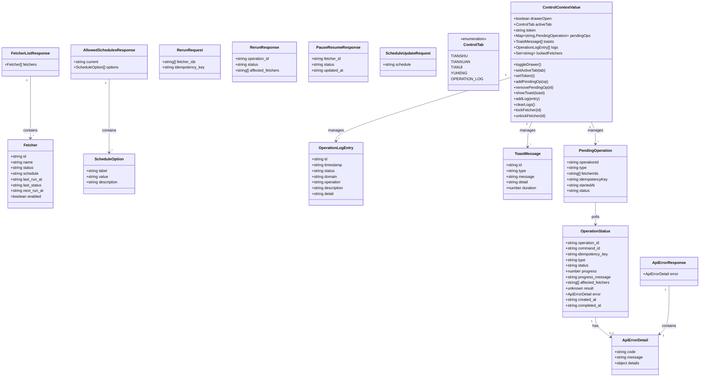
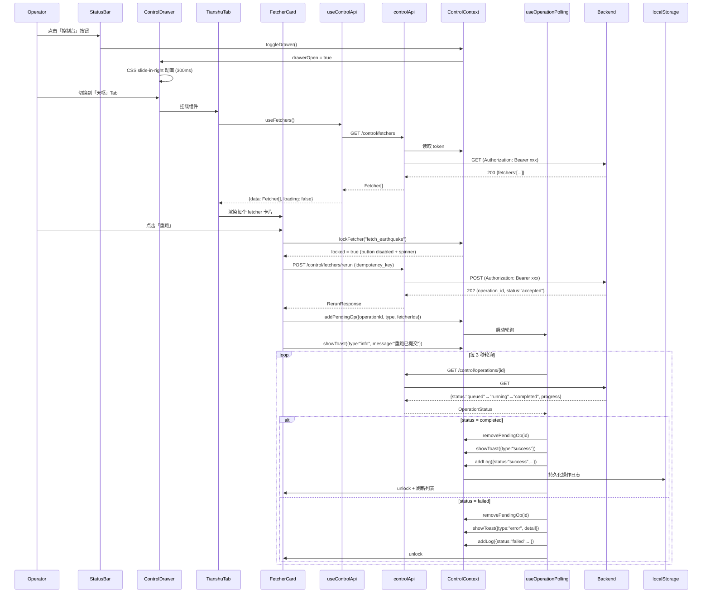
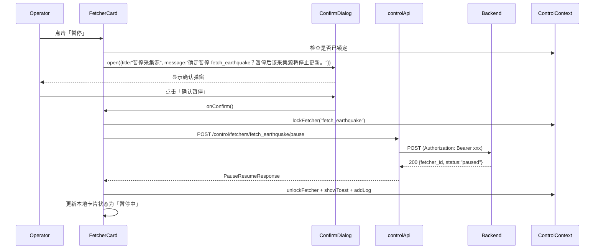
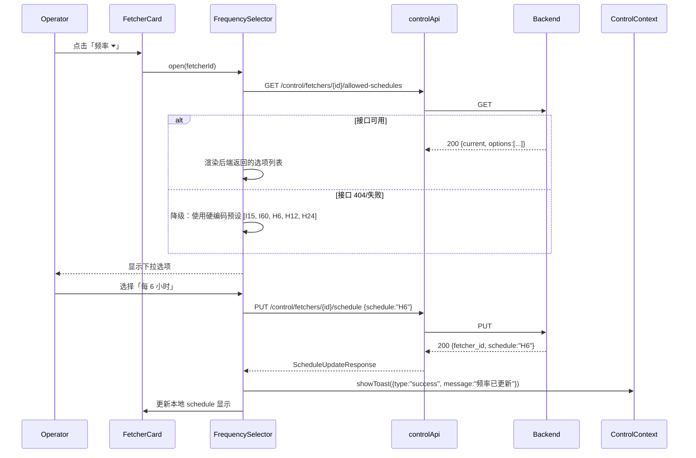
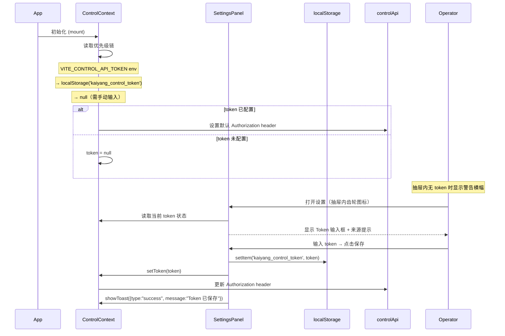
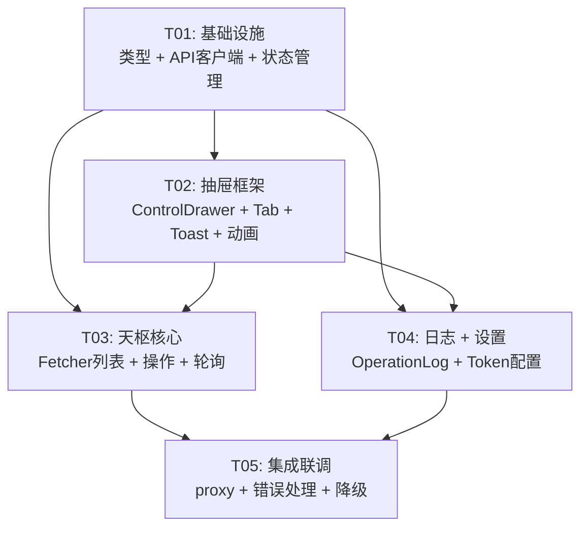

# 开阳控制面板 · 天枢控制 Tab · 系统设计

> 架构师：高见远（Bob）｜ 日期：2026-08-01
> 关联文档：PRD_CONTROL_PANEL.md / 后端接口需求-回复.md / DESIGN.md / DATA_CONTRACT.md

---

## Part A: 系统设计

### 1. 实现方案

#### 1.1 核心技术难点

| 难点 | 分析 | 方案 |
|------|------|------|
| **抽屉覆盖层** | 右侧 380px 玻璃拟态抽屉，需覆盖在现有 12 栅格网格上方，不可破坏现有布局 | z-index 提升 + `fixed` 定位 + CSS transition 滑入/滑出动画。抽屉不走 `panelRegistry`，作为独立覆盖层渲染在 `<App>` 根级别 |
| **操作状态机** | 五种状态流转：idle → loading → polling(accepted→queued→running→completed/failed) → toast | React Context + `useReducer` 管理全局操作锁（per-fetcher）+ `useOperationPolling` hook 处理轮询生命周期 |
| **Token 鉴权** | Bearer Token 需要配置入口，支持 env / localStorage / 手动输入三种来源 | 优先级链：`VITE_CONTROL_API_TOKEN` → `localStorage('kaiyang_control_token')` → 设置面板手动输入。API 客户端统一从 `ControlContext` 取 token 注入 Authorization header |
| **优雅降级** | 4 个补充端点（health/history/scheduler-status/allowed-schedules）可能未就绪 | 每个端点独立 `try/catch`，失败时 UI 降级（如频率选择器降级为文本显示、历史记录显示"暂不可用"），不阻塞主流程 |
| **防重复提交** | 按钮 disabled + idempotency_key(UUID v4) | 使用 `crypto.randomUUID()`（浏览器原生，无需额外依赖）。同一 fetcher 的操作锁由 `ControlContext` 的 `lockedFetchers: Set<string>` 管理 |
| **操作日志持久化** | 前端 localStorage，50 条滚动上限 | `src/lib/operationLog.ts` 封装读写，JSON 序列化存储，超限自动裁剪最早条目 |

#### 1.2 框架与库选型

| 类别 | 选型 | 理由 |
|------|------|------|
| UUID 生成 | `crypto.randomUUID()` | 浏览器原生 API，Chrome 92+/Firefox 95+/Safari 15.4+ 全支持，无需引入 `uuid` 包 |
| Toast 通知 | 自研 `<Toast />` 组件 | 轻量（~60 行）、与现有玻璃拟态风格一致、无额外依赖。放在 `src/control/Toast.tsx`，通过 Context 驱动 |
| HTTP 客户端 | 原生 `fetch` | 与现有 `readLayer.ts` 一致，保持零 HTTP 库依赖。封装在 `src/lib/controlApi.ts` |
| 状态管理 | React Context + useReducer | 与现有 `StatusContext` 模式一致，不引入 Redux/Zustand |
| 图标 | 内联 SVG / Unicode 符号 | 与现有代码风格一致（StatusBar 使用 ⚠ 等 Unicode），不引入图标库 |

**结论：本期不新增任何 npm 依赖。**

#### 1.3 架构模式

```
src/control/          ← 控制面板 UI 层（组件）
src/state/            ← 控制面板状态层（ControlContext）
src/hooks/            ← 控制面板数据层（useControlApi / useOperationPolling）
src/lib/              ← 控制面板工具层（controlApi / operationLog）
src/config/           ← 控制面板配置层（controlConfig）
src/types/            ← 控制面板类型层（control.ts）
```

遵循现有项目的分层惯例：配置 → 类型 → 工具 → 状态 → 钩子 → 组件。

---

### 2. 文件列表

> 根目录：`C:\Users\luoxi\WorkBuddy\世界推演系统\世界推演系统开阳\kaiyang-wave1\`
> 注：基础项目文件（package.json / vite.config.ts / tsconfig.json / tailwind.config.js / postcss.config.js / index.html / src/main.tsx / src/App.tsx / src/index.css / src/components/* / src/panels/* / src/config/* / src/hooks/* / src/lib/* / src/state/* / src/types/* / public/*）需从 `kaiyang-wave1.deleted-20260731` 复制。以下仅列出控制面板**新增**和**修改**的文件。

#### 新增文件（17 个）

```
src/types/control.ts                 # 控制面板所有 TypeScript 类型定义
src/config/controlConfig.ts          # API Base URL、默认配置、频率预设
src/lib/controlApi.ts                # 控制 API 客户端（fetch 封装 + auth + 错误处理）
src/lib/operationLog.ts              # 操作日志 localStorage 读写
src/state/ControlContext.tsx          # 控制面板全局状态（抽屉/Token/锁/Toast/日志）
src/hooks/useControlApi.ts           # 数据获取 hooks（useFetchers / useOperationStatus 等）
src/hooks/useOperationPolling.ts     # 操作状态轮询 hook
src/control/ControlDrawer.tsx         # 抽屉容器（滑入/滑出动画 + 玻璃拟态）
src/control/TabBar.tsx               # Tab 导航栏（天枢/天璇/天玑/玉衡/操作日志）
src/control/TianshuTab.tsx           # 天枢 Tab：fetcher 列表 + 搜索 + 批量操作
src/control/FetcherCard.tsx          # 单个 fetcher 卡片（状态灯 + 元信息 + 操作按钮组）
src/control/FrequencySelector.tsx    # 频率选择下拉（动态拉取 allowed-schedules）
src/control/ProgressCard.tsx         # 内嵌进度卡片（操作进行中状态展示）
src/control/OperationLogTab.tsx      # 操作日志 Tab（列表 + 清空 + 导出）
src/control/PlaceholderTab.tsx       # 建设中占位 Tab（天璇/天玑/玉衡共用）
src/control/Toast.tsx                # Toast 通知容器 + 单条 Toast
src/control/ConfirmDialog.tsx        # 高危操作确认弹窗
```

#### 修改文件（5 个）

```
src/App.tsx                          # 包裹 ControlProvider + 渲染 ControlDrawer
src/components/StatusBar.tsx         # 右侧新增「控制台」toggle 按钮
src/index.css                        # 新增抽屉动画 + toast 动画 + 控制面板样式
src/main.tsx                         # 无需改动（ControlProvider 在 App.tsx 内）
vite.config.ts                       # 新增开发代理（可选，/api/v1/control → :8900）
```

---

### 3. 数据结构和接口

#### 3.1 TypeScript 类型定义（classDiagram）



#### 3.2 关键 API 端点映射

| 端点 | 方法 | 请求体 | 响应体 | 降级策略 |
|------|------|--------|--------|----------|
| `/control/fetchers` | GET | — | `FetcherListResponse` | 不降级（P0） |
| `/control/fetchers/rerun` | POST | `RerunRequest` | `RerunResponse` (202) | 不降级（P0） |
| `/control/fetchers/{id}/pause` | POST | `{idempotency_key}` | `PauseResumeResponse` | 不降级（P0） |
| `/control/fetchers/{id}/resume` | POST | `{idempotency_key}` | `PauseResumeResponse` | 不降级（P0） |
| `/control/fetchers/{id}/schedule` | PUT | `ScheduleUpdateRequest` | `PauseResumeResponse` | 不降级（P0） |
| `/control/operations/{id}` | GET | — | `OperationStatus` | 不降级（P0） |
| `/control/health` | GET | — | `{status:"ok"}` | 接口 404→显示"API 离线"指示器 |
| `/control/fetchers/{id}/history` | GET | — | `{runs:[...]}` | 接口 404→FetcherCard 隐藏"历史"入口 |
| `/control/fetchers/{id}/allowed-schedules` | GET | — | `AllowedSchedulesResponse` | 接口 404→降级为硬编码预设列表 |
| `/control/scheduler/status` | GET | — | `{...}` | 接口 404→不显示调度器状态区 |

---

### 4. 程序调用流程

#### 4.1 打开抽屉 → 加载天枢列表 → 重跑 fetcher → 轮询 → 完成



#### 4.2 暂停 fetcher（高危确认流）



#### 4.3 调整采集频率



#### 4.4 Token 配置流程



---

### 5. 待明确事项

| # | 事项 | 影响范围 | 当前假设 |
|---|------|----------|----------|
| 1 | 控制 API 的 CORS 配置何时就绪？ | 前端开发期需要 vite proxy 或浏览器 CORS 插件 | 开发期使用 `vite.config.ts` proxy 代理 `/api/v1/control` → `http://<nas-ip>:8900`；生产环境依赖后端 CORS 中间件 |
| 2 | `GET /control/fetchers` 返回的 `status` 字段精确值是什么？ | FetcherCard 状态指示灯颜色映射 | 假设 `running` / `paused` / `error` 三种。若后端返回其他值（如 `unknown`），前端统一映射为 `error` |
| 3 | `allowed-schedules` 端点不可用时，硬编码预设列表应该含哪些值？ | FrequencySelector 降级行为 | 预设：`I15`(每15分钟)、`I60`(每小时)、`H6`(每6小时)、`H12`(每12小时)、`H24`(每天)。这些值与后端调度表达式格式对齐 |
| 4 | 操作日志是否需要区分「操作员」身份？ | OperationLogEntry 字段设计 | 本期不做身份区分。若后续有登录系统，在 `detail` 字段中补充 operator 信息 |
| 5 | 抽屉在小屏（<lg）是否需要全屏 Bottom Sheet 样式？ | ControlDrawer 响应式实现 | PRD 提及但本期仅实现右侧抽屉；小屏适配留待后续迭代 |

---

## Part B: 任务分解

### 6. 所需依赖包

**本期不新增任何 npm 依赖。** 所有功能使用浏览器原生 API 和现有依赖实现：

- UUID 生成：`crypto.randomUUID()`（浏览器原生，Chrome 92+ / Firefox 95+ / Safari 15.4+）
- HTTP 请求：原生 `fetch`（与现有 `readLayer.ts` 一致）
- Toast 动画：CSS `@keyframes`（与现有 `pulseSoft` / `glowPulse` 模式一致）
- 状态管理：React 18 `createContext` + `useReducer`（与现有 `StatusContext` 模式一致）

现有依赖已覆盖：
```
- react@^18.3.1: UI 框架
- react-dom@^18.3.1: DOM 渲染
- echarts@^5.5.1: 图表（现有展示面板使用）
- globe.gl@^2.46.1: 3D 地球（现有展示面板使用）
- tailwindcss@^3.4.10: 样式框架
```

---

### 7. 任务列表

| 任务 ID | 任务名称 | 源文件 | 依赖 | 优先级 |
|---------|----------|--------|------|--------|
| **T01** | **项目基础设施 + 类型 + API 客户端 + 状态管理** | `src/types/control.ts`, `src/config/controlConfig.ts`, `src/lib/controlApi.ts`, `src/lib/operationLog.ts`, `src/state/ControlContext.tsx`, `package.json` | 无 | P0 |
| **T02** | **控制抽屉框架 + Tab 导航 + Toast + 确认弹窗 + CSS 动画** | `src/control/ControlDrawer.tsx`, `src/control/TabBar.tsx`, `src/control/Toast.tsx`, `src/control/ConfirmDialog.tsx`, `src/control/PlaceholderTab.tsx`, `src/index.css`, `src/components/StatusBar.tsx`, `src/App.tsx` | T01 | P0 |
| **T03** | **天枢 Tab 核心：Fetcher 列表 + 操作交互 + 轮询** | `src/control/TianshuTab.tsx`, `src/control/FetcherCard.tsx`, `src/control/ProgressCard.tsx`, `src/control/FrequencySelector.tsx`, `src/hooks/useControlApi.ts`, `src/hooks/useOperationPolling.ts` | T01, T02 | P0 |
| **T04** | **操作日志 Tab + Token 设置面板** | `src/control/OperationLogTab.tsx`, `src/control/SettingsPanel.tsx` | T01, T02 | P1 |
| **T05** | **集成联调 + 错误处理 + 优雅降级 + 边缘场景** | `vite.config.ts`（proxy 配置），各组件错误边界、降级逻辑 | T01, T02, T03, T04 | P1 |

---

### 8. 共享知识（跨文件约定）

#### 8.1 Token 管理

```
优先级链：VITE_CONTROL_API_TOKEN (构建时 env) → localStorage('kaiyang_control_token') → null
- Token 存在但 API 返回 401 → Toast "Token 无效，请重新配置" + 清空存储的 Token
- Token 未配置 → 抽屉内天枢 Tab 顶部显示黄色警告横幅：「⚠ 未配置 API Token，请点击⚙设置」
- Token 保存后立即生效，无需刷新页面
```

#### 8.2 API 调用封装

```
所有控制 API 调用统一走 src/lib/controlApi.ts：
- 自动拼接 BASE_URL 前缀（默认 http://<nas-ip>:8900/api/v1/control/）
- 自动注入 Authorization: Bearer <token> header
- 统一错误处理：非 2xx 响应解析为 ApiErrorResponse 并 throw
- 统一超时：30s（AbortController）
- 4 个补充端点（health/history/scheduler-status/allowed-schedules）：404 时返回 null 而非抛错
```

#### 8.3 操作状态机

```
IDLE → (用户点击) → LOADING（按钮 disabled + spinner）
LOADING → (收到 202) → POLLING（启动 3s 间隔轮询）
POLLING → (completed) → SUCCESS（toast ✅ + unlock + 刷新列表 + 写日志）
POLLING → (failed) → FAILED（toast ❌ + unlock + 写日志）
POLLING → (30 次轮询无终态) → TIMEOUT（toast ⚠ + unlock + 写日志）

状态流转由 ControlContext 的 pendingOps Map 管理。
每个 fetcher 同一时间只能有一个进行中的操作（lockedFetchers Set 去重）。
```

#### 8.4 操作日志格式

```typescript
interface OperationLogEntry {
  id: string;           // crypto.randomUUID()
  timestamp: string;    // new Date().toISOString()
  status: 'success' | 'failed' | 'pending';
  domain: 'tianshu';    // 当前仅天枢，预留扩展
  operation: string;    // e.g., '重跑', '暂停', '恢复', '调频'
  description: string;  // e.g., '重跑 fetcher fetch_earthquake'
  detail?: string;      // 失败时存放错误信息
}

存储：localStorage key = 'kaiyang_operation_logs'
上限：50 条（超过则 shift 最早条目）
```

#### 8.5 CSS 动画约定

```
- 抽屉滑入：@keyframes slide-in-right { from{transform:translateX(100%)} to{transform:translateX(0)} }
- 抽屉滑出：@keyframes slide-out-right { from{transform:translateX(0)} to{transform:translateX(100%)} }
- Toast 进入：@keyframes toast-in { from{opacity:0;transform:translateY(-8px)} to{opacity:1;transform:translateY(0)} }
- Toast 退出：@keyframes toast-out { from{opacity:1} to{opacity:0} }
- 状态指示灯呼吸：复用现有 .animate-pulseSoft
```

#### 8.6 视觉一致性约束

```
- 抽屉：复用 .glass .scanlines 类，宽度 380px
- 卡片：复用 .panel-card 样式
- 按钮：复用 .chip 样式，active 态使用 --ky-cyan
- 进度条：--ky-cyan（进行中）/ --ky-teal（完成）/ --ky-red（失败）
- 状态灯：● running → #5eead4（青绿）, ◐ paused → #fbbf24（琥珀）, ○ error → #f87171（红）
- 全部中文文案，字号 text-xs（11px）为主，标题 text-sm
```

#### 8.7 BASE_URL 配置

```
控制 API Base URL 默认值：'http://localhost:8900/api/v1/control/'
可覆盖：
- 构建时：VITE_CONTROL_API_BASE_URL env
- 运行时：localStorage('kaiyang_control_api_base_url')
优先级：localStorage > env > 默认值
```

---

### 9. 任务依赖图



---

> 设计完成。本方案严格遵循后端回复的接口形状和协议约定，复用现有项目的玻璃拟态视觉体系和技术栈约定，不引入任何新依赖。
