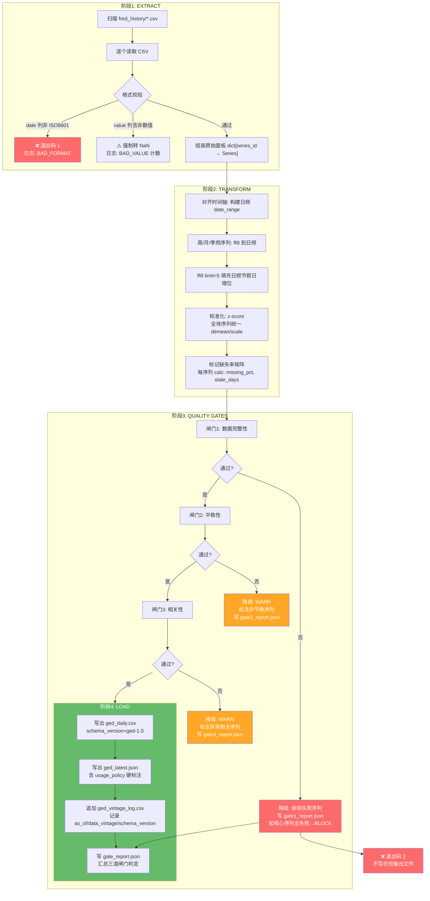
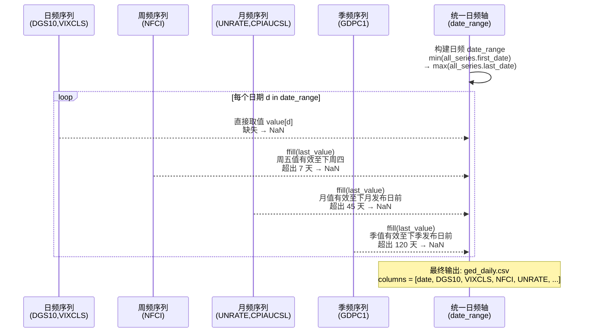

# GED（全球经济数据库）ETL 管道设计（A2）

> 版本：v0.1（设计稿，未实现）
> 作者：Alex / Kou（world-sim 工程师，eng-a2-v2）
> 日期：2026-07-31
> 关联文档：`worldsim-review-synthesis.md` §7.5 GED 接入、§7.3 FCI 设计、`STATUS.md` §A2 条目
> 交付约束：**只设计，不写代码，不部署 NAS**。

---

## §1 概述与范围

### 1.1 定位

GED ETL 管道是 Sprint-0 止血线的 **C 流（方法学与验证流）组件**，在实施上纳入 Sprint-0 独立交付。其职责是从 `fred_history/` 目录读取 FRED 原始序列 CSV，经清洗、对齐、聚合后，输出标准化的 GED 中间数据集，供 probit（L3 衰退概率）和 FCI（L1 金融条件指数）等模型直接消费。

### 1.2 核心设计原则

| 原则 | 说明 |
|------|------|
| **只读落盘 CSV，禁直连 FRED** | 复现 FCI 已验证模式：不新增网络调用，不引入 FRED API 依赖 |
| **纯新文件，零侵入** | 不修改任何现有 fetcher / scheduler / compute_fci.py，新增模块自包含 |
| **三闸门 fail-loud** | 每道闸门失败均有明确降级策略和结构化日志，禁静默吞错 |
| **vintage 可追溯** | 输出带 `as_of` / `data_vintage` / `schema_version`，append-only 版本日志 |
| **日频核心，补月/周频对齐** | 主输出为日频 CSV，内部处理不同频率的对齐逻辑 |

### 1.3 明确排除项

> ⚠️ **Brier 校准已砍**：经 2026-07-31 四角评审裁决，移出本 Sprint。理由：
> 1. 当前无 `predictions` 表（天璇 0%），无校准目标；
> 2. `BAMLH0A0HYM2` 仅 837 行，burn-in 504 后有效样本不足，先算功效再定阈值；
> 3. GED 年度冻结快照（1989–2025），不能当日更实时信号使用。
>
> 本设计 **不含 Brier 校准、模型评估、回测验证章节**。

此外明确排除：
- 不实现新的数据采集器（fetcher）
- 不修改 `scheduler.py`（调度注册在单独的任务卡）
- 不实现 probit 计算逻辑（属 A1 任务）
- 不实现 FCI PCA 计算逻辑（已完成，fci-1.1）
- 不包含 GRV 权重优化或 GRV 维度扩展

### 1.4 与其他模块的关系

```
fred_history/*.csv  ──→  GED ETL  ──→  ged_daily.csv     ──→  probit (A1)
                     (本设计)           ged_latest.json    ──→  FCI (已完成)
                                        ged_vintage_log.csv
```

GED ETL 是 **纯中间层**：上游只读 FRED 落盘 CSV，下游输出标准化宽表。与 FCI 的 `compute_fci.py` 是**平级关系**（各自独立消费 FRED 源），不是替代关系。

---

## §2 数据源清单

### 2.1 FRED 序列总览（48 个 series，经 2026-07-31 SSH 复核）

全部位于 `data/fred_history/`，格式统一为 **无表头 2 列 CSV**（实测格式）：

```
date,value
1982-01-04,2.32
1982-01-05,2.24
...
```

> ⚠️ **实测与早期契约差异**：`worldsim-review-synthesis.md` §6.4 描述为 `date,series_id,value` 三列格式，**实测全部 CSV 均为 `date,value` 两列格式**（series_id 由文件名隐式承载）。本设计以实测为准。

### 2.2 关键序列清单

| 文件名 | 描述 | 行数 | 最早日期 | 最晚日期 | 频率 | 用途 |
|--------|------|------|----------|----------|------|------|
| `DGS10.csv` | 10 年期国债收益率 | 16,128 | 1962-01-02 | 2026-07-28 | 日 | FCI 成分 / probit 交叉校验 |
| `DGS2.csv` | 2 年期国债收益率 | 12,537 | 1976-06-01 | 2026-07-28 | 日 | FCI 成分（T10Y2Y 计算的替代） |
| `DGS3MO.csv` | 3 月期国债收益率 | 11,227 | 1982-01-03 | 2026-07-28 | 日 | probit 交叉校验 |
| `T10Y3M.csv` | 10Y-3M 期限利差 | 11,147 | 1982-01-04 | 2026-07-29 | 日 | **probit 核心自变量**（G1 口径断言） |
| `T10Y2Y.csv` | 10Y-2Y 期限利差 | 12,537 | 1976-06-01 | 2026-07-30 | 日 | FCI 成分（期限利差维度） |
| `BAA10Y.csv` | 投资级信用利差 | 10,143 | 1986-01-02 | 2026-07-29 | 日 | FCI 成分（信用利差维度） |
| `BAMLH0A0HYM2.csv` | **高收益债利差** ⚠️ | **837** | 2023-05-22 | 2026-07-29 | 日 | FCI 成分（窗口瓶颈） |
| `VIXCLS.csv` | VIX 波动率 | 9,240 | 1990-01-02 | 2026-07-29 | 日 | FCI 成分（波动率维度） |
| `DTWEXBGS.csv` | 贸易加权美元广义指数 | 5,155 | 2006-01-02 | 2026-07-24 | 日 | FCI 成分（汇率维度） |
| `NFCI.csv` | 芝加哥联储金融条件指数 | 2,900 | 1971-01-08 | 2026-07-24 | **周** | FCI sanity 锚 |
| `DFF.csv` | 联邦基金利率 | — | — | — | 日 | 参考 |
| `UNRATE.csv` | 失业率 | — | — | — | 月 | 参考 |
| `CPIAUCSL.csv` | CPI | — | — | — | 月 | 参考 |
| `GDPC1.csv` | 实际 GDP | — | — | — | 季 | 参考 |
| `SP500.csv` | S&P 500 | — | — | — | 日 | 参考 |
| `DCOILWTICO.csv` | WTI 原油 | — | — | — | 日 | 参考 |
| `T5YIE.csv` | 5 年期通胀预期 | — | — | — | 日 | 参考 |
| `M2SL.csv` | M2 货币供应量 | — | — | — | 月 | 参考 |
| `PAYEMS.csv` | 非农就业 | — | — | — | 月 | 参考 |
| 其余 28 个 | — | — | — | — | — | 保留，按需可扩展 |

### 2.3 频率异构性

当前 FRED 序列天然存在四种频率：

| 频率 | 示例序列 | 对齐策略 |
|------|---------|---------|
| **日频**（主力） | DGS10, T10Y3M, BAA10Y, VIXCLS, DTWEXBGS | 直接按日期对齐 |
| **周频** | NFCI | 前向填充到日频（周五值 → 周六至下周四） |
| **月频** | UNRATE, CPIAUCSL, M2SL, PAYEMS | 前向填充到日频（月值 → 当月每日） |
| **季频** | GDPC1 | 前向填充到日频（季值 → 当季每日） |

### 2.4 BAMLH0A0HYM2 特殊状况

| 属性 | 值 |
|------|-----|
| 行数 | 837（不含表头） |
| 日期范围 | 2023-05-22 ~ 2026-07-29 |
| 覆盖年限 | ~3.2 年 |
| 作为 FCI 瓶颈 | 面板对齐后所有序列截断到此范围 |
| burn-in 504 后可用 | 仅 333 个有效观测 |
| GED 中处理策略 | 单独标记 `panel_constraint`，闸门显式覆盖判定 |

---

## §3 ETL 管道架构

### 3.1 三阶段流程

```
┌──────────────────────────────────────────────────────────────┐
│                    GED ETL 管道                              │
│                                                              │
│  ┌──────────┐    ┌──────────────┐    ┌──────────────────┐   │
│  │ EXTRACT  │───→│  TRANSFORM   │───→│      LOAD        │   │
│  │          │    │              │    │                  │   │
│  │ 读取     │    │ 清洗/对齐   │    │ 写GED中间文件    │   │
│  │ CSV文件  │    │ 标准化/聚合 │    │ 质量闸门判定     │   │
│  │ 格式校验 │    │ 缺失值处理  │    │ 版本日志         │   │
│  └──────────┘    └──────────────┘    └──────────────────┘   │
│       │                │                      │              │
│       ▼                ▼                      ▼              │
│  fred_history/   内存 DataFrame        ged_daily.csv         │
│  48 个 CSV       统一时间轴            ged_latest.json       │
│                                      ged_vintage_log.csv    │
└──────────────────────────────────────────────────────────────┘
```

### 3.2 详细流程（Mermaid）



### 3.3 退出码约定

| 退出码 | 含义 | 触发条件 | 是否写输出 |
|--------|------|---------|-----------|
| 0 | 全部通过 | 三闸门均 PASS | 是（完整） |
| 1 | 格式错误 | CSV 解析失败、日期非法 | 否 |
| 2 | 闸门阻断 | 闸门1 核心序列全部失败 | 否 |
| 3 | 降级通过 | 闸门2/3 有 WARN，但核心可用 | 是（含 degradation 标注） |

---

## §4 聚合层设计

### 4.1 时间轴对齐策略

核心思路：构建统一的日频日期索引，不同频率序列按各自规则映射到日频。



### 4.2 日/周/月/季频处理细则

| 频率 | ffill 上限 | 超限行为 | 示例 |
|------|-----------|---------|------|
| **日频** | limit=5 个交易日 | 超 5 天无新值 → NaN（节假日 + 异常断更） | DGS10 周六无值：周五值 ffill 到周六；周一若仍无值 → NaN |
| **周频** | limit=10 天 | 超 10 天无新值 → NaN（源断更检测） | NFCI 每周五发布：ffill 到下周四 |
| **月频** | limit=45 天 | 超 45 天无新值 → NaN（发布延迟容忍） | UNRATE 每月第一个周五发布 |
| **季频** | limit=120 天 | 超 120 天无新值 → NaN | GDPC1 每季发布一次 |

> ⚠️ **禁 `fillna(0)`**：z-score 下 0 = 常态，fillna(0) = 静默捏造"无异常"（与 FCI G2 闸门同源）。ffill 仅用于节假日/频率错位的自然填充，超限直接留 NaN。

### 4.3 缺失值三层策略

| 层 | 策略 | 适用场景 |
|----|------|---------|
| **L1: ffill 有限前向填充** | limit=N（按频率），同序列最近有效值前向传播 | 节假日、周末、频率错位 |
| **L2: 成分剔除** | 某序列在某日期的缺失率超阈值 → 该行 `n_components` 减 1 | 个别序列断更（如 DTWEXBGS 滞后 1–2 天） |
| **L3: 日期降级** | 有效成分 < min_components（默认 4）→ 该日期标记 `degraded=true` | 多序列同时缺失的极端日 |

### 4.4 标准化策略

全部序列统一进行 **z-score 标准化**（减均值除标准差），与 FCI 的 revised 轨方法一致：

- **均值/标准差计算窗口**：全样本（与 FCI revised 同）。
- **符号定向（orient）**：各序列按其经济含义预设方向，在 z-score 后乘以 orient（+1 或 −1）。方向表由外部配置文件提供（`ged_config.yaml`），不在代码中硬编码。
- **前瞻标注**：全样本标准化含 look-ahead，`ged_daily.csv` 每行标注 `standardization_scope=full_sample`。

### 4.5 日频核心与补充频率

GED 主输出为**日频**，理由：
- FCI 和 probit 均以日频运行（FCI 调度 05:35 日档，probit 计划 05:40 日档）
- 日频是最小公倍数，周/月/季频数据通过 ffill 降采样到日频
- 消费方可以按需降采样（`resample('W')` / `resample('M')`），不必 GED 同时产出多频率副本

---

## §5 三闸门详细设计

### 5.1 闸门总览

| 闸门 | 名称 | 判定类型 | 失败策略 | 退出码影响 |
|------|------|---------|---------|-----------|
| G1 | 数据完整性 | BLOCK / WARN | 核心序列全失败 → BLOCK；非核心 → 排除+WARN | 退出码 2 或 3 |
| G2 | 平稳性 | WARN | 非平稳序列标注，不阻断 | 退出码 3 |
| G3 | 相关性 | WARN | 异常背离序列标注，不阻断 | 退出码 3 |

> 与 FCI 的 G2/G3 不同，GED 的闸门是**数据管道质量闸**（非模型输出质量闸）。GED G1 比 FCI G3（覆盖率闸）粒度更细：序列级判定 vs 整体判定。

### 5.2 闸门 1：数据完整性（G1）

#### 5.2.1 判定维度

| 子项 | 判定函数 | 阈值 | 作用范围 |
|------|---------|------|---------|
| **缺失率** | `missing_pct = 1 − (valid_rows / total_rows)` | ≤ 20% | 每序列独立计算 |
| **stale 检测** | `stale_days = 最新日期 − last_valid_date` | ≤ 5 天（日频）/ ≤ 10 天（周频）/ ≤ 45 天（月频） | 每序列独立计算 |
| **ffill 边界** | `max_ffill_run = max(连续 NaN 长度)` | ≤ limit（按频率） | 每日频序列 |
| **最小行数** | `n_rows` | ≥ 252（1 年交易日） | 每序列独立计算 |

#### 5.2.2 判定逻辑

```python
def gate1_integrity(panel: dict[str, pd.Series]) -> Gate1Result:
    results = {}
    for series_id, series in panel.items():
        freq = detect_frequency(series)  # 'D' | 'W' | 'M' | 'Q'
        cfg = FREQ_LIMITS[freq]

        missing_pct = series.isna().mean()
        stale_days = (pd.Timestamp.now() - series.dropna().index[-1]).days
        max_ffill = max_consecutive_nan(series)
        n_rows = series.dropna().shape[0]

        results[series_id] = {
            "missing_pct": missing_pct,
            "stale_days": stale_days,
            "max_ffill_run": max_ffill,
            "n_rows": n_rows,
            "pass": (
                missing_pct <= cfg["max_missing_pct"]
                and stale_days <= cfg["max_stale_days"]
                and max_ffill <= cfg["max_ffill"]
                and n_rows >= cfg["min_rows"]
            ),
            "fail_reasons": [...]  # 列出所有未通过的子项
        }

    # 核心序列判定（probit/FCI 必须依赖的序列）
    core_series = ["DGS10", "T10Y3M", "BAA10Y", "VIXCLS", "DTWEXBGS"]
    core_failures = [s for s in core_series if not results[s]["pass"]]

    if len(core_failures) >= 3:  # ≥3 个核心序列失败 → BLOCK
        return Gate1Result.BLOCK, results, core_failures
    elif len(core_failures) > 0:
        return Gate1Result.WARN, results, core_failures  # 排除失败核心序列
    else:
        return Gate1Result.PASS, results, []
```

#### 5.2.3 频率阈值配置

| 参数 | 日频 | 周频 | 月频 | 季频 |
|------|------|------|------|------|
| `max_missing_pct` | 20% | 25% | 30% | 30% |
| `max_stale_days` | 5 | 10 | 45 | 120 |
| `max_ffill` | 5 | 10 | 45 | 120 |
| `min_rows` | 252 | 52 | 24 | 12 |

### 5.3 闸门 2：平稳性（G2）

#### 5.3.1 检验方法

对每个序列（经 z-score 标准化后）执行：

| 检验 | 方法 | H₀ | 适用条件 |
|------|------|-----|---------|
| **ADF 检验** | Augmented Dickey-Fuller | 存在单位根（非平稳） | n ≥ 100，自动选择 lag（AIC） |
| **KPSS 检验** | Kwiatkowski-Phillips-Schmidt-Shin | 平稳 | n ≥ 100，作为 ADF 的互补检验 |

> 综合判定：ADF **拒绝** H₀（p < 0.05）**且** KPSS **不能拒绝** H₀（p > 0.05）→ 平稳。任一不满足 → 标注非平稳。

#### 5.3.2 趋势变化检测

对非平稳序列进一步诊断：

- **滚动窗口均值漂移**：252 日滚动窗口均值变化超过 2σ → 标注 `regime_shift`
- **结构性断点**：Chow 检验（以最近 20% 数据为断点候选）→ 标注 `structural_break` 及断点日期

#### 5.3.3 判定逻辑

```python
def gate2_stationarity(panel_normalized: dict[str, pd.Series]) -> Gate2Result:
    results = {}
    for series_id, series in panel_normalized.items():
        n = series.dropna().shape[0]
        if n < 100:
            results[series_id] = {"pass": None, "reason": "样本不足(<100)", "verdict": "SKIP"}
            continue

        adf_stat, adf_pvalue, _, _, _ = adfuller(series.dropna(), autolag='AIC')
        kpss_stat, kpss_pvalue, _, _ = kpss(series.dropna(), regression='c')

        is_stationary = adf_pvalue < 0.05 and kpss_pvalue > 0.05
        regime_shift = detect_regime_shift(series)  # 滚动均值 2σ 漂移
        structural_break = detect_structural_break(series)  # Chow 检验

        results[series_id] = {
            "adf_pvalue": adf_pvalue,
            "kpss_pvalue": kpss_pvalue,
            "is_stationary": is_stationary,
            "regime_shift": regime_shift,
            "structural_break": structural_break,
            "verdict": "PASS" if is_stationary else "WARN",
        }

    any_warn = any(r["verdict"] == "WARN" for r in results.values() if r["verdict"] != "SKIP")
    return Gate2Result.WARN if any_warn else Gate2Result.PASS, results
```

#### 5.3.4 降级策略

- **WARN**（有非平稳序列）：不阻断管道，在 `ged_latest.json` 中标注 `stationarity_warnings: [series_id, ...]`
- **不剔除**非平稳序列——仅标注，由消费方（probit/FCI）自行决定是否使用
- 理由：某些序列（如 BAA10Y 信用利差）本质上可能非平稳但仍含关键信号，GED 的职责是告知而非替消费者做决策

### 5.4 闸门 3：相关性（G3）

#### 5.4.1 检验方法

对选定锚序列与其余序列计算相关系数，检测异常背离。

| 检验 | 方法 | 阈值 |
|------|------|------|
| **Pearson r** | 线性相关 | |r| < 0.1 → 标注 `low_correlation` |
| **Spearman ρ** | 秩相关（对异常值更稳健） | |ρ| < 0.1 → 标注 `low_rank_correlation` |
| **滚动相关背离** | 252 日滚动窗口相关系数 vs 全样本相关系数 | 偏差 > 0.3 → 标注 `correlation_drift` |

#### 5.4.2 锚序列选择

| 锚序列 | 用途 | 理由 |
|--------|------|------|
| **T10Y3M** | probit 核心自变量，检测其他序列是否与之异常背离 | 经济含义明确，与衰退概率直接关联 |
| **NFCI** | FCI sanity 锚，检测合成指标与外部基准的一致性 | 芝加哥联储权威指数 |

#### 5.4.3 判定逻辑

```python
def gate3_correlation(panel: dict[str, pd.Series]) -> Gate3Result:
    anchor_pairs = [
        ("T10Y3M", "probit 锚"),
        ("NFCI", "FCI 锚"),
    ]

    results = {}
    for series_id, series in panel.items():
        series_results = []
        for anchor_id, anchor_label in anchor_pairs:
            if series_id == anchor_id:
                continue
            common = panel[anchor_id].dropna().index.intersection(series.dropna().index)
            if len(common) < 100:
                series_results.append({"anchor": anchor_id, "verdict": "SKIP", "reason": "样本不足"})
                continue

            pearson_r, pearson_p = pearsonr(panel[anchor_id][common], series[common])
            spearman_rho, spearman_p = spearmanr(panel[anchor_id][common], series[common])
            drift = detect_correlation_drift(panel[anchor_id][common], series[common])

            issues = []
            if abs(pearson_r) < 0.1:
                issues.append(f"Pearson r={pearson_r:.3f} 异常低")
            if abs(spearman_rho) < 0.1:
                issues.append(f"Spearman ρ={spearman_rho:.3f} 异常低")
            if drift > 0.3:
                issues.append(f"相关系数漂移 {drift:.3f}")

            series_results.append({
                "anchor": anchor_id,
                "pearson_r": pearson_r,
                "spearman_rho": spearman_rho,
                "correlation_drift": drift,
                "verdict": "WARN" if issues else "PASS",
                "issues": issues,
            })
        results[series_id] = series_results

    any_warn = any(
        s["verdict"] == "WARN"
        for r in results.values()
        for s in r
    )
    return Gate3Result.WARN if any_warn else Gate3Result.PASS, results
```

#### 5.4.4 降级策略

- **WARN**：标注异常相关序列及锚点，不剔除，不阻断
- 消费方（probit/FCI）根据 GED 标注自行判断是否排除
- 异常序列在 `ged_latest.json` 中标记 `correlation_flags: [{series_id, anchor, issue}]`

### 5.5 闸门日志格式

所有闸门判定汇总写入 `gate_report.json`：

```json
{
  "schema_version": "ged-1.0",
  "as_of": "2026-07-31T08:00:00+08:00",
  "data_vintage": "2026-07-30",
  "overall_verdict": "PASS_WITH_WARNINGS",
  "exit_code": 3,
  "gate1_integrity": {
    "verdict": "WARN",
    "n_total_series": 48,
    "n_pass": 45,
    "n_warn": 2,
    "n_block": 1,
    "core_failures": ["DTWEXBGS"],
    "details": [
      {
        "series_id": "DTWEXBGS",
        "pass": false,
        "fail_reasons": ["stale_days=7 > 5"],
        "missing_pct": 0.001,
        "stale_days": 7,
        "max_ffill_run": 3,
        "n_rows": 5154
      }
    ]
  },
  "gate2_stationarity": {
    "verdict": "WARN",
    "n_stationary": 35,
    "n_nonstationary": 8,
    "n_skip": 5,
    "warnings": [
      {"series_id": "BAA10Y", "adf_pvalue": 0.32, "kpss_pvalue": 0.01, "regime_shift": false}
    ]
  },
  "gate3_correlation": {
    "verdict": "PASS",
    "n_checked": 47,
    "n_warn": 0,
    "warnings": []
  }
}
```

---

## §6 BAMLH0A0HYM2 特殊处理

### 6.1 问题定性

`BAMLH0A0HYM2`（ICE BofA US High Yield Index Option-Adjusted Spread，高收益债利差）是当前 GED 面板的**最短序列**：

| 属性 | 值 | 影响 |
|------|-----|------|
| 837 行 | 约 3.2 年日数据 | 面板对齐后所有序列截断到 2023-05-22 |
| burn-in 504 后 | 仅 333 个有效观测 | 回测样本不足（这是 Brier 校准移出本 Sprint 的直接原因） |
| 在 FCI 中的角色 | PC1 载荷 **+0.637**（最高） | 信号质量好，但样本量是瓶颈 |

### 6.2 GED 中的处理策略

1. **显式标识**：在 `ged_latest.json` 中，`BAMLH0A0HYM2` 标记 `panel_constraint: true, short_series: true, n_rows: 837`
2. **闸门 1 单独调整**：BAMLH0A0HYM2 不参与 G1 的 `min_rows` 阈值判定（否则 ≥252 的规则会将其排除），改为单独判定 `n_rows ≥ 500`（宽松门槛，承认它是短序列但仍有价值）
3. **闸门 2 跳过**：`n_rows < 1000` 的序列在 G2 中标注 SKIP（非 WARN），不强制平稳性要求
4. **面板维度标注**：`ged_daily.csv` 元数据行记录 `panel_binding_constraint: BAMLH0A0HYM2`，使消费方知晓面板对齐的瓶颈序列
5. **不作为锚序列**：BAMLH0A0HYM2 不作为 G3 相关性闸门的锚（锚仅用 T10Y3M 和 NFCI）

### 6.3 未来扩展路径

当 BAMLH0A0HYM2 积累 ≥ 1000 行（约 4 年日数据，预计 2027 年中）：
- G2 自动纳入平稳性检验
- 回测样本 ≥ 496（1000 − 504），Brier 校准可重新评估

---

## §7 输出契约

### 7.1 文件清单

| 文件 | 格式 | 写入策略 | 大小估算 |
|------|------|---------|---------|
| `ged_daily.csv` | CSV（UTF-8 + BOM） | 全量重写（每次运行覆盖） | ~5–15 MB（48 列 × ~3000 日） |
| `ged_latest.json` | JSON（UTF-8, indent=2） | 全量重写 | ~10–20 KB |
| `ged_vintage_log.csv` | CSV（append-only） | 追加一行 | ~200 B/次 |
| `gate_report.json` | JSON（UTF-8, indent=2） | 全量重写 | ~5–20 KB |

### 7.2 `ged_daily.csv` 格式

```csv
date,DGS10,T10Y3M,BAA10Y,BAMLH0A0HYM2,VIXCLS,DTWEXBGS,NFCI,UNRATE,...,n_components,degraded,as_of,data_vintage,schema_version
2023-05-22,3.72,-0.52,2.15,4.54,17.24,121.5,-0.32,3.7,...,45,false,2026-07-31T08:00:00+08:00,2026-07-30,ged-1.0
2023-05-23,3.69,-0.54,2.18,4.60,18.19,121.3,NaN,3.7,...,44,false,2026-07-31T08:00:00+08:00,2026-07-30,ged-1.0
...
```

**列说明**：

| 列 | 类型 | 说明 |
|----|------|------|
| `date` | date (ISO 8601) | 日期，日频 |
| `<series_id>` | float | 标准化值（z-score），缺失为 NaN（**不为 0，不为空串**） |
| `n_components` | int | 该日期有效成分数（非 NaN 序列数） |
| `degraded` | bool | n_components < min_components（默认 4）时为 true |
| `as_of` | datetime (ISO 8601) | ETL 运行时间 |
| `data_vintage` | date | 面板中最新 data_vintage（各成分 latest_date 的最小值） |
| `schema_version` | string | 固定 `ged-1.0` |

> ⚠️ **铁律**：**写 NaN 不留空串**。GED 不发明"0=常态"语义——缺值 = NaN，由消费方自行处理。

### 7.3 `ged_latest.json` 格式

```json
{
  "schema_version": "ged-1.0",
  "as_of": "2026-07-31T08:00:00+08:00",
  "data_vintage": "2026-07-30",
  "date": "2026-07-30",
  "indicators": {
    "DGS10": {"value": -1.23, "unit": "z-score", "orient": 1, "stale_days": 2},
    "T10Y3M": {"value": -0.87, "unit": "z-score", "orient": -1, "stale_days": 1},
    "BAA10Y": {"value": 0.45, "unit": "z-score", "orient": 1, "stale_days": 2},
    "VIXCLS": {"value": -0.12, "unit": "z-score", "orient": 1, "stale_days": 2},
    "DTWEXBGS": {"value": 0.33, "unit": "z-score", "orient": 1, "stale_days": 7}
  },
  "gate_summary": {
    "overall_verdict": "PASS_WITH_WARNINGS",
    "exit_code": 3,
    "gate1": "WARN",
    "gate2": "WARN",
    "gate3": "PASS"
  },
  "panel_metadata": {
    "n_series": 48,
    "n_rows": 840,
    "range": "2023-05-22 ~ 2026-07-30",
    "binding_constraint": {
      "series_id": "BAMLH0A0HYM2",
      "name": "高收益债利差",
      "rows": 837,
      "is_short_series": true
    },
    "standardization_scope": "full_sample",
    "standardization_note": "全样本 z-score，含 look-ahead。禁回测/Brier 打分使用。"
  },
  "usage_policy": {
    "dashboard": true,
    "alerting": true,
    "backtest": false,
    "brier_scoring": false,
    "note": "全样本标准化含 look-ahead。回测/Brier 请使用 pit 轨（未来版本）。"
  }
}
```

### 7.4 `ged_vintage_log.csv` 格式

```csv
as_of,data_vintage,schema_version,date,n_series,n_rows,overall_verdict,exit_code,gate1,gate2,gate3
2026-07-31T08:00:00+08:00,2026-07-30,ged-1.0,2026-07-30,48,840,PASS_WITH_WARNINGS,3,WARN,WARN,PASS
```

> Append-only，每次运行追加一行。与 FCI 的 `fci_vintage_log.csv` 同模式。

---

## §8 与 probit/FCI 的接口约定

### 8.1 与 probit 的接口

probit（`compute_probit.py`）需要的唯一自变量是 **T10Y3M**（原始利差值，非 z-score）。

#### 消费方式

```
方案 A（推荐）: probit 直接读 fred_history/T10Y3M.csv
  优点: 不依赖 GED，probit 逻辑自包含（只读 1 个文件，最简）
  局限: probit 需自己做 ffill limit=5 清洗

方案 B: probit 读 ged_daily.csv 取 T10Y3M 列
  优点: 清洗/对齐/闸门由 GED 统一完成
  局限: GED 输出版是 z-score，需逆变换 https://github.com/T10Y3M 原始值

方案 C: ged_daily.csv 保留 raw_value_* 列（原始值副本）
  优点: probit 直接取用
  局限: CSV 体积翻倍
```

**本设计建议方案 A**（与 STATUS.md probit 约束一致——"读 fred_history/T10Y3M.csv，禁直连 FRED"），但 GED 输出同时保留 z-score 列，方便未来改方案。

#### 接口契约

| 项 | 约定 |
|----|------|
| probit 读 T10Y3M 的路径 | `data/fred_history/T10Y3M.csv`（不是 GED 输出） |
| GED 对 probit 的增值 | 提供 `gate_report.json` 供 probit 判断数据质量 |
| probit 的 G1 口径断言 | 自变量必须为 T10Y3M，否则 exit（与 GED 无关，由 probit 自身保证） |

### 8.2 与 FCI 的接口

FCI（`compute_fci.py`, fci-1.1）已独立运行，有自己的双轨 PCA 和质量闸门。GED 与 FCI 是**平级互补关系**：

| 维度 | FCI | GED |
|------|-----|-----|
| 输入 | fred_history/ 5 个序列 | fred_history/ 全部 48 个序列 |
| 方法 | 双轨 PCA（revised + pit） | z-score 标准化 + 三闸门 |
| 输出 | fci_daily.csv, fci_latest.json | ged_daily.csv, ged_latest.json |
| 用途 | FCI 日报 / NFCI 对照 | probit 输入 / 通用经济数据面板 |
| 调度 | 05:35（fred_fetch 后） | 05:38（FCI 后，probit 前） |

> GED 不替代 FCI。FCI 的 5 序列 PCA 是专用金融条件指标，GED 的 48 序列宽表是通用数据基础设施。GED 的 T10Y3M 列可以**校验** FCI 中 T10Y2Y 载荷的一致性（二者高度相关但非完全等价）。

### 8.3 调度顺序

```
05:30  fred_fetch (更新 fred_history/*.csv)
05:35  compute_fci (FCI 双轨 PCA)
05:38  compute_ged  (GED ETL 三闸门，← 本设计)
05:40  compute_probit (读取 T10Y3M.csv)
```

### 8.4 共享模式复用

GED 复用 FCI 已验证的写盘/vintage 模式：

| 模式 | FCI 实现 | GED 复用 |
|------|---------|---------|
| 全量重写 daily CSV | `fci_daily.csv` | `ged_daily.csv` |
| latest JSON + usage_policy | `fci_latest.json` | `ged_latest.json` |
| append-only 版本日志 | `fci_vintage_log.csv` | `ged_vintage_log.csv` |
| FFILL_LIMIT=5 + 禁 fillna(0) | `compute_fci.py` | `compute_ged.py` |
| DATA_DIR 断言 | `os.environ["DATA_DIR"] == "/workspace/data"` | 同 |

> GED **不 import compute_fci**——只复用模式（代码层面各自独立），避免依赖耦合。

---

## §9 实现文件清单与顺序

### 9.1 待创建文件（全部新增，零修改现有文件）

| # | 文件 | 作用 | 行数估算 |
|---|------|------|---------|
| 1 | `compute_ged.py` | **主入口**：ETL 管道编排，三闸门调度，输出写入 | ~300 行 |
| 2 | `ged_extract.py` | Extract 阶段：扫描目录、读取 CSV、格式校验、组装 raw panel | ~80 行 |
| 3 | `ged_transform.py` | Transform 阶段：时间轴对齐、ffill、标准化、缺失统计 | ~150 行 |
| 4 | `ged_gates.py` | 三闸门判定函数（G1/G2/G3）+ 结构化日志输出 | ~200 行 |
| 5 | `ged_config.yaml` | 配置文件：序列清单、频率映射、orient 方向、阈值参数 | ~60 行 |
| 6 | `ged_output.py` | 输出模块：写 ged_daily.csv / ged_latest.json / ged_vintage_log.csv / gate_report.json | ~100 行 |

**总计新增约 6 个文件，~890 行代码**。工期 2–3 人日（含三闸门 +0.5 人日，在 §7.7 工期红线内）。

### 9.2 实现顺序

```
T1: ged_config.yaml        ← 先定配置：序列清单、频率映射、orient、阈值
T2: ged_extract.py          ← 读取 + 校验
T3: ged_transform.py       ← 对齐 + ffill + 标准化
T4: ged_gates.py            ← 三闸门实现 + gate_report.json
T5: ged_output.py           ← 输出模块
T6: compute_ged.py          ← 集成编排，串联 T2→T3→T4→T5
T7: scheduler 注册           ← 05:38 日档（单独任务卡，非本设计范围）
```

### 9.3 依赖清单

```python
# Python 标准库
import csv, json, logging, os, sys
from datetime import datetime, timedelta
from typing import Optional

# 第三方（已在容器内可用）
import pandas as pd
import numpy as np
from scipy.stats import pearsonr, spearmanr
from statsmodels.tsa.stattools import adfuller, kpss  # G2 平稳性检验
import yaml  # 读取 ged_config.yaml

# 项目内复用（只复制模式，不 import）
# - FFILL_LIMIT=5 来自 compute_fci.py 实践
# - DATA_DIR=/workspace/data 落盘断言
# - 禁 fillna(0) 铁律
```

### 9.4 不可让步的红线

| # | 红线 | 检查方式 |
|---|------|---------|
| 1 | **禁 `fillna(0)`** | code review 搜索 `fillna(0)` / `.fillna(0)` |
| 2 | **写 NaN 不留空串** | `ged_daily.csv` 空值必须为 `NaN` 字符串 |
| 3 | **禁直连 FRED** | 搜索 `fredapi` / `Fred` / `requests.get.*fred` |
| 4 | **不 import compute_fci** | 搜索 `import compute_fci` / `from compute_fci` |
| 5 | **不修改任何现有文件** | `git diff --name-only` 仅含新增文件 |
| 6 | **DATA_DIR 断言** | 启动时 `assert os.environ.get("DATA_DIR") == "/workspace/data"` |
| 7 | **usage_policy 硬标注** | `ged_latest.json` 必须含 `usage_policy.backtest: false` |

---

## 附录 A：设计决策记录

| # | 决策 | 理由 | 替代方案 |
|---|------|------|---------|
| 1 | 日频核心，不产出多频率副本 | 最小公倍数，消费方自行降采样 | 同时产出日/周/月三份 CSV（体积 ×3，维护成本 ×3） |
| 2 | 全样本 z-score（含 look-ahead） | 与 FCI revised 轨一致，当期/仪表盘正确 | 扩展窗 z-score（数据量要求高，且 GED 暂无回测需求） |
| 3 | probit 直接读 T10Y3M.csv 而非 GED | GED 输出是 z-score，probit 需要原始 bp 值 | GED 保留 raw_value 列（增加复杂度，且 probit 读 1 文件 vs GED 读全量） |
| 4 | G2/G3 失败仅 WARN 不 BLOCK | GED 是数据基础设施，不应替消费者做排除决策 | BLOCK（过度激进，可能阻塞 probit/FCI 正常消费） |
| 5 | 配置文件外置 (ged_config.yaml) | 序列清单/阈值/方向应热改，不重新部署 | 硬编码（FCI 已验证外部配置优于硬编码） |
| 6 | 分四个子模块（extract/transform/gates/output） | 单一职责，便于测试和闸门独立调试 | 单文件 monolithic（FCI compute_fci.py 的模式，但 GED 复杂度更高） |

## 附录 B：与 FCI 设计的对比

| 维度 | FCI (compute_fci.py) | GED (compute_ged.py) |
|------|---------------------|---------------------|
| 输入序列数 | 5 个 | 48 个 |
| 方法 | 双轨 PCA（revised + pit） | z-score 标准化 |
| 质量闸门 | G2 禁 fillna(0) / G3 覆盖率 / G4 vintage | G1 完整性 / G2 平稳性 / G3 相关性 |
| 输出频率 | 日频 | 日频 |
| 标准化范围 | 全样本（revised）/ 扩展窗（pit） | 全样本（仅 revised 轨） |
| pit 轨 | ✅（供回测） | ❌（Sprint-0 不做回测） |
| sanity 锚 | NFCI 水平相关 | NFCI 水平相关（G3）+ T10Y3M 交叉校验 |
| BAMLH0A0HYM2 处理 | 面板绑定约束，G3 显式覆盖 | 面板绑定约束 + 短序列特殊标识 + G1/G2 宽松判定 |

---

> **文档结束**。本设计待评审后进入实施。实施时参考 FCI 的写盘/vintage 模式，但代码层面保持独立（不 import compute_fci）。
