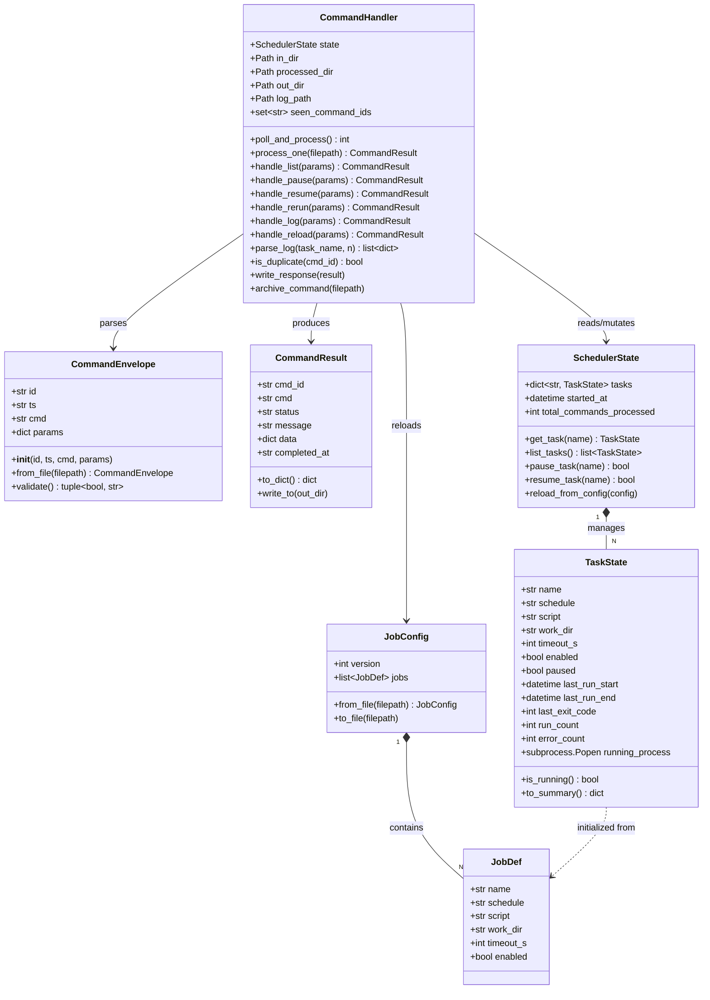
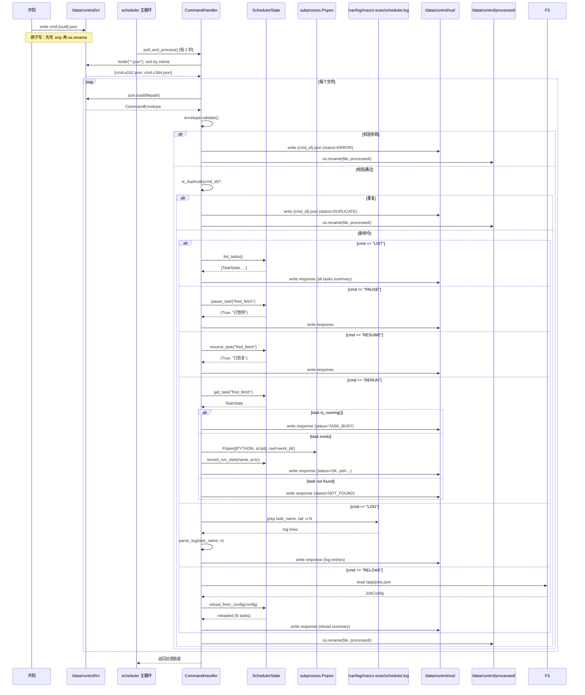
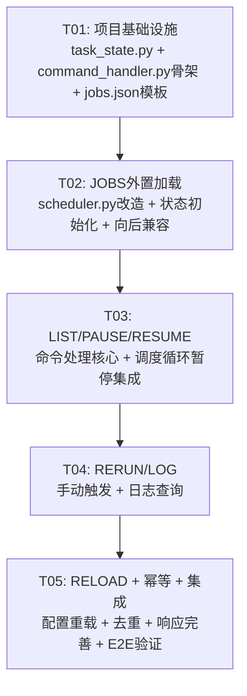

# A3a 控制 API — 系统设计文档

> ## ❌ 未采纳方案（历史存档）
> **本文件描述的"文件投递通道"方案（v1.0）未实施**——实际采用 HTTP REST 方案。现役实现 = **HTTP REST :8900（v0.2）**，协议见 [`archive/a3a_control_api_design.md`](archive/a3a_control_api_design.md)。本文件仅作历史决策参考，**不要按本文档实施或引用其作为现役协议**。

> **文档分工**：本文档 = 系统级视图（架构、模块、时序）；协议细节见 [`a3a_control_api_design.md`](a3a_control_api_design.md)（写侧协议 v0.2，含开阳需求对齐修订）。

> 版本：v1.0（基于 PRD v1.0 — 文件投递通道方案）
> 作者：高见远（Gao）· 架构师
> 日期：2026-08-01
> 关联文档：PRD（team-lead 下发）、`STATUS.md` §架构设计决策、`a3a_control_api_design.md` v0.2（HTTP 方案，本设计以文件投递替代）
> 交付范围：**系统设计 + 任务分解**，不写代码

---

## 与既有设计 v0.2 的差异说明

| 维度 | v0.2（HTTP 方案） | v1.0（本设计·文件投递） |
|------|-------------------|--------------------------|
| 通道 | REST API（FastAPI/Flask） | 文件投递 `/data/control/in/` |
| 鉴权 | Bearer Token + mTLS | 文件系统权限（容器内受信） |
| 复杂度 | 新增 HTTP 服务 + 中间件 + CORS | 零新进程，scheduler 轮询 |
| 依赖 | FastAPI/Flask + uvicorn | Python stdlib only |
| 命令 | REPLAY_FETCHER / PAUSE / RESUME / SET_FREQUENCY | LIST / PAUSE / RESUME / RERUN / LOG / RELOAD |
| 响应 | HTTP 202 + 轮询 E7 | 响应文件 `/data/control/out/{cmd_id}.json` |

**结论**：本设计（v1.0）为 PRD 指定方案，v0.2 HTTP 方案归档为备选升级路径（对应 P2-2 Unix Socket / P2-3 WebSocket）。

---

# Part A: 系统设计

## 1. 实现方案与框架选型

### 1.1 整体架构思路

```
┌──────────────────────────────────────────────────┐
│                    开阳（可视化层）                  │
│  写入命令 JSON 文件到持久卷 control/ 目录            │
└─────────────────┬────────────────────────────────┘
                  │ NAS 持久卷（目录挂载）
                  ▼
┌──────────────────────────────────────────────────┐
│              /data/control/                       │
│  ├── in/           ← 开阳写入命令                  │
│  ├── processed/    ← scheduler 处理后移入           │
│  └── out/          ← scheduler 写入响应             │
└─────────────────┬────────────────────────────────┘
                  │ 文件系统轮询（每 2 秒）
                  ▼
┌──────────────────────────────────────────────────┐
│           天枢 scheduler.py（常驻进程）              │
│  ┌─────────────┐  ┌──────────────────────────┐   │
│  │ 调度循环      │  │ 命令轮询（集成在主循环）      │   │
│  │ _tick(now)   │  │ poll_commands(in_dir)    │   │
│  │ 匹配时间→启动  │  │ 解析→路由→执行→响应→归档    │   │
│  └─────────────┘  └──────────────────────────┘   │
│                      │                            │
│  ┌───────────────────┴────────────────────────┐  │
│  │         command_handler.py                  │  │
│  │  命令路由 / LIST / PAUSE / RESUME /         │  │
│  │  RERUN / LOG / RELOAD / 响应文件写入         │  │
│  └────────────────────────────────────────────┘  │
│                      │                            │
│  ┌───────────────────┴────────────────────────┐  │
│  │           task_state.py                     │  │
│  │  TaskState / JobDef / CommandEnvelope       │  │
│  │  运行时状态追踪（运行中进程/上次运行/退出码）    │  │
│  └────────────────────────────────────────────┘  │
│                      │                            │
│  ┌───────────────────┴────────────────────────┐  │
│  │           jobs.json（外置配置）               │  │
│  │  启动加载 / RELOAD 重载 / 向后兼容自动生成     │  │
│  └────────────────────────────────────────────┘  │
└──────────────────────────────────────────────────┘
```

### 1.2 为什么不用 Flask/FastAPI

| 考量 | 文件投递 | HTTP 服务 |
|------|---------|----------|
| **新增进程** | 零 | 需要独立 HTTP 进程（或线程） |
| **网络暴露** | 无（文件系统） | 需要端口/防火墙/CORS |
| **鉴权复杂度** | 文件系统权限即可 | Bearer Token / mTLS |
| **依赖** | Python stdlib only | Flask/FastAPI + uvicorn |
| **部署变更** | 零（仅改 scheduler.py） | docker-compose 新增 service |
| **可靠性** | 文件系统是同步的，不会丢 | 网络分区/超时/重试 |
| **调试** | 文件可见，直接 cat/jq | 需要 curl/日志 |

**决策**：当前阶段（P0/P1），天枢与开阳运行在同一 NAS、共享持久卷，文件投递通道是最简可行方案。P2 阶段如需跨网络/实时推送，再评估 Unix Socket / WebSocket 升级。

### 1.3 命令处理的线程模型

**单线程、集成在主循环**——不引入额外线程。

现有调度器结构：`while True: sleep(1); _tick(now)`。命令轮询嵌入此循环：

```python
_last_poll = 0.0
while True:
    now = time.time()
    _tick(now)
    if now - _last_poll >= 2.0:
        poll_commands(COMMAND_IN_DIR, scheduler_state)
        _last_poll = now
    time.sleep(1)
```

**理由**：
- 单线程避免 GIL 竞争和共享状态加锁
- 2 秒延迟对运维操作用户体验完全可接受（暂停/恢复非实时）
- `poll_commands()` 本身是 I/O 操作（`os.listdir` + `json.load`），耗时 <1ms（目录通常 <10 个文件）
- 不阻塞调度 tick（2 秒一次，tick 仍每秒运行）

---

## 2. 文件列表

### 2.1 新建文件

| # | 路径（容器内） | 路径（仓库内，相对 world-sim/macro-scan/） | 说明 |
|---|---------------|------------------------------------------|------|
| 1 | `/app/task_state.py` | `macro-scan/task_state.py` | 数据模型（dataclass）：TaskState, JobDef, JobConfig, CommandEnvelope, CommandResult |
| 2 | `/app/command_handler.py` | `macro-scan/command_handler.py` | 命令解析/路由/执行/响应文件写入 |
| 3 | `/app/jobs.json` | `macro-scan/jobs.json` | 外置 JOBS 配置（首次运行自动生成） |

### 2.2 修改文件

| # | 路径（容器内） | 路径（仓库内） | 改动范围 |
|---|---------------|---------------|---------|
| 4 | `/app/scheduler.py` | `macro-scan/scheduler.py` | ① 加载外置 JOBS ② 主循环集成命令轮询 ③ _tick 跳过暂停任务 ④ 进程追踪 ⑤ RELOAD |

### 2.3 运行时目录（scheduler 启动时自动创建）

| # | 路径 | 说明 |
|---|------|------|
| 5 | `/data/control/in/` | 命令入口目录（开阳写入，scheduler 轮询） |
| 6 | `/data/control/processed/` | 已处理命令归档 |
| 7 | `/data/control/out/` | 命令响应文件 |

---

## 3. 数据结构和接口

### 3.1 类图（Mermaid classDiagram）



### 3.2 关键函数签名

```python
# ── task_state.py ──

@dataclass
class TaskState:
    """单个任务的运行时状态"""
    name: str
    schedule: str              # "HH:MM" | "IHH" (如 I15)
    script: str
    work_dir: str
    timeout_s: int
    enabled: bool
    paused: bool = False
    last_run_start: Optional[datetime] = None
    last_run_end: Optional[datetime] = None
    last_exit_code: Optional[int] = None
    run_count: int = 0
    error_count: int = 0
    _process: Optional[subprocess.Popen] = None  # 不参与序列化

    def is_running(self) -> bool: ...
    def to_summary(self) -> dict: ...

@dataclass
class JobDef:
    name: str
    schedule: str
    script: str
    work_dir: str = "/app"
    timeout_s: int = 300
    enabled: bool = True

@dataclass
class JobConfig:
    version: int
    jobs: list[JobDef]

    @staticmethod
    def from_file(filepath: Path) -> "JobConfig": ...
    def to_file(self, filepath: Path) -> None: ...

@dataclass
class CommandEnvelope:
    id: str                    # UUID v4
    ts: str                    # ISO 8601
    cmd: str                   # "LIST"|"PAUSE"|"RESUME"|"RERUN"|"LOG"|"RELOAD"
    params: dict               # {"task": "...", "n": 20}

    @staticmethod
    def from_file(filepath: Path) -> "CommandEnvelope": ...
    def validate(self) -> tuple[bool, str]: ...

@dataclass
class CommandResult:
    cmd_id: str
    cmd: str
    status: str                # "OK" | "ERROR"
    message: str
    data: Optional[dict] = None
    completed_at: str = ""     # ISO 8601

    def to_dict(self) -> dict: ...

class SchedulerState:
    """聚合所有任务状态，提供查询/修改接口"""
    tasks: dict[str, TaskState]
    started_at: datetime
    total_commands_processed: int

    def get_task(self, name: str) -> Optional[TaskState]: ...
    def list_tasks(self) -> list[TaskState]: ...
    def pause_task(self, name: str) -> tuple[bool, str]: ...
    def resume_task(self, name: str) -> tuple[bool, str]: ...
    def record_run_start(self, name: str, proc: subprocess.Popen) -> None: ...
    def record_run_end(self, name: str, exit_code: int) -> None: ...
    def reload_from_config(self, config: JobConfig) -> None: ...

# ── command_handler.py ──

class CommandHandler:
    def __init__(self, state: SchedulerState,
                 in_dir: Path, processed_dir: Path,
                 out_dir: Path, log_path: Path): ...

    def poll_and_process(self) -> int:
        """扫描 in_dir，处理所有 .json 文件，返回处理数量"""
        ...

    def process_one(self, filepath: Path) -> CommandResult:
        """解析→去重→路由→执行→写响应→归档"""
        ...

    # 各命令处理器
    def handle_list(self, params: dict) -> CommandResult: ...
    def handle_pause(self, params: dict) -> CommandResult: ...
    def handle_resume(self, params: dict) -> CommandResult: ...
    def handle_rerun(self, params: dict) -> CommandResult: ...
    def handle_log(self, params: dict) -> CommandResult: ...
    def handle_reload(self, params: dict) -> CommandResult: ...

    # 辅助
    def parse_log(self, task_name: str, n: int = 20) -> list[dict]: ...
    def is_duplicate(self, cmd_id: str) -> bool: ...
    def write_response(self, result: CommandResult) -> None: ...
    def archive_command(self, filepath: Path) -> None: ...

# ── scheduler.py 新增函数 ──

def load_jobs_config(config_path: Path) -> JobConfig:
    """加载 jobs.json；不存在则从硬编码 JOBS 生成并落盘"""
    ...

def build_scheduler_state(config: JobConfig) -> SchedulerState:
    """从 JobConfig 构造 SchedulerState"""
    ...

def poll_commands(handler: CommandHandler) -> None:
    """在主循环中被调用，委托给 handler.poll_and_process()"""
    ...
```

---

## 4. 程序调用流程

### 4.1 启动流程

```mermaid
sequenceDiagram
    participant MAIN as scheduler.main()
    participant FS as 文件系统
    participant LOAD as load_jobs_config()
    participant STATE as SchedulerState
    participant HANDLER as CommandHandler
    participant LOOP as 主循环

    MAIN->>FS: ensure /data/control/{in,processed,out}/
    FS-->>MAIN: 目录就绪

    MAIN->>LOAD: load_jobs_config("/app/jobs.json")
    alt jobs.json 存在
        LOAD->>FS: read /app/jobs.json
        FS-->>LOAD: JSON 内容
        LOAD->>LOAD: JobConfig.from_file()
        LOAD-->>MAIN: JobConfig (from file)
    else jobs.json 不存在
        LOAD->>LOAD: 读源码硬编码 JOBS 元组
        LOAD->>LOAD: 构造 JobConfig(version=1, jobs=[...])
        LOAD->>FS: write /app/jobs.json
        LOAD-->>MAIN: JobConfig (auto-generated，log 提示)
    end

    MAIN->>STATE: build_scheduler_state(config)
    STATE-->>MAIN: SchedulerState (N tasks ready)

    MAIN->>HANDLER: CommandHandler(state, in_dir, processed_dir, out_dir, log_path)
    HANDLER-->>MAIN: handler ready

    MAIN->>LOOP: 进入主循环
    Note over LOOP: while True: sleep(1); _tick(now); poll every 2s
```

### 4.2 命令处理流程（完整链路）



### 4.3 调度 tick 中的暂停检查

```mermaid
sequenceDiagram
    participant LOOP as 主循环 _tick(now)
    participant STATE as SchedulerState
    participant PROC as subprocess

    LOOP->>STATE: 遍历 tasks
    loop 每个 TaskState
        alt task.paused == true
            Note over LOOP: 跳过，不触发
        else task.enabled == false
            Note over LOOP: 跳过
        else 时间匹配
            LOOP->>PROC: Popen([PYTHON, script], cwd=work_dir)
            LOOP->>STATE: record_run_start(name, proc)
        end
    end

    Note over LOOP: 收割已完成进程
    loop 每个 running process
        LOOP->>PROC: proc.poll()
        alt proc 已结束
            LOOP->>STATE: record_run_end(name, exit_code)
        end
    end
```

---

## 5. 待明确事项（Anything UNCLEAR）

| # | 问题 | 影响 | 建议 |
|---|------|------|------|
| Q1 | `/data/control/` 是否在持久卷上？ | 若 `/data` 非持久卷，容器重启后命令目录丢失 | 确认容器 compose 中 `/data` 的挂载；若不在持久卷，改为 `/workspace/data/control/`（DATA_DIR 路径） |
| Q2 | 现有 `scheduler.py` 的 JOBS 元组完整结构？ | 需要确认所有字段以正确生成 jobs.json | PRD 给出了 5 元组 `(name, hhmm, weekdays, dom, command)`——需确认 weekdays/dom 在 jobs.json 中如何表达 |
| Q3 | scheduler.log 的确切格式？ | LOG 命令的解析正则依赖日志格式 | 假设格式为 `[YYYY-MM-DD HH:MM:SS] [LEVEL] message`——需在实际日志上验证 |
| Q4 | RERUN 是否需要传递命令行参数？ | 部分 fetcher 可能需要 `--date` 等参数 | PRD 未提及参数透传；假设默认无参数，后续可扩展 `params.args` |
| Q5 | 硬编码 JOBS 中 `weekdays` 和 `dom` 字段的迁移 | jobs.json 当前 schema 只有 schedule（HH:MM / I{min}），未保留 weekdays/dom | 需要 PRD 补充：weekdays/dom 是否需要在 jobs.json 中表达？假设：当前已全部为 `"1-7"` / `None`，无需迁移 |

---

# Part B: 任务分解

## 6. 所需依赖包

```
无新增依赖。全部使用 Python 3.11+ 标准库：
- dataclasses    — 数据模型
- json           — JSON 解析/序列化
- pathlib        — 文件路径操作
- uuid           — UUID 生成
- datetime       — 时间处理
- subprocess     — 进程管理
- os / shutil    — 文件操作
- re             — 日志解析正则
- typing         — 类型标注
```

已存在于 NAS 容器的依赖（不新增）：Python 3.11.15

## 7. 任务列表（按依赖顺序，最多 5 个任务）

### T01 · 项目基础设施：数据模型 + 命令信封 + JOBS 配置 schema

| 属性 | 内容 |
|------|------|
| **Task ID** | T01 |
| **任务名称** | 数据模型层：TaskState / CommandEnvelope / JobConfig 及 jobs.json 模板 |
| **优先级** | P0 |
| **依赖** | 无 |
| **源文件** | `task_state.py`（新建）、`command_handler.py`（新建骨架）、`jobs.json`（新建模板） |
| **描述** | 创建全部数据类定义，这是所有后续任务的基础。包含：① `TaskState` dataclass（运行时状态：暂停标记、运行追踪、退出码、进程引用）② `JobDef` / `JobConfig` dataclass（JOBS 配置结构与 JSON 读写）③ `CommandEnvelope` dataclass（命令解析与校验）④ `CommandResult` dataclass（响应结构）⑤ `SchedulerState` 类（状态聚合器：增删改查、暂停/恢复、运行记录）⑥ `CommandHandler` 类骨架（初始化、路由分发 stub）⑦ `jobs.json` 模板文件（含 2-3 个示例任务）⑧ selftest（`python task_state.py --selftest` 覆盖序列化/反序列化/状态转换） |

### T02 · JOBS 外置加载与调度器状态初始化

| 属性 | 内容 |
|------|------|
| **Task ID** | T02 |
| **任务名称** | JOBS 外置加载、调度器改造：配置加载 + 状态初始化 + 向后兼容 |
| **优先级** | P0 |
| **依赖** | T01 |
| **源文件** | `scheduler.py`（修改）、`task_state.py`（修改）、`command_handler.py`（修改） |
| **描述** | 实现 JOBS 从源码硬编码到外置 JSON 的迁移。包含：① `load_jobs_config()`：优先读 `/app/jobs.json`；不存在则从源码硬编码 JOBS 元组构造 JobConfig → 落盘 jobs.json → log 提示"已自动生成" ② `build_scheduler_state()`：JobConfig → SchedulerState（每个 JobDef 初始化一个 TaskState）③ `save_jobs_config()`：运行时持久化（RELOAD 后可选写回）④ scheduler.py 启动流程改造：替换硬编码 JOBS 为上述加载逻辑 ⑤ 向后兼容验证：删除 jobs.json 后重启 → 自动生成 → 调度行为不变 ⑥ `command_handler.py` 中 `handle_reload` stub → 读取新 jobs.json → 调 `SchedulerState.reload_from_config()` |

### T03 · 查询与控制命令：LIST / PAUSE / RESUME

| 属性 | 内容 |
|------|------|
| **Task ID** | T03 |
| **任务名称** | 命令处理核心：LIST / PAUSE / RESUME 实现 + 调度循环暂停集成 |
| **优先级** | P0 |
| **依赖** | T02 |
| **源文件** | `command_handler.py`（修改）、`scheduler.py`（修改）、`task_state.py`（修改） |
| **描述** | 实现三大查询/控制命令。包含：① `handle_list()`：遍历所有 TaskState，返回结构化摘要（name/schedule/last_run/next_run/status/paused/enabled）；计算 next_run（基于 schedule 表达式）② `handle_pause()`：设置 `task.paused=True`；不影响正在运行的实例 ③ `handle_resume()`：设置 `task.paused=False` ④ scheduler.py `_tick()` 改造：遍历时跳过 `paused=True` 或 `enabled=False` 的任务 ⑤ 收割器：每个 tick 轮询所有已启动 Popen 进程（`proc.poll()`），完成时调用 `record_run_end()` ⑥ `poll_commands()` 集成进主循环（每 2 秒）⑦ `CommandHandler.process_one()` 完整实现：解析→校验→去重→路由→执行→写响应→归档 |

### T04 · 执行与日志命令：RERUN / LOG

| 属性 | 内容 |
|------|------|
| **Task ID** | T04 |
| **任务名称** | RERUN 手动触发 + LOG 日志查询 |
| **优先级** | P0 |
| **依赖** | T03 |
| **源文件** | `command_handler.py`（修改）、`scheduler.py`（修改）、`task_state.py`（修改） |
| **描述** | 实现执行类命令。包含：① `handle_rerun()`：检查 `task.is_running()` → 若是返回 `TASK_BUSY`；否则 `subprocess.Popen` 启动 → `record_run_start()`；不排队（PRD Q3）② `handle_log()`：从 `/var/log/macro-scan/scheduler.log` 中 grep 任务名 → tail -n N → 解析为结构化日志条目 `[{ts, level, message}]`；日志格式假设 `[YYYY-MM-DD HH:MM:SS] [LEVEL] message` ③ `parse_log()` 函数：正则提取时间戳/级别/消息 ④ scheduler.py 中 `_tick()` 收割器完善：更新 `last_run_end` / `last_exit_code` ⑤ 命令路由 `process_one()` 补充 RERUN/LOG 分支 |

### T05 · 配置重载 + 幂等 + 端到端集成验证

| 属性 | 内容 |
|------|------|
| **Task ID** | T05 |
| **任务名称** | RELOAD 命令 + 命令幂等去重 + 响应系统完善 + 端到端验证 |
| **优先级** | P1（RELOAD）+ P1（幂等）+ P0（集成验证） |
| **依赖** | T04 |
| **源文件** | `command_handler.py`（修改）、`scheduler.py`（修改）、`task_state.py`（修改）、`jobs.json`（验证用） |
| **描述** | 实现 RELOAD 和横切关注点。包含：① `handle_reload()`：重新读取 jobs.json → `SchedulerState.reload_from_config()`——新增任务添加、删除任务清理、保留运行中任务不中断、保留 paused 状态（若任务仍存在）② 命令幂等去重：`CommandHandler.seen_command_ids`（内存 set + 可选基于 processed/ 目录的文件去重）；重复 cmd_id → 返回 DUPLICATE 状态，不执行 ③ 响应文件完善：`write_response()` 写入 `/data/control/out/{cmd_id}.json`，原子写（tmp → rename）④ 目录初始化：scheduler 启动时 `Path.mkdir(parents=True, exist_ok=True)` 创建三个目录 ⑤ 端到端验证脚本：手动写 JSON 到 in/ → 等待 2s → 检查 out/ 响应 → 检查 processed/ 归档 → 验证调度行为变化（PAUSE 后不再触发、RESUME 后恢复、RERUN 后进程启动）⑥ selftest 补充：T01-T04 全部 selftest 回归通过 |

## 8. 共享知识

```
── 跨文件约定 ──
- 所有路径使用 pathlib.Path，不使用字符串拼接
- 命令目录：COMMAND_IN_DIR = Path("/data/control/in")
- 归档目录：COMMAND_PROCESSED_DIR = Path("/data/control/processed")
- 响应目录：COMMAND_OUT_DIR = Path("/data/control/out")
- JOBS 配置路径：JOBS_CONFIG_PATH = Path("/app/jobs.json")
- 调度日志路径：SCHEDULER_LOG_PATH = Path("/var/log/macro-scan/scheduler.log")
- 工作目录：WORKDIR = "/app"
- Python 解释器：PYTHON = "/usr/local/bin/python3"

── 命令状态机 ──
- 命令文件生命周期：in/ → (解析+执行) → out/写响应 + processed/归档
- 响应状态枚举：OK | ERROR | TASK_BUSY | NOT_FOUND | DUPLICATE | RELOADED
- 任务运行状态：idle（未运行）| running（进程中）→ idle（进程结束）
- paused 与 enabled 独立：paused=True 跳过调度但允许 RERUN；enabled=False 两者都禁止

── 文件命名 ──
- 命令文件：{uuid}.json（开阳生成 UUID v4）
- 响应文件：{cmd_id}.json（与命令 id 字段一致）
- 原子写：先写 .tmp 后缀，再 os.rename() 到目标名（同一目录内，inode 稳定）

── 向后兼容 ──
- 启动时 jobs.json 不存在 → 从 scheduler.py 硬编码 JOBS 元组自动生成
- 硬编码 JOBS 保留在源码中作为 fallback 默认值，不删除
- 生成的 jobs.json 与源码 JOBS 等价，调度行为不变

── 日志格式约定 ──
- 日志行格式（假设）：[YYYY-MM-DD HH:MM:SS] [LEVEL] message
- LOG 命令匹配：grep 任务名（script 文件名）+ tail -n N
- 若日志文件不存在或为空 → 返回空列表，不报错

── 并发安全 ──
- 单线程设计，无并发竞争
- 命令文件由 scheduler 独占消费（开阳只写新文件，不改已有文件）
- os.rename() 在统一文件系统内是原子的
```

## 9. 任务依赖图



---

> 文档结束。本稿为 v1.0 系统设计 + 任务分解，不含代码实现。落地时由工程师（寇豆码）按 T01→T05 顺序实现。
