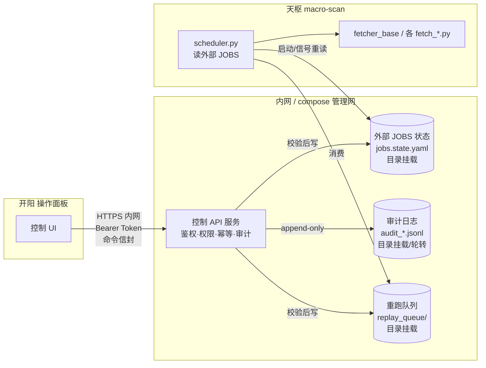
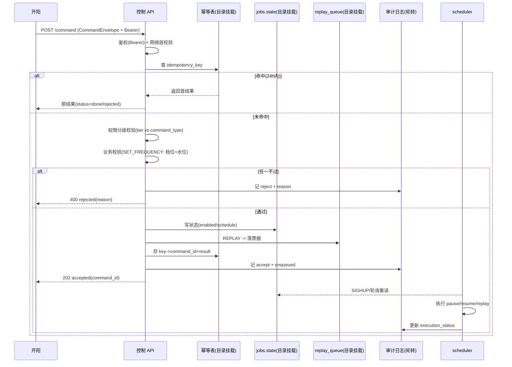
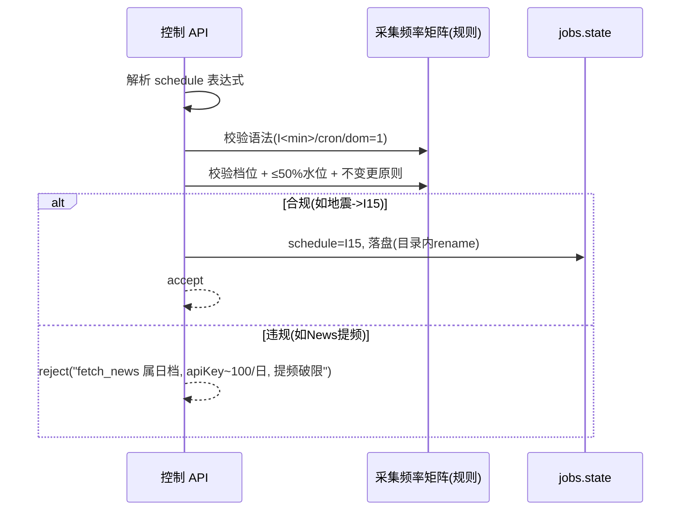

# 天枢 macro-scan 受控控制 API 设计（A3a · 写侧协议）

> ## ✅ 现役实现协议（v0.2）
> **本文档为现役 A3a 协议**：HTTP REST :8900（契约/白名单/健康探测），由 `核心代码/control_server.py`（macro-scan 容器 :8900）实现。系统级视图见 `docs/a3a_system_design.md`（文件投递方案，❌ 未采纳，仅历史参考）。

> 版本：v0.2（v0.1 原稿 → 开阳接口需求评审后修订）
> 作者：高见远 / Gao（world-sim 架构师，arch-a3a）· 修订：齐活林 / Qi（交付总监，D2 裁决 + 开阳需求对齐）
> 日期：2026-07-31（原稿）→ 2026-08-01（修订）
> 关联文档：`STATUS.md` §架构设计决策、`采集频率矩阵.md`、天枢 `scheduler.py` JOBS 模式、`开阳控制面-后端接口需求询问.md`、`开阳控制面-后端接口需求-回复.md`
> 交付约束：**只设计协议，不写代码实现，不部署 NAS**。
>
> **v0.2 修订摘要（6 项）**：① 操作状态机补 `queued` 态 ② E1 裸信封降内部接口 + 补 RESTful 端点 ③ 补 4 个开阳对齐端点 ④ 错误返回格式标准化 ⑤ Token 客户端传递流程 ⑥ CORS。

---

## 0. 范围声明

### 0.1 本次范围（已钉定）
天枢观测层**运维类**控制 API，接收开阳下发的操作指令：
1. **重跑某个 fetcher**（REPLAY_FETCHER）
2. **暂停某个采集源**（PAUSE_SOURCE）
3. **恢复某个采集源**（RESUME_SOURCE）
4. **调整某个采集源的频率**（SET_FREQUENCY）

### 0.2 非范围（本次不做，标注前置闸门）
- 天璇推演类端点（触发 macro-sim / 场景切换 / 调参 / 确认·驳回 sim_trigger）—— **A3b，待总监 D2 拍板**。
- 天玑校验 / 玉衡审批指令端点——待后端暴露。
- **sim_trigger 写侧通道实现**：本轮**仅锁死写侧铁律**，不实现写端点（见 §8）。任何 A3b 写侧工作必须以 §8 方案为硬前置闸门。

### 0.3 设计目标
- 开阳（操作面板，自身无业务后端）经**内网 + 鉴权** HTTP 通道向天枢下发运维指令。
- 指令通过**命令信封（command envelope）**承载：唯一标识、幂等防重发、鉴权、权限分级、审计。
- 控制指令**不写死源码**，走外部 **JOBS 状态**（呼应现有 `scheduler.py` 的 JOBS 模式）。
- 所有跨容器文件契约遵守**目录挂载 / 目录轮转**铁律（禁单文件 bind mount + `os.replace`）。

---

## 1. 背景与约束

### 1.1 现状
- 天枢 `macro-scan` 当前**纯采集 + 落盘**，无接收指令的 HTTP 控制服务。
- 开阳已确立「操作面板（展示 + 控制双职能）」定位，但**自身无业务后端**；控制指令须经写侧通道下发后端执行。
- 调度现状：`scheduler.py` 内含 `JOBS` 字典（硬编码），已支持 `I<min>` interval 语法（地震 I15 / 灾害 I30 / 加密 I15）。控制面改动目前需改源码 + `docker restart`。

### 1.2 核心约束（来自 `STATUS.md`）
- **铁律（坑清单① / §70）**：跨容器文件契约一律**目录挂载 / 目录轮转**，**禁单文件 bind mount + `os.replace` 原子写**——单文件 bind mount 会把容器钉死在原 inode，host 侧 `os.replace` 换 inode 后容器**静默收不到新内容且不报错**（P0 级未爆弹）。
- **sim_trigger 双角色冲突（§70）**：sim_trigger 既为读侧（开阳读推演状态）又为写侧候选（开阳写触发推演）。当前天枢↔天璇是单文件 bind mount + `os.replace`，写侧若由开阳经单文件挂载写仍会 inode 断链。**写侧协议必须锁死走目录挂载 / 目录轮转**。
- **采集频率「不变更原则」（矩阵 §一 / §四结论）**：绝大多数源已是贴合上游频率 + ≤50% 安全水位的正确档位，**不可改**；真正可提频仅地震/灾害（事件档），加密可选 15min（分钟级会爆月限额，**禁**）；**News/OpenSky 绝不可提频**。调频指令须强制该校验。

---

## 2. 总体架构

控制面（薄 HTTP 服务）与采集面（scheduler / fetcher）解耦：控制面**只改外部 JOBS 状态**，不直接执行采集；scheduler 读取外部状态决定行为。



**网络边界**：控制 API 仅监听内网接口（compose 管理网 / `192.168.x` 段），**不 publish 到宿主机 WAN**。开阳所在网段经网络策略放行，其余拒绝。

---

## 3. 端点清单（路径 + 方法 + 入参）

基址：`/api/v1/control`（仅内网可达）。除 E12（health）外所有端点要求 `Authorization: Bearer <token>`。

### 3.1 对外 API 端点（开阳对接面）

| # | 方法 | 路径 | 入参（body / path） | 所需权限 | 说明 |
|---|---|---|---|---|---|
| **E1** | POST | `/api/v1/control/fetchers/replay` | `{idempotency_key, fetcher_ids[], params?}` | operator | 批量重跑 fetcher；返回 operation_id 供 E7 轮询 |
| **E2** | POST | `/api/v1/control/fetchers/{id}/pause` | `{idempotency_key, reason?}` | operator | 暂停采集源 |
| **E3** | POST | `/api/v1/control/fetchers/{id}/resume` | `{idempotency_key, reason?}` | operator | 恢复采集源 |
| **E4** | PUT | `/api/v1/control/fetchers/{id}/schedule` | `{idempotency_key, schedule, reason?}` | **admin** | 调频；schedule 须从 E8 返回的可选项中选取 |
| **E5** | GET | `/api/v1/control/fetchers` | — | operator | 列所有 fetcher 状态（id/name/status/schedule/last_run/last_status/enabled） |
| **E6** | GET | `/api/v1/control/fetchers/{id}/history?limit=10` | — | operator | 单个 fetcher 最近运行记录（时间、状态、错误信息） |
| **E7** | GET | `/api/v1/control/operations/{operation_id}` | — | operator | 轮询操作进度（accepted→queued→running→completed/failed） |
| **E8** | GET | `/api/v1/control/fetchers/{id}/allowed-schedules` | — | operator | 该 fetcher 可用的频率选项列表（label/value/description），开阳下拉框动态加载 |
| **E9** | GET | `/api/v1/control/scheduler/status` | — | operator | scheduler 全局状态（上次调度时间、队列长度、是否有全局报错） |
| **E10** | GET | `/api/v1/control/commands/{command_id}` | — | operator | 按 command_id 查指令详情（含执行状态 + 审计追溯） |
| **E11** | GET | `/api/v1/control/health` | — | 无（网络层限制即可） | 控制面存活探针 |

### 3.2 内部端点（不暴露给开阳）

| # | 方法 | 路径 | 说明 |
|---|---|---|---|
| **I1** | POST | `/api/v1/control/internal/command` | **通用命令信封入口**（见 §4）。E1–E4 收到请求后，内部构造 CommandEnvelope → 转发至此。开阳**不直接调用**。 |

> **设计取舍**：以 I1 统一命令信封为内部协议核心——鉴权、幂等、审计、权限校验只实现一次。E1–E4 为开阳便捷 RESTful 封装（内部组装信封后转发 I1）。开阳永远不直接拼裸信封，避免绕过参数验证与两套错误格式分裂。

### 3.3 通用响应结构

成功：
```json
{ "code": 0, "data": { "operation_id": "uuid", "command_id": "uuid", "status": "accepted", "affected_fetchers": ["fetcher_id"], "accepted_at": "ISO8601" } }
```

错误：见 §3.4 统一错误格式。

### 3.4 统一错误格式

所有端点错误响应使用统一结构：

```json
{
  "code": 非零,
  "error": {
    "code": "VALIDATION_ERROR | AUTHENTICATION_ERROR | FORBIDDEN | NOT_FOUND | RATE_LIMIT | INTERNAL_ERROR",
    "message": "人类可读原因",
    "details": {}
  }
}
```

| HTTP | error.code | 触发条件 |
|------|-----------|---------|
| 400 | `VALIDATION_ERROR` | 参数缺失/类型错、schedule 非法、调频越界 |
| 401 | `AUTHENTICATION_ERROR` | 无 Bearer Token 或 Token 无效 |
| 403 | `FORBIDDEN` | Token 有效但 tier 不足（如 operator 调 SET_FREQUENCY） |
| 404 | `NOT_FOUND` | fetcher / operation / command 不存在 |
| 429 | `RATE_LIMIT` | 请求频率超限（控制 API 自身限流，非 fetcher 限流） |
| 500 | `INTERNAL_ERROR` | 内部异常（不暴露 traceback） |

调频拒绝示例：
```json
{
  "code": 400,
  "error": {
    "code": "VALIDATION_ERROR",
    "message": "fetch_news 属日档且 apiKey ~100/日，提频将破限，拒绝",
    "details": { "reason": "rate_limit_violation", "source": "fetch_news", "current_tier": "日档", "requested": "I30" }
  }
}
```

### 3.5 操作状态机（operation lifecycle）

E1–E4 异步操作的生命周期：

```
accepted → queued → running → completed
                            → failed
```

| 状态 | 含义 | 前端建议 |
|------|------|---------|
| `accepted` | 指令已通过鉴权+幂等+权限+业务校验，已写入队列 | 显示"已接单" |
| `queued` | 在队列中等待 scheduler 消费 | 显示"排队中（预计 ≤30s）" |
| `running` | scheduler 已取走并正在执行 | 显示进度条/执行中 |
| `completed` | 执行成功 | 显示结果（如重跑后 fetcher 的新 last_status） |
| `failed` | 执行失败 | 显示 error 字段（格式同 §3.4） |

- 状态转换通过 E7 `GET /operations/{id}` 轮询获取。
- queued→running 延迟上限 = scheduler 轮询周期（D2-2 定 30s）。
- `failed` 态含 `error.message` 和 `error.code`（格式同 §3.4）。

---

## 4. 命令信封结构（字段表）

所有写操作经 **I1**（内部通用信封入口）提交，body 为如下信封。E1–E4 收到开阳请求后，在控制 API 内部构造信封并转发至此。字段缺失或类型错误 → `400 rejected`。

| 字段 | 类型 | 必填 | 说明 |
|---|---|---|---|
| `api_version` | string | ✅ | 协议版本，当前 `"v1"` |
| `command_id` | string (UUIDv4) | ✅ | 全局唯一指令标识；用于审计、查询（E7）、去重 |
| `idempotency_key` | string (≤128) | ✅ | 客户端幂等键；网络重试重发同键时**不重复执行**，直接返回首次结果 |
| `command_type` | enum | ✅ | `REPLAY_FETCHER` / `PAUSE_SOURCE` / `RESUME_SOURCE` / `SET_FREQUENCY` |
| `target` | object | ✅ | `{ "kind": "fetcher"|"source", "id": string }`；id 须匹配 JOBS 注册名 |
| `params` | object | 条件 | 指令参数：`SET_FREQUENCY` 必带 `{schedule}`；`REPLAY_FETCHER` 可选 `{force, backfill}`；其余可为空 |
| `issuer` | object | ✅ | `{ "id": string, "tier": "operator"|"admin", "auth_scheme": "token"|"mtls" }` |
| `issued_at` | string (ISO8601 UTC) | ✅ | 签发时间 |
| `expires_at` | string? | 否 | 过期时间，默认 `issued_at + 15min`；过期指令拒收 |
| `signature` | string? | 推荐 | 对 body（canonical JSON）的 `HMAC-SHA256`（密钥=共享 secret）；防篡改（D2 可强制） |
| `trace_id` | string? | 否 | 链路追踪 ID，透传至审计 |

**幂等语义**：服务端维护 `control/idempotency/{key} -> command_id+result`（落目录挂载的 state，TTL 24h）。同键二次到达 → 直接返回首结果，`status=done`（或原 reject 原因），**不二次执行**。这是防开阳网络重试重发的核心机制。

**信封示例（调频）**：
```json
{
  "api_version": "v1",
  "command_id": "3f1c...uuid",
  "idempotency_key": "kaiyang-20260731-1300-eq-up",
  "command_type": "SET_FREQUENCY",
  "target": { "kind": "source", "id": "fetch_earthquake" },
  "params": { "schedule": "I15" },
  "issuer": { "id": "kaiyang-svc", "tier": "admin", "auth_scheme": "token" },
  "issued_at": "2026-07-31T13:00:00Z",
  "signature": "hmac_hex..."
}
```

---

## 5. 鉴权 / 权限分级 / Token 交付 / CORS

### 5.1 双层防护
1. **网络层（强制）**：控制 API 仅监听内网接口，**不 publish 到 WAN**；compose 网络隔离 + 防火墙策略仅放行开阳网段。这是第一道也是不可绕过的一道。
2. **应用层（强制）**：`Bearer <token>`。Token 签发给已知客户端（开阳 service account），服务端**哈希存储**，绑定权限分级；支持轮换（D2 定 issuance 流程）。

### 5.2 mTLS（可选升级，D2 已决 = 本期不做）
- D2-1 已决：**本期 Bearer+网络隔离，mTLS 列为可选升级项**。客户端证书 `CN` → 权限分级映射；未来可与 Bearer 并存（mTLS 做身份、Bearer 做会话）。

### 5.3 Token 交付流程（客户端侧）

D2-3 已决：**手动 env 注入**。开阳作为单一客户端，不需要 Token 签发/刷新服务。

- **生成**：`openssl rand -hex 32` 生成静态 token，写入天枢控制 API 的环境变量（如 docker-compose `.env` 的 `CONTROL_API_TOKEN`）。
- **交付**：token 值通过安全通道（SSH / 面对面）告知开阳配置人员，由开阳写入其配置文件/环境变量/`localStorage`。
- **开阳侧**：需提供一个 Token 配置入口（设置页面、启动时的配置弹窗、或 `localStorage` 读写），每次请求带 `Authorization: Bearer <token>` header。
- **轮换**：手动生成新 token → 更新后端 env → 重启控制 API → 通知开阳更新配置。频率极低（季度/半年/泄密时）。
- **本期明确不做**：Token 签发服务、自动轮换、过期检测、SSO/OAuth。

### 5.4 权限分级矩阵
| 权限分级 | 可执行 command_type | 可读 | 说明 |
|---|---|---|---|
| **operator** | REPLAY_FETCHER, PAUSE_SOURCE, RESUME_SOURCE | E6/E7/E8 | 日常运维；动作**可逆、低风险** |
| **admin** | 全部 operator + **SET_FREQUENCY** | 全部 | 调频影响 rate-limit 水位，须谨慎；未来天璇/天玑类控制亦归 admin |

> **分级依据**：暂停/恢复/重跑可逆且不影响上游限流；调频直接改变请求频率，可能触碰 ≤50% 安全水位红线（甚至封号），故归 admin。与 `STATUS.md`「权限分级（运维类先行，如 operator / admin）」一致。

### 5.5 拒绝与降级
- 权限不足 / 令牌无效 / 过期 / 签名不符 → `code!=0`（按 §3.4 统一错误格式），**不执行**，审计记录 `decision=reject` + `reject_reason`。
- 任何指令在「鉴权 → 幂等 → 权限 → 业务校验」四道闸全过才落 JOBS 状态。

### 5.6 CORS

天枢控制 API 端口 ≠ 开阳前端端口 → 跨域请求。控制 API 启动时添加 CORS 中间件：
- `Access-Control-Allow-Origin`: 仅开阳的 origin（非 `*`）。
- `Access-Control-Allow-Headers`: `Authorization, Content-Type`。
- `Access-Control-Allow-Methods`: `GET, POST, PUT`。
- 实现成本：3 行 Flask/FastAPI 中间件，与现有鉴权逻辑独立。

---

## 6. 审计日志方案

### 6.1 存储
- 持久卷 `control_audit/`（容器内 `/workspace/data/control_audit/`，**非 SMB**），**目录挂载**。
- **按日轮转**：每日一个文件 `audit_YYYY-MM-DD.jsonl`，新文件 append；**绝不 `os.replace` 单文件**（铁律）。
- **append-only / WORM**：仅追加，无删除、无改写；审计本身也遵守跨容器文件契约铁律。

### 6.2 每条记录字段（JSONL 一行）
```json
{
  "ts": "2026-07-31T13:00:00.123Z",
  "command_id": "3f1c...uuid",
  "idempotency_key": "kaiyang-20260731-1300-eq-up",
  "issuer_id": "kaiyang-svc",
  "issuer_tier": "admin",
  "auth_scheme": "token",
  "source_ip": "192.168.x.x",
  "command_type": "SET_FREQUENCY",
  "target": { "kind": "source", "id": "fetch_earthquake" },
  "params_sanitized": { "schedule": "I15" },
  "decision": "accept|reject",
  "reject_reason": null,
  "execution_status": "accepted|queued|running|completed|failed",
  "result": "ok|error_msg",
  "trace_id": "..."
}
```
- `params_sanitized`：脱敏后参数（不含 secret/签名原文）。
- `decision` + `execution_status` 分离：accept 后仍可能执行失败（如 fetcher 报错），分别记录便于追责。

### 6.3 查询
- E7 按 `command_id` 查执行状态；审计文件可按 `command_id` / `issuer_id` / 时间窗离线检索（ELK/脚本均可，本期不强制集中化）。

---

## 7. JOBS 外置方案

### 7.1 现状 → 目标
- **现状**：`scheduler.py` 内 `JOBS` 硬编码；控制改动 = 改源码 + `docker restart`。
- **目标**：JOBS 真相源外置为 `control/jobs.state.yaml`（持久卷，**目录挂载**）。控制 API 改外部状态，scheduler 读外部状态。

### 7.2 外部 JOBS 状态结构
```yaml
version: 1
jobs:
  fetch_earthquake:
    module: fetch_earthquake
    enabled: true
    schedule: "I15"            # I<min> / cron / dom=1
    last_run: "2026-07-31T12:45:00Z"
    next_run: "2026-07-31T13:00:00Z"
    paused_until: null         # 定时恢复（可选）
    replay_requested: false    # 重跑一次性标记
    owner: "macro-scan"
  # ... 其余 23 个源同构
```

### 7.3 控制面如何改状态
| 指令 | 动作 |
|---|---|
| PAUSE_SOURCE | `enabled=false`（可选 `paused_until`） |
| RESUME_SOURCE | `enabled=true`；清 `paused_until` |
| SET_FREQUENCY | `schedule=<新表达式>`（**先过 §7.5 校验**） |
| REPLAY_FETCHER | `replay_requested=true` **或** 落一张一次性票据到 `control/replay_queue/<ts>_<command_id>.json`（目录挂载，推荐后者，避免轮询 state） |

### 7.4 调度器如何消费（避免每次 docker restart）
- scheduler 启动时加载外部 `jobs.state.yaml`。
- **轻量重读**：支持 `SIGHUP` 信号或周期性（如每 30s）重读 state，使 pause/resume/replay **无需 `docker restart` 即生效**。
- **结构性改动**（如新增 job 字段、改调度引擎）仍须 `docker restart`（沿用 `STATUS.md` 既有约束），但运维类控制在外部 state 内闭环，不触发。

### 7.5 SET_FREQUENCY 强制校验（锁死「不变更原则」）
服务端在写入前校验，任一不过则 `reject`：
1. **语法合法**：`I<min>`（min≥1）/ cron / `dom=1` 之一。
2. **档位合法**：目标表达式须落在该源允许档位内（锚定 `采集频率矩阵.md`）。
3. **≤50% 安全水位**：按矩阵核算新频率下对上游（含共享代理 IP）请求量 ≤ 50% 限流，且**不突破「不变更原则」**——
   - ✅ 允许：地震/灾害 → 事件档（I15/I30）；加密 → 15min（I15，月额内；**分钟级禁**）。
   - ❌ **拒绝**：News / OpenSky 等任何提频；任何把慢变量（ONI 月 / GISS 年 / FRED 日序）无意义提频的请求。
4. `reject_reason` 明确告知违规点（如「fetch_news 属日档且 apiKey ~100/日，提频将破限，拒绝」）。

### 7.6 原子写（铁律执行）
控制 API 写 `jobs.state.yaml` 时：
- 写临时文件 `jobs.state.yaml.tmp.<ts>`（同在挂载目录内）；
- **同文件系统内 `os.rename`** 到目标名（rename 原子且**不改目录 inode**——容器看到的是目录 inode，目录内文件增删 rename 均可见）；
- **绝不**对单文件 bind mount 用 `os.replace` 覆盖。replay_queue / audit 同理（新增文件即可，无需覆盖）。

---

## 8. sim_trigger 写侧约束（铁律 · 跨切面的 P0 闸门）

### 8.1 冲突回顾
`sim_trigger.json` 当前双角色：
- **读侧**：开阳读推演状态（天璇产出）。
- **写侧候选**：开阳写以触发推演（A3b 范围）。
当前天枢↔天璇是**单文件 bind mount + `os.replace` 原子写**。P0 已修**读取侧**（inode 断链已修读取），但**写入通道若改由开阳经单文件挂载写，仍会 inode 断链** → 天璇永久收不到信号、不报错。

### 8.2 强制方案（写侧锁死）
任何 sim_trigger 写侧实现**必须**以下列模式，**禁单文件 bind mount + `os.replace`**：
```
sim_trigger/                # 整个目录挂载（非单文件）
  inbound/                  # 开阳/控制API 写 NEW 文件，绝不覆盖 canonical
    <ts>_<command_id>.json  # 每条触发 = 一个新文件
  processed/                # 天璇处理后 rename 至此（同目录 rename，安全）
  current.json              # 可选：symlink -> 最新，目录内维护
```
- **写侧**：开阳（或代发控制 API）向 `inbound/` 写**新文件** `<ts>_<command_id>.json`，**永不原地覆盖** `current.json`/canonical。
- **读侧（天璇）**：轮询 `inbound/` 发现新文件 → 读取 → 处理 → `rename` 到 `processed/`（同目录 rename，inode 稳定，容器可见）。
- 若现状 `sim_trigger.json` 为单文件 bind mount，**必须先迁移为目录挂载 + 轮转**，方可开放任何写侧端点。

### 8.3 本轮定位
- A3a **不实现** sim_trigger 写端点（非运维类，归 A3b）。
- 但本铁律**锁死为 A3b 前置硬闸门**：D2 拍板天璇端点前，须先完成 §8.2 迁移，否则控制面写侧不得上线（P0 风险）。

---

## 9. 关键流程（mermaid sequence）

### 9.1 通用指令提交（E1）


### 9.2 调频额外校验（SET_FREQUENCY 分支）


---

## 10. 跨容器文件契约铁律（汇总）

所有控制面状态文件**统一规则**，违反即 P0：

| 文件 / 状态 | 挂载方式 | 写入方式 | 禁止 |
|---|---|---|---|
| `jobs.state.yaml` | **目录挂载** | 目录内写 tmp → `os.rename` | 单文件 bind mount + `os.replace` |
| `replay_queue/*` | **目录挂载** | 新增文件 | 覆盖既有文件 |
| `audit_*.jsonl` | **目录挂载 + 按日轮转** | append-only | `os.replace` / 改写 / 删除 |
| `sim_trigger/*`（A3b） | **目录挂载** | inbound 新增文件 / processed rename | 单文件 bind mount + `os.replace` |

**一句话铁律**：跨容器契约一律**挂载目录、在目录内增删/rename**，绝不把单个文件 bind mount 后做 `os.replace` 原子覆盖（inode 静默断链，不报错）。

---

## 11. 待总监 D2 拍板事项

> **全 6 项已于 2026-07-31 23:11 由总监（luoxi）全票采纳团队建议。以下为裁决记录。**

| # | 事项 | 裁决 | 备注 |
|---|---|---|---|
| **D2-1** | 鉴权强度 | ✅ Bearer+网络隔离，mTLS 可选升级 | 本期不做 mTLS |
| **D2-2** | scheduler 重读机制 | ✅ 30s 周期轮询 | jobs.state.yaml ~5KB，解析 <1ms |
| **D2-3** | Token 签发/轮换 | ✅ 手动 env | 单客户端，见 §5.3 |
| **D2-4** | 调频是否需玉衡审批 | ✅ 本期仅 admin 分级+程序校验 | 审批流留玉衡端点 |
| **D2-5** | sim_trigger 目录迁移时机 | ✅ A3b 前置硬闸门 | STATUS 已加 TODO |
| **D2-6** | 重跑语义 | ✅ 队列+并发上限=3 | 防批量重跑雷暴

---

## 12. 附：频率档位与调度语法速查（锚定矩阵）

**档位（tier）**：
| 档位 | 间隔 | 适用 |
|---|---|---|
| 事件档 | ≤15min / 事件驱动 | 地震、火点、可更高频的加密 |
| 小时档 | 30–60min | 部分新闻流、部分 FX |
| 日档 | 1/日 | FRED 日序、能源、商品、News、GPR、制裁、HDX、OpenSky、BDI |
| 周档 | 1/周 | GDELT、NFCI |
| 月档 | 每月1日（dom=1） | AkShare 中观、FAO、ONI、气候、慢变量 |
| 年档 | 年度 | GISS、SIPRI |

**调度语法**：`I<min>`（每 interval 分钟触发，按当日分钟数取模 + 桶去重，已落地）/ cron / `dom=1`。
**已落地**：earthquake→I15 / disaster→I30 / crypto+crypto_extra→I15。
**不变更原则**：绝大多数源已正确，**只地震/灾害可提事件档、加密可选 I15**；**News/OpenSky 绝不可提频**，分钟级加密会爆月限额（禁）。

---

> 文档结束。本稿为 v0.2 协议设计（v0.1 原稿 + 开阳接口需求评审修订），不含代码实现；落地时由 Engineer 按 §3–§10 实现，D2 事项已全决（§11）。
