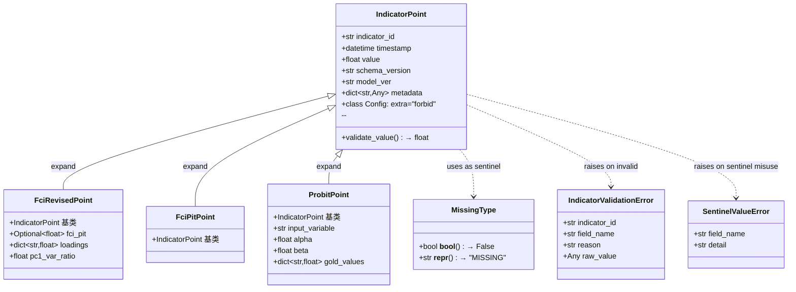
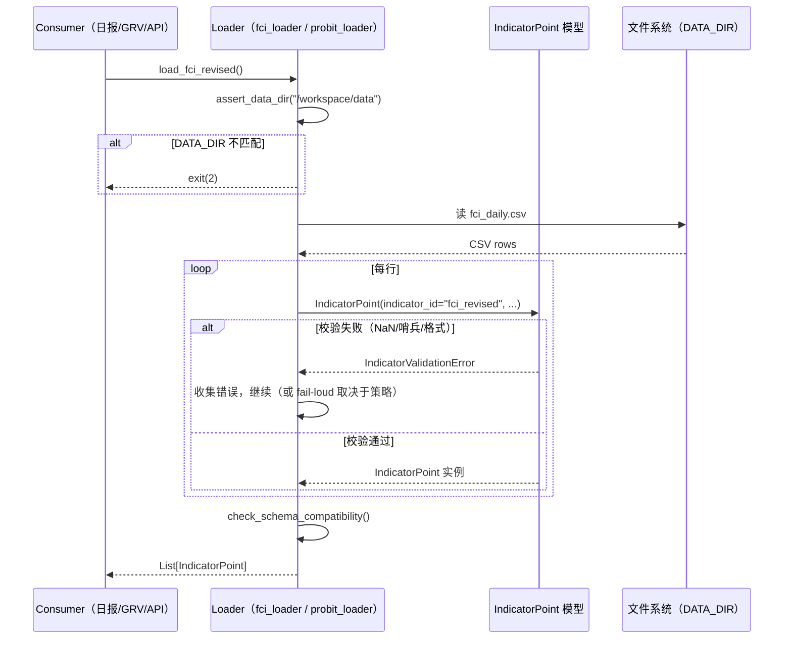

# I1 · Pydantic 指标数据契约设计

> **版本**：v1.0（设计定稿）
> **作者**：Bob（arch-i1-v2，架构师角色）
> **日期**：2026-07-31
> **上游依据**：`worldsim-review-synthesis.md` §6.2/§6.3、`STATUS.md` §I1、`MEMORY.md` Sprint-0 编排评审裁决
> **关联文档**：`design/a3a_control_api_design.md`（schema_version 语义）、`design/a2_ged_etl_design.md`（I1 对齐待办 §8）
> **交付约束**：**纯设计文档，不写代码实现，不部署 NAS，不改动任何现有代码**。

---

## §0 执行摘要

本设计为 world-sim 项目定义**统一的 Pydantic 数据契约模型**，所有数据产品（FCI、probit、未来所有指标）的**行级数据点**必须遵守此契约。

### 核心设计决策速览

| # | 决策 | 理由 |
|---|------|------|
| **D1** | `IndicatorPoint` 为 Pydantic `BaseModel`，`extra=forbid` | 字段必须显式声明；拒绝未声明字段 = 杜绝静默属性漂移 |
| **D2** | 哨兵 `MISSING = MissingType()` 替代 `None`/`0`/`""` | 区分「未提供」与「值为零/空」——后者在金融数据中均有合法含义 |
| **D3** | `schema_version` 与 `model_ver` **拆为两字段** | schema_version 描述数据契约版本（SemVer），model_ver 描述模型版本（如 `fci-1.1`） |
| **D4** | `value` 字段**强制非 NaN 非 INF** | NaN/INF 是静默降级的温床；校验期拦截，不进下游 |
| **D5** | FCI 双轨（revised/pit）映射为**两个独立 `indicator_id`** | `fci_revised` / `fci_pit` 有不同 usage_policy，独立标识便于消费侧分轨 |
| **D6** | `metadata` 为 `dict[str, Any]` 松散容器 | 持有 vintage/contributions/loadings 等可变字段，避免基类随业务膨胀 |

### 与现有 FCI 的兼容性承诺

- **fci-1.1 现有输出（`fci_latest.json` / `fci_daily.csv`）不改动**
- IndicatorPoint 作为**加载期校验层**叠加在现有输出之上
- FCI 适配方案（§4）是**映射 + 加载校验**，不重写 compute_fci.py 的落盘逻辑

---

## §1 契约总则

### 1.1 目的

为 world-sim 系统中所有结构化指标数据定义统一的**行级数据契约**，解决以下三类静默降级：

| 静默降级形态 | 契约防御 |
|-------------|---------|
| 上游字段改名/增删 → 下游读到错字段 | `extra=forbid` + 必填校验 → **加载期 fail-loud** |
| NaN/INF 静默流入聚合/监控 | `value` 字段强制 `finite float` → **校验拦截** |
| `None`/`0`/`""` 无法区分"缺值"与"合法零/空" | `MISSING` 哨兵 → **语义明确** |

### 1.2 适用范围

- **直接适用**：Sprint-0 止血线指标——FCI（fci-1.1）、probit（probit-1.0）
- **扩展适用**：未来所有天枢产出的指标数据产品，均应继承 `IndicatorPoint` 基类
- **不适用**：原始采集数据（`fred_history/*.csv`、`fx_latest.json` 等 fetcher 落盘）——这些是**上游输入**，不在指标契约范围内

### 1.3 版本策略

| 版本字段 | 语义 | 何时递增 | 格式 |
|---------|------|---------|------|
| `schema_version` | **数据契约版本**（结构向后兼容保证） | 字段增删/改类型/改语义 | SemVer `"1.0.0"` |
| `model_ver` | **模型版本**（模型参数/方法变更） | 模型重训/参数调整/方法升级 | `"<model>-<major>.<minor>"` |

**版本兼容性矩阵**：

| schema_version 变更类型 | 消费侧行为 |
|------------------------|-----------|
| **PATCH**（如 1.0.0→1.0.1）：仅新增 optional 字段 | 向前兼容，旧消费侧忽略新字段即可 |
| **MINOR**（如 1.0.0→1.1.0）：新增字段 + 旧字段保留 | 向前兼容，消费侧可选升级 |
| **MAJOR**（如 1.0.0→2.0.0）：删除/重命名字段或改类型 | **不兼容**，消费侧必须升级；加载期校验 `schema_version` 范围 |

**与 A3a 信封 `api_version` 的关系**：
- A3a 的 `api_version`（`"v1"`）是**控制 API 协议版本**
- I1 的 `schema_version`（`"1.0.0"`）是**数据契约版本**
- 两者独立演进、不耦合。A3a 未来通过控制 API 查询指标时，按 `schema_version` 做兼容性路由（详见 §7）

---

## §2 IndicatorPoint 模型定义

### 2.1 类图



### 2.2 字段表

| # | 字段 | 类型 | 必填 | 默认 | 校验规则 | 说明 |
|---|------|------|------|------|---------|------|
| 1 | `indicator_id` | `str` | ✅ | — | `r"^[a-z][a-z0-9_]*$"`，长度 1–64 | 指标标识，如 `"fci_revised"` `"fci_pit"` `"probit"` |
| 2 | `timestamp` | `datetime` | ✅ | — | must be aware (含 tz) 或 naive；精确到日 | 数据点时间（因指标皆为日频，精确到日即可） |
| 3 | `value` | `float` | ✅ | — | `math.isfinite(value) == True`（非 NaN 非 ±INF） | 指标数值 |
| 4 | `schema_version` | `str` | ✅ | — | SemVer `r"^\d+\.\d+\.\d+$"` | 数据契约版本 |
| 5 | `model_ver` | `str` | ✅ | — | 格式 `"<name>-<major>.<minor>"`，如 `"fci-1.1"` | 模型版本 |
| 6 | `metadata` | `dict[str, Any]` | ✅ | `{}` | 键为 `str`，值类型不限；空字典合法 | 可变附属字段容器（vintage/contributions/loadings 等） |

### 2.3 哨兵定义

```python
class MissingType:
    """非平凡缺失哨兵。

    禁止以 None / 0 / "" / False 表示"值缺失"：
    - None：Pydantic 默认行为是"可选字段缺省 = None"，无法区分"未传入"与"明确设 None"
    - 0："零伤亡""零波动率"是合法业务值
    - ""：空字符串可由上游 CSV 空列产生，静默含义不明
    - False：布尔假 ≠ 缺失
    """

    _instance = None

    def __new__(cls):
        if cls._instance is None:
            cls._instance = super().__new__(cls)
        return cls._instance

    def __bool__(self) -> bool:
        return False

    def __repr__(self) -> str:
        return "MISSING"


# 全局单例
MISSING = MissingType()
```

**哨兵使用规则**：

| 场景 | 做法 |
|------|------|
| 上游字段缺失（如 `fci_pit` 在 burn-in 期内无值） | 在 metadata 中设 `"pit_value": MISSING` |
| 可选字段未提供 | 使用 Pydantic `default=MISSING` 而非 `default=None` |
| 校验 `value` 不应为哨兵 | `IndicatorPoint` 的 `value` **禁止**等于 `MISSING`——它是一个 `float` 字段，哨兵不适用 |

### 2.4 错误/异常层级

```
ValueError
 └─ IndicatorValidationError         # 基类：所有指标校验异常
     ├─ SentinelValueError            # 哨兵误用（MISSING 出现在不允许的位置）
     ├─ ValueNotFiniteError           # value 为 NaN 或 INF
     ├─ SchemaVersionMismatchError    # schema_version 不兼容
     ├─ ModelVersionFormatError       # model_ver 格式不合规
     ├─ RequiredFieldMissingError     # 必填字段缺失
     └─ ExtraFieldForbiddenError      # 未声明字段（extra=forbid 触发）
```

**异常携带信息**（以 `IndicatorValidationError` 为例）：

| 属性 | 类型 | 说明 |
|------|------|------|
| `indicator_id` | `str` | 出错的指标标识 |
| `field_name` | `str` | 出错字段名 |
| `reason` | `str` | 人类可读错误描述 |
| `raw_value` | `Any` | 原始违规值（供调试，不泄露到日志外） |
| `timestamp` | `datetime` | 发生时间 |

**设计原则**：
1. 所有校验异常 `exit != 0`，**不静默**——与 §三静默降级病族对抗是一致的
2. 异常消息包含足够上下文（`indicator_id` + `field_name` + `raw_value`），便于运维快速定位
3. 异常层级继承自 `ValueError`，与 Pydantic 内置 `ValidationError` 并存时可由上层统一捕获

### 2.5 Config 配置

```python
class IndicatorPoint(BaseModel):
    model_config = ConfigDict(
        extra="forbid",          # ← 核心：拒绝未声明字段
        frozen=True,             # 不可变（防下游偷改）
        str_strip_whitespace=True,
        validate_assignment=True, # 即使直接赋值也走校验
    )
```

**`frozen=True` 的取舍**：
- **利**：记录级不可变，与 `@dataclass(frozen=True)` 的 GED `GedEventRecord`（A2 设计 §2）一致；下游无法偷改
- **弊**：无法做 `point.metadata["new_key"] = val` 的原地修改——需用 `point.model_copy(update={"metadata": {**point.metadata, "new_key": val}}) `
- **裁决**：采纳 `frozen=True`。指标数据点的语义是"已定稿的观测"，不应被下游改写；若需丰富元数据，在上游落盘时完整提供

---

## §3 字段级校验规则（validator 清单）

### 3.1 `indicator_id` 校验

| 规则 | 违规动作 |
|------|---------|
| 非空字符串 | `RequiredFieldMissingError` |
| 匹配 `^[a-z][a-z0-9_]*$` | `IndicatorValidationError(reason="indicator_id 格式非法")` |
| 长度 ≤ 64 | `IndicatorValidationError(reason="indicator_id 过长")` |

### 3.2 `timestamp` 校验

| 规则 | 违规动作 |
|------|---------|
| 可解析为 `datetime` | `RequiredFieldMissingError` |
| 日期部分非 `0001-01-01` 等哨兵最小值 | `SentinelValueError` |
| *（不强求 timezone-aware——FCI 现有输出为 ISO 含时区，但未来可能兼容无时区）* | — |

### 3.3 `value` 校验（核心）

| 规则 | 违规动作 |
|------|---------|
| `isinstance(value, (int, float))` | `IndicatorValidationError` |
| `math.isfinite(value) == True` | `ValueNotFiniteError` |
| 非 `MISSING` 哨兵 | `SentinelValueError` |

**`math.isfinite` 拦截范围**：`NaN`、`+inf`、`-inf` 全部拦截。`float('nan')` 的 `isfinite` 返回 `False`。

**为什么在 Pydantic 层做而不依赖 numpy**：指标契约应独立于计算库。消费侧可能不导入 numpy。

### 3.4 `schema_version` 校验

| 规则 | 违规动作 |
|------|---------|
| 匹配 `^\d+\.\d+\.\d+$` | `IndicatorValidationError` |
| MAJOR 版本在消费侧兼容列表内（加载期校验，见 §3.6） | `SchemaVersionMismatchError` |

### 3.5 `model_ver` 校验

| 规则 | 违规动作 |
|------|---------|
| 匹配 `^[a-z][a-z0-9_]*-\d+\.\d+$` | `ModelVersionFormatError` |
| 对于同一 `indicator_id`，`model_ver` 须在已知版本集合内（加载期校验，可配） | `IndicatorValidationError(reason="未知 model_ver")` |

### 3.6 加载期兼容性校验（非 Pydantic validator，是独立校验函数）

此校验在**加载数据后、消费前**执行，而非在 Pydantic 实例化时：

```python
def check_schema_compatibility(point: IndicatorPoint, accepted_versions: list[str]) -> None:
    """验证 schema_version 与消费侧兼容。

    accepted_versions 是消费侧声明的兼容 schema_version 列表（如 ["1.0.0", "1.0.1"]）。
    若 point.schema_version 不在列表内 → SchemaVersionMismatchError。

    PATCH 版本不匹配→可由消费侧决定是否接受（宽松模式）或拒绝（严格模式）。
    MINOR 版本不匹配→WARN 但可接受（只要 MAJOR 一致且 consumer 声明兼容）。
    MAJOR 不一致→拒绝。
    """
```

---

## §4 FCI 适配方案

### 4.1 现状（fci-1.1 输出格式）

**`fci_daily.csv`** 列：
```
date, fci_revised, fci_pit, pit_available, load_T10Y2Y, load_BAA10Y, load_BAMLH0A0HYM2,
load_VIXCLS, load_DTWEXBGS, pc1_var_ratio, as_of, data_vintage, schema_version
```

**`fci_latest.json`** 结构（见 §0 摘要；完整结构在 `fci_latest.json` 实测数据中）。

### 4.2 映射方案：FCI 行 → `IndicatorPoint`

FCI 的双轨（revised/pit）映射为**两个独立 `indicator_id`**：

#### 4.2.1 `fci_revised` 映射

| IndicatorPoint 字段 | 来源 | 备注 |
|---------------------|------|------|
| `indicator_id` | 硬编码 `"fci_revised"` | |
| `timestamp` | CSV `date` 列 → `datetime` | |
| `value` | CSV `fci_revised` 列 | 非 NaN 非 INF 校验 |
| `schema_version` | 硬编码 `"1.0.0"`（首次引入 I1 契约） | **区别于 FCI 自身的 `fci-1.1`**（那是 model_ver） |
| `model_ver` | CSV `schema_version` 列 → `"fci-1.1"` | fci-1.1 的 schema_version 字段语义实为 model_ver |
| `metadata` | 从 CSV 列组装 | 见下表 |

**`fci_revised` 的 `metadata` 内容**：

```json
{
  "as_of": "2026-07-31T07:59:21+08:00",
  "data_vintage": "2026-07-24",
  "pc1_var_ratio": 0.4234,
  "loadings": {
    "T10Y2Y": 0.4361,
    "BAA10Y": 0.5516,
    "BAMLH0A0HYM2": 0.6369,
    "VIXCLS": -0.0013,
    "DTWEXBGS": -0.3162
  },
  "n_components": 5,
  "panel_rows": 840,
  "rows_dropped": 0,
  "sanity_status": "PASS",
  "sanity_corr_level": 0.8284,
  "usage_policy": {
    "allow": ["nowcast", "dashboard", "alerting"],
    "deny": ["backtest", "verification", "brier"]
  },
  "pit_value": -0.942287,
  "pit_available": true
}
```

#### 4.2.2 `fci_pit` 映射

| IndicatorPoint 字段 | 来源 | 备注 |
|---------------------|------|------|
| `indicator_id` | 硬编码 `"fci_pit"` | |
| `timestamp` | CSV `date` 列 → `datetime` | |
| `value` | CSV `fci_pit` 列 | burn-in 期内为 NaN → 该行**不生成** fci_pit 点（而非生成含 NaN 的点） |
| `schema_version` | 硬编码 `"1.0.0"` | |
| `model_ver` | `"fci-1.1"` | |
| `metadata` | 精简版 | 不含 usage_policy（fci_pit 的 usage_policy 不同：allow backtest 等） |

**生成规则**：
- FCI 每行同时产出 `fci_revised` 和 `fci_pit` 两个 `IndicatorPoint`
- `fci_pit` 仅在 `pit_available == 1` 时生成；burn-in 期内 `fci_pit` 为 NaN → **不生成** fci_pit 点
- `fci_revised` 始终生成（全样本 PCA 始终有值）

### 4.3 向后兼容策略

**铁律：不修改现有 FCI 落盘逻辑**。`compute_fci.py` 继续以现有格式写 `fci_daily.csv` / `fci_latest.json`。

I1 契约以**加载适配层**方式叠加：

```
compute_fci.py（不改动）
       │
       ▼
  fci_daily.csv（现有格式不变）
       │
       ▼
  fci_loader.py（新建，约 50 行）
       │  读 CSV → 逐行映射为 IndicatorPoint
       │  校验 (extra=forbid + value 非 NaN 等)
       │  返回 List[IndicatorPoint]
       ▼
  下游消费（GRV / 日报 / 控制API 查询）
```

**schema_version 过渡期**：
- FCI 现有 CSV 的 `schema_version` 列为 `"fci-1.1"`——这是 FCI 自己的版本号
- I1 将其映射为 `model_ver="fci-1.1"` + `schema_version="1.0.0"`
- 未来 FCI 若升级到 fci-1.2（模型参数变），只需在 loader 中更新 `model_ver` 映射
- 若 I1 契约本身升级到 1.1.0（新增字段），`schema_version` 才变

**`fci_latest.json` 的加载**：
- 从 JSON 提取 `date` + `fci_revised` + `fci_pit` 等字段
- 同样映射为两个 `IndicatorPoint`
- JSON 中的 `usage_policy` / `method` / `panel` / `components` / `sanity_vs_nfci` 进入 `metadata`

---

## §5 probit 适配方案

### 5.1 probit-1.0 预期输出

probit 模型（`compute_probit.py`，待实现）预期落盘格式：

**`probit_daily.csv`**（每行一天）：
```
date, probit_value, t10y3m, as_of, data_vintage, schema_version
```

**`probit_latest.json`**：
```json
{
  "schema_version": "probit-1.0",
  "as_of": "2026-07-31T08:00:00+08:00",
  "data_vintage": "2026-07-30",
  "date": "2026-07-30",
  "probit_value": 0.1501,
  "input_variable": "T10Y3M",
  "input_value": 0.84,
  "alpha": -0.5333,
  "beta": -0.5984,
  "gold_values": {
    "m100bp": 0.5260,
    "zero": 0.2969,
    "p100bp": 0.1289
  },
  "formula": "Φ(α + β × T10Y3M)",
  "reference": "Estrella & Trubin (2006), FRB NY Staff Report No. 258"
}
```

### 5.2 probit → `IndicatorPoint` 映射

| IndicatorPoint 字段 | 来源 | 备注 |
|---------------------|------|------|
| `indicator_id` | 硬编码 `"probit"` | |
| `timestamp` | CSV `date` → `datetime` | |
| `value` | CSV `probit_value` | 范围 [0, 1]，表示 12M 衰退概率 |
| `schema_version` | 硬编码 `"1.0.0"` | |
| `model_ver` | `"probit-1.0"` | |
| `metadata` | 从 CSV/JSON 组装 | 含 input_variable/alpha/beta/gold_values |

**probit `metadata` 内容**：

```json
{
  "as_of": "2026-07-31T08:00:00+08:00",
  "data_vintage": "2026-07-30",
  "input_variable": "T10Y3M",
  "input_value": 0.84,
  "alpha": -0.5333,
  "beta": -0.5984,
  "gold_values": {
    "m100bp": 0.5260,
    "zero": 0.2969,
    "p100bp": 0.1289
  },
  "formula": "Φ(α + β × T10Y3M)",
  "reference": "Estrella & Trubin (2006)"
}
```

### 5.3 G1 口径断言映射到 Pydantic validator

G1 闸门（probit 自变量必须是 T10Y3M，系数 α=−0.5333 / β=−0.5984）在 I1 契约中通过 `ProbitPoint` 子类的 **Pydantic validator** 实现：

```python
class ProbitPoint(IndicatorPoint):
    """probit 指标专用子类，携带 G1 口径断言。"""

    input_variable: str          # 必填："T10Y3M"
    alpha: float                 # 必填：−0.5333
    beta: float                  # 必填：−0.5984
    gold_values: dict[str, float]  # 黄金回归值

    @field_validator("input_variable")
    @classmethod
    def _assert_t10y3m(cls, v: str) -> str:
        if v != "T10Y3M":
            raise IndicatorValidationError(
                indicator_id="probit",
                field_name="input_variable",
                reason=f"G1 口径断言：自变量必须为 T10Y3M，实际 {v}。"
                       f"使用 T10Y2Y 套同一系数 = 系统性偏（上线首日高估 ~6pp）。",
                raw_value=v,
            )
        return v

    @field_validator("value")
    @classmethod
    def _assert_probability_range(cls, v: float) -> float:
        if not (0.0 <= v <= 1.0):
            raise IndicatorValidationError(
                indicator_id="probit",
                field_name="value",
                reason=f"probit 值应在 [0,1] 范围内，实际 {v}",
                raw_value=v,
            )
        return v
```

**G1 断言层级**：
1. **Pydantic 层**（本设计）：`input_variable` 字段必须为 `"T10Y3M"`
2. **代码层**（probit 任务卡）：`compute_probit.py` 内部 `assert input_column == "T10Y3M"`，否则 `exit`
3. **单测层**（probit 黄金值单测）：±100bp/0 三个点 ±0.05pp

三道闸互为冗余——任何一道被绕过，下道仍在。

---

## §6 QA 验收断言（spec-first）

> 原则：**先写验收断言，再写实现**。以下断言是 I1 契约的 spec，工程实现时必须全部通过。

### 6.1 应拦截的非法输入（FAIL 断言）

#### A1. 必填字段缺失

| # | 输入 | 期望 |
|---|------|------|
| A1.1 | `{}`（空对象） | `RequiredFieldMissingError`，列出全部缺失字段 |
| A1.2 | `{"indicator_id": "fci_revised"}` 其余全缺 | `RequiredFieldMissingError`，列出 timestamp/value/schema_version/model_ver |
| A1.3 | 缺少 `timestamp`，其余字段正常 | `RequiredFieldMissingError` |

#### A2. `extra=forbid` 拒绝未声明字段

| # | 输入 | 期望 |
|---|------|------|
| A2.1 | 正常 FCI 点 + 额外字段 `{"foo": "bar"}` | `ExtraFieldForbiddenError`（Pydantic `extra=forbid`） |
| A2.2 | 正常 FCI 点 + 额外字段 `{"schemaVersion": "1.0"}`（大小写不同） | `ExtraFieldForbiddenError` |
| A2.3 | 正常 probit 点 + `{"coefficient": 0.5}`（非标准字段） | `ExtraFieldForbiddenError` |

#### A3. `value` 为 NaN 或 INF

| # | 输入 | 期望 |
|---|------|------|
| A3.1 | `value=float('nan')` | `ValueNotFiniteError` |
| A3.2 | `value=float('inf')` | `ValueNotFiniteError` |
| A3.3 | `value=float('-inf')` | `ValueNotFiniteError` |
| A3.4 | `value=None` | Pydantic 类型校验失败（None 不能赋值给 float） |

#### A4. `indicator_id` 格式非法

| # | 输入 | 期望 |
|---|------|------|
| A4.1 | `indicator_id=""`（空字符串） | `IndicatorValidationError` |
| A4.2 | `indicator_id="FCI"`（含大写） | `IndicatorValidationError` |
| A4.3 | `indicator_id="fci-revised"`（含连字符） | `IndicatorValidationError` |
| A4.4 | `indicator_id="a" * 65`（超 64 字符） | `IndicatorValidationError` |

#### A5. `schema_version` 格式非法

| # | 输入 | 期望 |
|---|------|------|
| A5.1 | `schema_version="v1"` | `IndicatorValidationError` |
| A5.2 | `schema_version="1.0"`（缺 PATCH） | `IndicatorValidationError` |
| A5.3 | `schema_version="1.0.0-beta"` | `IndicatorValidationError` |
| A5.4 | `schema_version=""` | `IndicatorValidationError` |

#### A6. `model_ver` 格式非法

| # | 输入 | 期望 |
|---|------|------|
| A6.1 | `model_ver="1.1"`（缺模型名前缀） | `ModelVersionFormatError` |
| A6.2 | `model_ver="fci-1"`（缺 minor） | `ModelVersionFormatError` |
| A6.3 | `model_ver=""` | `ModelVersionFormatError` |

#### A7. probit G1 口径断言

| # | 输入 | 期望 |
|---|------|------|
| A7.1 | `ProbitPoint(input_variable="T10Y2Y", ...)` | `IndicatorValidationError`（G1 断言：自变量必须为 T10Y3M） |
| A7.2 | `ProbitPoint(input_variable="", ...)` | `IndicatorValidationError` |
| A7.3 | `ProbitPoint(value=1.5, ...)` | `IndicatorValidationError`（值超出 [0,1]） |
| A7.4 | `ProbitPoint(value=-0.1, ...)` | `IndicatorValidationError` |

#### A8. 加载期 schema_version 不兼容

| # | 输入 | 期望 |
|---|------|------|
| A8.1 | `schema_version="2.0.0"`（MAJOR 不匹配），消费侧仅接受 1.x | `SchemaVersionMismatchError` |
| A8.2 | `schema_version="1.2.0"`（MINOR 不匹配），消费侧仅接受 1.0.x（严格模式） | 严格模式→`SchemaVersionMismatchError`；宽松模式→WARN 但接受 |

### 6.2 应通过的合法输入（PASS 断言）

#### B1. FCI revised 合法点

```python
IndicatorPoint(
    indicator_id="fci_revised",
    timestamp=datetime(2026, 7, 30),
    value=-0.942287,
    schema_version="1.0.0",
    model_ver="fci-1.1",
    metadata={
        "as_of": "2026-07-31T07:59:21+08:00",
        "data_vintage": "2026-07-24",
        "pc1_var_ratio": 0.4234,
        "loadings": {"T10Y2Y": 0.4361, "BAA10Y": 0.5516, "BAMLH0A0HYM2": 0.6369, "VIXCLS": -0.0013, "DTWEXBGS": -0.3162},
    }
)
# 期望：无异常抛出，所有字段可访问
```

#### B2. FCI pit 合法点

```python
IndicatorPoint(
    indicator_id="fci_pit",
    timestamp=datetime(2026, 7, 30),
    value=-0.942287,
    schema_version="1.0.0",
    model_ver="fci-1.1",
    metadata={
        "as_of": "2026-07-31T07:59:21+08:00",
        "data_vintage": "2026-07-24",
        "burnin": 504,
    }
)
# 期望：无异常
```

#### B3. probit 合法点

```python
ProbitPoint(
    indicator_id="probit",
    timestamp=datetime(2026, 7, 30),
    value=0.1501,
    schema_version="1.0.0",
    model_ver="probit-1.0",
    input_variable="T10Y3M",
    alpha=-0.5333,
    beta=-0.5984,
    gold_values={"m100bp": 0.5260, "zero": 0.2969, "p100bp": 0.1289},
    metadata={"as_of": "2026-07-31T08:00:00+08:00", "data_vintage": "2026-07-30"}
)
# 期望：无异常
```

#### B4. `metadata={}` 空字典合法

```python
IndicatorPoint(
    indicator_id="fci_revised",
    timestamp=datetime(2026, 1, 1),
    value=0.0,               # 0 是合法 FCI 值（= z-score 恰好等于均值）
    schema_version="1.0.0",
    model_ver="fci-1.1",
    metadata={}
)
# 期望：无异常。元数据可空——契约不强制元数据内容。
```

#### B5. `value=0` 通过（0 是合法值）

```python
# FCI z-score = 0 表示恰好均值——合法
# probit = 0 表示 0% 衰退概率——合法
# 哨兵 MISSING ≠ 0，故 0 始终通过
```

#### B6. `MISSING` 哨兵在 metadata 中合法

```python
IndicatorPoint(
    indicator_id="fci_revised",
    timestamp=datetime(2026, 5, 22),
    value=4.30,
    schema_version="1.0.0",
    model_ver="fci-1.1",
    metadata={"pit_value": MISSING}  # burn-in 期内无 pit 值
)
# 期望：无异常。MISSING 在 metadata 中是合法的。
```

### 6.3 边界条件测试

| # | 场景 | 期望 |
|---|------|------|
| B7 | `value=1e-10`（极小正浮点） | PASS |
| B8 | `value=-1e-10`（极小负浮点） | PASS |
| B9 | `value=0.0`（精确零） | PASS |
| B10 | `value=1.0`（probit 上界） | PASS（probit）；PASS（FCI，z-score 可为任意值） |
| B11 | `timestamp` 为 `datetime.max` | PASS（只要可解析） |
| B12 | `indicator_id="a"`（最短合法） | PASS |
| B13 | `indicator_id="a" + "b" * 62`（最长合法 63 字符） | PASS |
| B14 | `model_ver="z-0.0"`（最简合法） | PASS |

---

## §7 落地闸集成

### 7.1 DATA_DIR 环境变量断言

来自 `MEMORY.md` 的落地闸铁律（容器内 `DATA_DIR==/workspace/data`）：

```python
def assert_data_dir(expected: str = "/workspace/data") -> None:
    """落地闸：DATA_DIR 必须指向持久卷。

    若 DATA_DIR 不等于 /workspace/data（如因 optim_config 缺失 FRED_PROXY
    导致 fallback 到容器根 /data），直接 exit——/data 在容器重启后丢失。
    """
    actual = os.environ.get("DATA_DIR", "")
    if actual != expected:
        print(f"[I1][FATAL] DATA_DIR={actual!r}，期望 {expected!r}。"
              f"落地卷错误——拒绝写数据。", file=sys.stderr)
        sys.exit(2)
```

**在哪里调用**：
- FCI loader / probit loader 的 `__init__` 或模块加载时
- 不放在 `IndicatorPoint` 内部——那是数据模型，不应耦合部署拓扑

### 7.2 静态闸白名单（import 白名单）

来自 MEMORY.md：两道静态闸是交付卡点——**import 白名单** + 单文件 bind mount 扫描。

I1 涉及的文件须在 import 白名单内：

| 文件 | 归属 | 白名单状态 |
|------|------|-----------|
| `core/indicator_contract.py`（IndicartorPoint 定义） | 新建 | **须加入白名单** |
| `core/indicator_errors.py`（异常类） | 新建 | **须加入白名单** |
| `core/fci_loader.py`（FCI→IndicatorPoint） | 新建 | **须加入白名单** |
| `core/probit_loader.py`（probit→IndicatorPoint） | 新建 | **须加入白名单** |

白名单允许的 import 范围（仅三条）：
1. `DATA_DIR`（环境变量，部署时注入）
2. `WORKSPACE`（OPENCLAW_WORKSPACE）
3. `CRUCIX_REMOTE_URL`（环境变量）

`indicator_contract.py` **不 import 任何外部库**（仅标准库 + pydantic），故天然合规。

### 7.3 I1 契约加载流程（含落地闸）



**错误处理策略**（可配）：

| 策略 | 行为 |
|------|------|
| **strict**（默认） | 任何一行校验失败 → 整批拒绝，`exit(2)` |
| **permissive** | 跳过失败行，仅返回合法行；失败行入 `validation_errors.log` |
| **quarantine** | 失败行写入 `quarantine/` 目录，合法行正常返回 |

Sprint-0 阶段使用 **strict**（止血线不允许半成品数据）。

---

## §8 与 A3a 信封对齐

### 8.1 `schema_version` 语义一致

| 组件 | 字段 | 语义 | 格式 |
|------|------|------|------|
| **A3a 控制 API** | `api_version` | 控制协议版本 | `"v1"` |
| **I1 数据契约** | `schema_version` | 数据记录结构版本 | `"1.0.0"`（SemVer） |

两者**不耦合**：控制 API 可以 v1→v2 升级而不影响数据结构；数据契约可以 1.0.0→1.1.0 升级而不影响控制协议。

### 8.2 未来控制 API 引用指标

A3a 设计的 E6（列源状态）和 E8（health）未来可能扩展为查询指标数据。当控制 API 返回指标数据时：

```json
{
  "code": 0,
  "message": "ok",
  "data": {
    "schema_version": "1.0.0",
    "points": [
      {
        "indicator_id": "fci_revised",
        "timestamp": "2026-07-30T00:00:00",
        "value": -0.942287,
        "model_ver": "fci-1.1",
        "metadata": { ... }
      }
    ]
  }
}
```

**关键对齐点**：
1. 控制 API 响应外层用 A3a 的 `api_version`（`"v1"`）
2. `data.points[]` 内层用 I1 的 `schema_version`（`"1.0.0"`）
3. 控制 API 可按 `schema_version` 做路由：同一个 `/api/v1/indicators/fci` 端点，根据请求头 `Accept-Schema-Version: 1.0.0` 返回对应结构
4. A3a 的 JOBS 状态（`jobs.state.yaml`）中可引用 `schema_version` 作为指标兼容性标记

---

## §9 实现计划

### 9.1 文件清单

| # | 文件 | 说明 | 行数估 |
|---|------|------|--------|
| 1 | `core/indicator_contract.py` | IndicatorPoint 基类 + MISSING 哨兵 + validator（§2–§3） | ~80 |
| 2 | `core/indicator_errors.py` | 异常层级（§2.4） | ~40 |
| 3 | `core/fci_loader.py` | FCI CSV→IndicatorPoint 加载器（§4） | ~50 |
| 4 | `core/probit_loader.py` | probit CSV→IndicatorPoint 加载器（§5） | ~50 |
| 5 | `core/indicator_contract_test.py` | QA 验收断言单测（§6） | ~120 |
| 6 | `core/__init__.py` | 如不存在则新建；导出公共符号 | ~5 |

**总计：~345 行**，纯新文件，不改动任何现有代码。

### 9.2 最小改动路径

```
Step 1: 创建 core/indicator_errors.py（异常类，无依赖）
Step 2: 创建 core/indicator_contract.py（依赖 indicator_errors.py）
Step 3: 创建 core/fci_loader.py（依赖 indicator_contract.py）
Step 4: 创建 core/probit_loader.py（依赖 indicator_contract.py，可与 Step 3 并行）
Step 5: 创建 core/indicator_contract_test.py（QA 单测，依赖上述全部）
```

**不改动文件清单**（零回归风险保证）：
- `compute_fci.py` ✓ 不改
- `scheduler.py` ✓ 不改
- `fetcher_base.py` ✓ 不改
- `fetch_fred_history.py` ✓ 不改
- 任何现有 `.csv` / `.json` 落盘 ✓ 不改

### 9.3 依赖

| 依赖 | 版本 | 用途 |
|------|------|------|
| `pydantic` | `>=2.0` | BaseModel / field_validator / ConfigDict |
| Python 标准库 | ≥3.10 | math.isfinite / datetime / os / sys / re |

**不依赖的库**（刻意规避）：
- `numpy` / `pandas`——数据契约不依赖计算库
- `fredapi`——契约不连外部 API
- 任何天枢内部模块——`indicator_contract.py` 是纯数据模型，零外部 import

### 9.4 工期

| 步骤 | 工时 |
|------|------|
| §2–§3 IndicatorPoint 基类 + 哨兵 + 异常 | 1h |
| §4 FCI loader | 0.5h |
| §5 probit loader（含 G1 断言） | 0.5h |
| §6 QA 单测（~26 条断言） | 1h |
| §7 落地闸集成（DATA_DIR 断言） | 0.25h |
| 文档 & review | 0.25h |
| **合计** | **~3.5h（≈0.5 人日）** |

---

## §A 附录：与 A2 GED ETL 的对齐建议

A2 设计文档 §8 列出了 5 项 I1 对齐待办。本设计对此回复如下：

| A2 待办 | I1 回复 |
|---------|--------|
| **I1-1** `schema_version` 命名规范 | 采纳 `<domain>-<major>.<minor>` 作为 **model_ver** 格式。`schema_version` 统一用 SemVer `"1.0.0"`。A2 的 `ged-etl-1.0` → `model_ver="ged-etl-1.0"` |
| **I1-2** `data_vintage` 语义 | I1 不强制 `data_vintage` 类型——它在 `metadata` 内，是 str 或 date 均可。A2 的 `data_vintage="v26.1"` 保留为 str |
| **I1-3** Pydantic 基类继承 | A2 的 `GedEventRecord` 当前是 `@dataclass(frozen=True)`——这是内部标准化结构，不是指标数据点。**GED 聚合产物**（`ged_agg_country_year.csv`）才是指标数据点、才继承 `IndicatorPoint`。A2 内部 dataclass 不需要改 |
| **I1-4** 加载期 fail-loud 契约 | 若 A2 的 `usage_policy` 校验与 I1 的 `check_schema_compatibility()` 语义重叠，建议合并为统一入口。否则独立即可——两者防护面不同（一个是数据用途、一个是结构兼容性） |
| **I1-5** 缺失哨兵约定 | I1 使用 `MISSING = MissingType()`。A2 的 `number_of_sources: -1 → None + source_sentinel=True` 是另一层面的语义（"-1 是上游哨兵值"），不冲突。建议 A2 的未来指标聚合产物中，缺失值统一使用 `MISSING` 而非 `None` |

---

> **文档结束**。本设计为纯设计文档，不含代码；待主理人审批后交由 Engineer 按 §9 路径实现。
