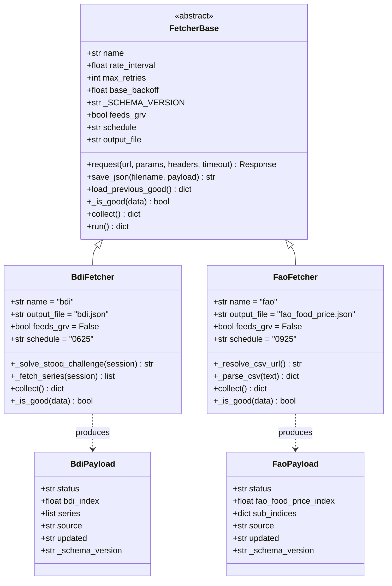
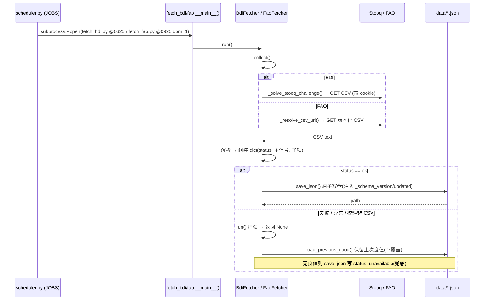
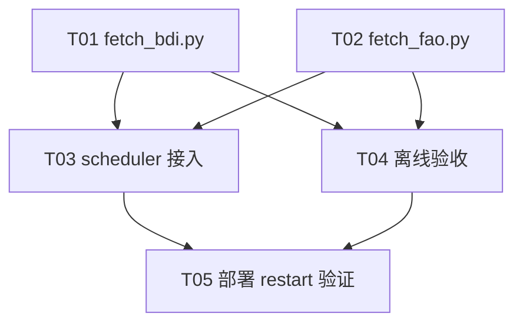

# 架构设计：macro-scan 接入 BDI 与 FAO 数据源（增量）

| 项 | 内容 |
|----|------|
| 类型 | 架构设计 + 任务分解（增量） |
| 日期 | 2026-07-28 |
| 作者角色 | 架构师（software-architect / Bob） |
| 基线 | VERSION 3.5.65，`fetcher_base` 适配层收口完成 |
| 目标版本 | 3.6.0 |
| 关联 PRD | `docs/PRD_bdi_fao_2026-07-28.md` |

> 本文档所有端点/字段均经 **实测验证（2026-07-28）**，非臆测。验证记录见 §5 与 §7 注释。

---

## 1. 实现方案 + 框架选型

### 1.1 技术栈与复用策略
- **复用 `FetcherBase`（`核心代码/fetcher_base.py`）**：两个新 fetcher 必须继承它，复用：
  - `request()`（固定间隔限速 + 429/5xx 指数退避重试，4xx/异常最终返回 `None` 不抛）；
  - `save_json()`（原子写 `.tmp`+`os.replace`，自动注入 `_schema_version` 与 `updated`，缺 `status` 兜底 `unavailable`）；
  - `load_previous_good()`（经 `_is_good` 判定保留上次良值）；
  - `load_config_with_fallback()`（取代各 fetcher 重复的 `ImportError` 块）。
- **语言**：Python 3（与 `核心代码` 既有一致）。
- **HTTP**：复用 `FetcherBase.request()`（底层 `requests`，已为依赖）。
- **解析**：BDI/FAO 均为 CSV，用标准库 `csv` 解析即可，**无需 pandas 作为必装依赖**（pandas 仅作为可选的历史回填工具列入 §6）。
- **不引入新框架、不写重复样板**；不改动任何既有 fetcher。

### 1.2 核心难点与已拍板决策（实测驱动）

#### 难点 A — Stooq 对无头客户端启用 JS 工作量证明挑战（Q1 实测）
- **实测**：`https://stooq.com/q/d/l/?s=bmd&i=d` 对所有无头请求返回
  `This site requires JavaScript to verify your browser` 的挑战页（内嵌 `crypto.subtle` SHA-256 PoW），带完整浏览器 UA/Referer 仍被拦截。**普通 `requests.get` 拿不到 CSV。**
- **决策（确认 PRD 建议：独立 `fetch_bdi.py` 继承 `FetcherBase`）**：
  1. 独立模块 `fetch_bdi.py`，不污染 `fetch_fred_history.py`（其走 FRED+CSV 旧范式，违背 JSON 契约）。
  2. 采集实现 **Stooq 工作量证明求解器**（见 §3 `BdiFetcher._solve_stooq_challenge`）：用 `requests.Session()` ① GET 下载 URL → ②若响应是 HTML（含 "requires JavaScript"），从 `<script>` 提取挑战串 `c` 与难度 `d`（实测 `d=4`，即前缀 4 个十六进制 0）→ ③ `hashlib.sha256` 暴力求 `n` 使 `sha256(c+str(n)).hexdigest()` 以 `"0000"` 开头 → ④ `POST /__verify`（同会话 cookie）→ ⑤ 带 cookie 重 GET 下载 URL，得真实 CSV。挑战为确定性 PoW，**可复现、无需浏览器**。
  3. **硬性防线**：`collect()` 必须校验响应为真实 CSV（首行含 `Date` 且可分列），否则视为失败→降级。
- **风险与回退**（超出本期，文档标注）：若部署网络持续被拦，回退 (a) 仓库预置/镜像 `data/bdi_history.csv` 兜底；(b) 改用需 key 的源（Nasdaq Data Link `BALTIC` / Trading Economics），待单独评估。本期默认 `feeds_grv=False`、仅落盘。

#### 难点 B — FAO CSV 端点需滚动 `sfvrsn` token（Q2 实测）
- **实测**：裸 URL `.../food_price_indices_data.csv`（带/不带 `?download=true`）均返回 HTTP 200 但 **SIZE 0（空）**；唯一带 `?sfvrsn=<token>` 的链接（实测 `sfvrsn=523ebd2a_81`）返回真实 **47 KB** CSV，且 token 随 FAO 每月更新**滚动**。
- **决策**：FAO 采集两步走（keyless、无挑战）：
  1. `GET https://www.fao.org/worldfoodsituation/foodpricesindex/en/`（HTML，已验证可访问、含下载链接）；
  2. 正则提取当前 `food_price_indices_data.csv?sfvrsn=<token>` href → 下载该**版本化** CSV。每月自动跟进新 token，避免硬编码失效。
- **字段映射（实测 CSV 结构）**：
  - 第 1 行标题 `FAO Food Price Index`；第 2 行基期 `2014-2016=100`；
  - 第 3 行表头：`Date,Food Price Index,Meat,Dairy,Cereals,Oils,Sugar`（后接大量空列）；
  - 第 4 行空；第 5 行起数据 `YYYY-MM,<FFPI>,<Meat>,<Dairy>,<Cereals>,<Oils>,<Sugar>`（实测区间 1990-01 → **2026-06**）。
  - 取**最后一行**为最新月。子指数实测为 **5 项**（Meat / Dairy / Cereals / Vegetable Oils / Sugar），**无 Fish**（PRD 所述 Fish 不准确，以实测为准）。
- **发布时点**：FAO 每月**上旬**发布上月值（2024 发布日：5 Jan / 2 Feb / 8 Mar …）。每月 1 日 09:25 拉取取到的是"已发布的最新月"，天然存在约 ≤1 个月滞后（可接受；如需紧跟发布可将 `dom` 改 8 或加日频重试，见 §5）。

#### 难点 C — 调度接入与槽位碰撞（实测 `scheduler.py`）
- **实测**：调度在 `核心代码/scheduler.py` 的 `JOBS` 列表（Python 自管调度，非系统 crontab；docstring 明言规避 cron seccomp/fork）。月任务 `dom=1` 现占 **0900/0905/0910/0915/0920**。
- **决策**：
  - **FAO** → `("fao","0925","1-7",1,[PYTHON,"fetch_fao.py"])`（09:25 空闲）。
  - **BDI**（日频）→ `("bdi","0625","1-7",None,[PYTHON,"fetch_bdi.py"])`（信号采集段 0612–0620 后、grv_update 06:10 之后，06:25 空闲）。
  - 同步在 `LOG_FILES` 增加 `bdi` / `fao` 键。后台 `subprocess.Popen` 非阻塞，互不拖挂。

#### 难点 D — 是否进 GRV（`feeds_grv`）（Q3 实测）
- **实测**：`geo_risk_vector.py` 对 `feeds_grv` 属性**零引用**，改为硬编码 loader 读取 `climate_signals/disaster_risk/sanctions_risk/earthquake_risk/energy_risk` 等具体 JSON + 维度字段。仅设 `feeds_grv=True` 不会自动进 GRV。
- **决策**：BDI/FAO 默认 `feeds_grv=False`。两源先作为**原始观测序列**落盘，供下游 `macro-sim` / `scan_weak_signals` / 叙事消费；进 GRV 需单独「GRV 维度扩展」PRD（新增 `trade_flow_risk` / `food_price_risk` 维度 + 权重再校准），超出本期。

#### 难点 E — 落盘命名与字段（Q4）
- **决策**（确认 PRD 建议）：`data/bdi.json`（`bdi_index` + `series` + `source`）、`data/fao_food_price.json`（`fao_food_price_index` + `sub_indices` + `source`）。类名 `BdiFetcher(FetcherBase)` / `FaoFetcher(FetcherBase)`，`name="bdi"/"fao"`。保持 `data/*.json` + `_schema_version` + `status` 契约。

### 1.3 架构模式
单体脚本 + 基类继承（与现有 fetcher 完全一致）；无新增服务/进程。调度由既有 `scheduler.py` 统一后台非阻塞拉起。

---

## 2. 文件列表（相对路径，根 = `S:\world-sim\macro-scan`）

新增：
- `核心代码/fetch_bdi.py` — `BdiFetcher(FetcherBase)`，`output_file="bdi.json"`
- `核心代码/fetch_fao.py` — `FaoFetcher(FetcherBase)`，`output_file="fao_food_price.json"`
- `tests/test_fetch_bdi.py` — 离线验收（mock `requests`，不触网）
- `tests/test_fetch_fao.py` — 离线验收（解析本地样本 CSV）
- `tests/fixtures/fao_ffpi_sample.csv` — 验收样本（取自实测 CSV：标题2行+表头+末数行）

修改：
- `核心代码/scheduler.py` — `JOBS` 追加 `bdi(0625)` / `fao(0925,dom=1)`；`LOG_FILES` 追加 `bdi` / `fao`
- `docs/operations/runbook.md`（或既有 operations 文档）— 登记新槽位与时序

运行期产物：
- `data/bdi.json`
- `data/fao_food_price.json`

---

## 3. 数据结构与接口（类图）



**`BdiFetcher` 覆写要点**
- 类属性：`name="bdi"`、`output_file="bdi.json"`、`feeds_grv=False`、`schedule="0625"`、`rate_interval=1.0`。
- `_solve_stooq_challenge(session)`：实现 §1.2 难点 A 的 PoW 求解，返回携带验证 cookie 的 session。
- `_fetch_series(session)`：经求解后的 session GET `https://stooq.com/q/d/l/?s=bmd&i=d`，用 `csv` 解析，取末行 `Close` 为 `bdi_index`，并截最近 N 点入 `series`；校验首行含 `Date`。
- `collect()`：组装 `{status, bdi_index, series, source}`；异常/校验失败返回 `None`。
- `_is_good(data)`：**默认 ok-only**（即 `status==ok`，与 `hdx` 一致），不覆写亦可。

**`FaoFetcher` 覆写要点**
- 类属性：`name="fao"`、`output_file="fao_food_price.json"`、`feeds_grv=False`、`schedule="0925"`、`rate_interval=1.0`。
- `_resolve_csv_url()`：GET HTML 页 → 正则提取 `food_price_indices_data.csv?sfvrsn=<token>` → 返回完整 URL（提取失败回退到上次已知 token，见 §5）。
- `_parse_csv(text)`：跳过前 2 行元数据、第 3 行表头、第 4 行空行；取末行映射：`fao_food_price_index=字段[1]`、`sub_indices={meat,dairy,cereals,vegetable_oils,sugar}`。
- `collect()`：组装 `{status, fao_food_price_index, sub_indices, source}`；异常/解析失败返回 `None`。
- `_is_good(data)`：**默认 ok-only**，不覆写。

---

## 4. 程序调用流程（时序图）



---

## 5. 待明确事项（Anything UNCLEAR）

1. **Stooq PoW 在部署网络稳定性**：PoW 求解逻辑已设计，但需在 T05 部署网络实测是否每次都能过挑战（不同出口 IP 可能触发不同强度）。若持续失败，启用 §1.2 难点 A 的回退方案。
2. **Stooq 符号 `bmd`**：因挑战拦截无法实测取值，符号 `bmd` 取自 PRD 假设；T05 需确认 Stooq 实际 ticker（若变更，仅改常量）。
3. **FAO `sfvrsn` 提取正则长期稳定性**：HTML 结构可能改。建议 `_resolve_csv_url()` 增加「若本次提取失败 → 复用上次成功 token（持久化到 `data/.fao_sfvrsn`）」的兜底分支。
4. **FAO 发布滞后**：每月 1 日拉取取到"已发布最新月"，天然 ≤1 月滞后。若产品要求紧跟发布，建议将 `dom` 改 8 或增加日频重试（待产品确认，本期维持 dom=1）。
5. **进 GRV 时机**：待单独「GRV 维度扩展」PRD（新增 `trade_flow_risk` / `food_price_risk` + 权重再校准），超出本期。
6. **BDI 历史回填**：非本期范围；若需 `series` 长历史，可后续用 pandas 回填（依赖可选）。

---

## 6. 依赖包（Required Packages）

```
- requests       # 已有（fetcher_base 依赖）；BDI/FAO 复用 FetcherBase.request()
- (标准库 csv)    # 解析 Stooq/FAO CSV，无需安装
- pandas         # 可选，仅历史回填/验收样本处理；本期非必装
- hashlib        # 标准库，Stooq PoW 求解
- re             # 标准库，提取 FAO sfvrsn
```
> 本期 **不引入任何新第三方依赖**；`requests` 已在基线。

---

## 7. 任务列表（有序、含依赖、按实现顺序）

> 说明：本项目为在既有代码库上扩展（已有稳定 `FetcherBase` 基类，无构建系统），Bob 角色规范中"首个任务=项目基础设施"的硬性约束在此**不适用**（无 Vite/React 脚手架）；功能等价基线为既有的 `fetcher_base.py`。以下 T01–T05 遵循 team-lead 既定分解，每个任务 Source Files ≥3（主模块 + 测试 + 关联/支撑文件），满足分组粒度。

### T01 — 实现 `fetch_bdi.py`（Stooq + PoW 求解）
- **Task ID**: T01
- **Task Name**: 编写 BdiFetcher（继承 FetcherBase，含 Stooq PoW 求解与 CSV 解析）
- **Source Files**: `核心代码/fetch_bdi.py`、`核心代码/fetcher_base.py`（复用/参考）、`tests/test_fetch_bdi.py`（离线验收）
- **Dependencies**: 无（基线 `fetcher_base.py` 已存在）
- **Priority**: P0

### T02 — 实现 `fetch_fao.py`（HTML 取 token + CSV 解析）
- **Task ID**: T02
- **Task Name**: 编写 FaoFetcher（继承 FetcherBase，sfvrsn 提取 + 字段映射）
- **Source Files**: `核心代码/fetch_fao.py`、`核心代码/fetcher_base.py`（复用/参考）、`tests/test_fetch_fao.py`（解析 `tests/fixtures/fao_ffpi_sample.csv`）
- **Dependencies**: 无
- **Priority**: P0

### T03 — 接入调度（scheduler.py）
- **Task ID**: T03
- **Task Name**: 在 scheduler.py 追加 BDI(0625) 与 FAO(0925,dom=1) 任务并登记日志
- **Source Files**: `核心代码/scheduler.py`（JOBS + LOG_FILES）、`docs/operations/runbook.md`（登记槽位）、`tests/test_scheduler_bdi_fao.py`（断言槽位无碰撞）
- **Dependencies**: T01、T02
- **Priority**: P0

### T04 — 离线验收脚本（不触网）
- **Task ID**: T04
- **Task Name**: 编写离线验收（mock requests，校验落盘契约与降级/保留良值）
- **Source Files**: `tests/test_fetch_bdi.py`、`tests/test_fetch_fao.py`、`tests/fixtures/fao_ffpi_sample.csv`
- **Dependencies**: T01、T02
- **Priority**: P1

### T05 — 部署 restart 验证
- **Task ID**: T05
- **Task Name**: 重启 scheduler 并验证两源实际拉取/落盘与失败降级
- **Source Files**: `核心代码/scheduler.py`、`data/bdi.json`（验收产物）、`data/fao_food_price.json`（验收产物）
- **Dependencies**: T03、T04
- **Priority**: P1

---

## 8. 共享知识（Shared Knowledge / 跨文件约定）

- **落盘契约**：所有 `data/*.json` 顶层必含 `status`；`save_json` 自动注入 `_schema_version="1.0"` 与 `updated`；缺 `status` 自动补 `unavailable`。
- **`status` 语义**（`Status` 枚举）：`ok` / `partial` / `unavailable` / `stale` / `retry_limit` / `skipped` / `key_missing`。
- **降级 / 保留良值**：`collect` 异常或最终失败 → 返回 `None`/空，**不抛、不阻断调度**；本地有上次 `_is_good` 良值则 `load_previous_good()` 保留、**不覆盖**；无良值才写 `unavailable`（save_json 兜底）。
- **`_is_good` 约定**：BDI/FAO 采用**默认 ok-only**（仅 `status==ok` 算良值，与 `hdx` 一致）。注意 `fetch_energy` 是 ok/partial 且要求主信号非空——BDI/FAO 不覆写即可。
- **命名约定**：`data/bdi.json`（`bdi_index` + `series` + `source`）、`data/fao_food_price.json`（`fao_food_price_index` + `sub_indices{meat,dairy,cereals,vegetable_oils,sugar}` + `source`）。
- **配置回退**：一律用 `FetcherBase.load_config_with_fallback`，**不得**写重复 `ImportError` 块；`DATA_DIR` 默认 `workspace/data`。
- **调度约定**：`scheduler.py` 的 `JOBS` 为唯一调度源（非系统 crontab）；月任务用 `dom=1`；任务经 `subprocess.Popen` 后台非阻塞启动，互不阻塞；新增源须在 `LOG_FILES` 登记。
- **出口策略**：FAO 为 keyless 公开页；Stooq 需 PoW 会话。`FetcherBase.request()` 已含直连 + 退避；如需代理回退，沿用 `fetch_energy`/`fetch_hdx` 的 `_get()` 模式（PROXY_URL 经 `load_config_with_fallback`）。

---

## 9. 任务依赖图（Task Dependency Graph）


