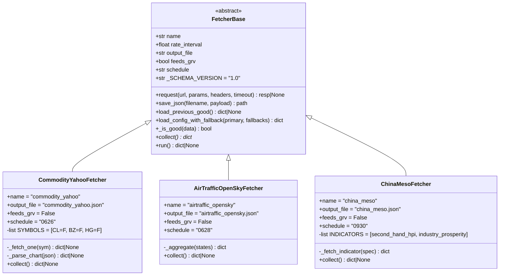
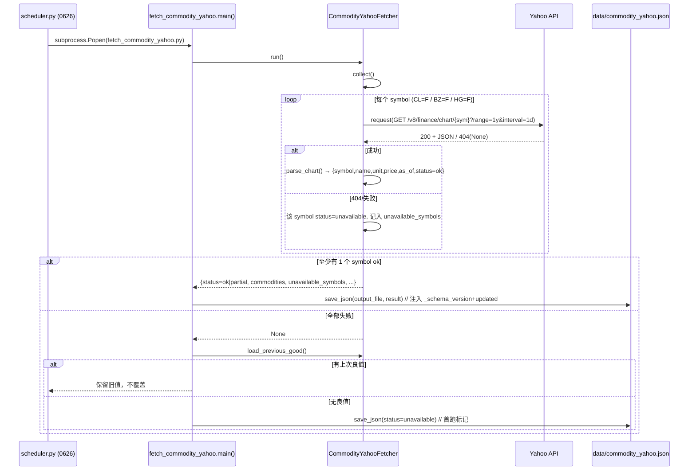
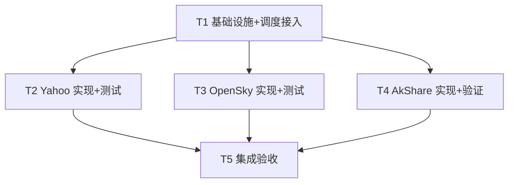

# 架构设计 + 任务分解：接入 Yahoo 商品 / OpenSky 航空 / AkShare 中国中观

| 项 | 内容 |
|----|------|
| 文档类型 | 架构设计 + 任务分解（一次性产出） |
| 日期 | 2026-07-28 |
| 作者角色 | 架构师「高见远」（software-architect） |
| 基线 | macro-scan VERSION 3.5.65+，`fetcher_base` 适配层已收口 |
| 关联 PRD | `docs/PRD_datasrc_expand_2026-07-28.md` |
| 目标版本 | 3.6.x |

> 本文档仅描述设计，不产出任何 `.py` 实现代码。所有开源结论均来自主理人探针实测（Yahoo/OpenSky 沙箱 HTTP 200）与既有代码事实（`fetcher_base.py` / `fetch_bdi.py` / `fetch_fao.py` / `scheduler.py`）。

---

## 1. 实现方案 + 框架选型

### 1.1 核心难点与决策

| 难点 | 选型 / 决策 | 依据 |
|------|------------|------|
| 三源协议异构（REST / 实时快照 / 第三方库） | **统一继承 `FetcherBase`**，三源各自独立 `collect()` | 适配层已提供 `request / save_json / load_previous_good / load_config_with_fallback`，验收标准 §4 要求样板复用，不重复 `ImportError` 回退块 |
| 网络异常/缺数据不阻断调度 | `collect()` 失败返回 `None` → `run()` 返回 `None` → 主流程 `load_previous_good()` 保留上次良值，无良值则 `save_json` 写 `status=unavailable`（首跑标记） | `fetch_bdi.py` / `fetch_fao.py` 的 `main()` 已定型此降级模式 |
| 单 symbol / 单子源失败隔离 | Yahoo 每个 symbol 独立请求，单 symbol 404 → 该 symbol `status=unavailable`，整体 `partial`；AkShare 每个 indicator 独立 try，列名变更 → 该 indicator `status=error_col_change` | PRD P1 异常处理 |
| 铝 `AH=F` 404 | Yahoo 端优雅标 `unavailable` 入 `unavailable_symbols`，**不阻断**其余（WTI/Brent/Copper 正常） | 主理人已拍板 Q4 |
| OpenSky 是否 bbox | **不限定 bbox，拉全球**（主理人拍板 Q2）；匿名 400/天限额，日频 1 次远够 | PRD §6 Q2 |
| 是否喂 GRV | 三源 `feeds_grv=False`（主理人拍板 Q3） | PRD §6 Q3，`geo_risk_vector.py` 当前不读该属性 |
| 原油期限结构 | **P2，本次不做**（主理人拍板 Q5） | PRD §3 P2 |
| AkShare 函数名 | **架构稿标注「待工程阶段容器内验证回填」，禁止臆造** | PRD §6 Q1 |

### 1.2 框架 / 库选型

- **HTTP 客户端**：复用 `fetcher_base` 内置的 `requests`（已 `pip` 固定 `requests==2.33.1`）。**不引入** `curl_cffi` 等新依赖。
  - Yahoo：直接打 `query1.finance.yahoo.com/v8/finance/chart/{sym}`，走 `FetcherBase.request()`（已含固定间隔限速 + 4xx 不重试 + 429/5xx 退避）。
  - OpenSky：直接打 `/api/states/all`，走 `FetcherBase.request()`。
  - *注：`requirements.txt` 已含 `yfinance==1.3.0`，但本设计**不使用** yfinance（避免额外依赖与 TLS 指纹坑，直接用已实测的公开 REST v8 端点，与探针结论一致）。*
- **中国中观**：复用容器内已装的 `akshare==1.18.63`（`fetch_china_data.py` 已在用）。函数名经工程验证后回填。
- **测试**：复用既有 `tests/` 目录风格（`unittest.mock.patch` 伪造 `requests`、`FakeResp` 类、`check()` 断言 + `sys.exit` 退出码），**不引入 pytest 框架**（与 `test_fetch_bdi.py` / `test_fetch_fao.py` 保持一致，零新依赖）。
- **架构模式**：单一职责 + 模板方法。`FetcherBase` 是抽象基类（提供 request/save_json/降级），三个 fetcher 仅实现 `collect()` 与各自解析逻辑，互不耦合。

---

## 2. 文件列表及相对路径（新增 / 修改）

| 路径（相对 `macro-scan/`） | 类型 | 说明 |
|---------------------------|------|------|
| `核心代码/fetch_commodity_yahoo.py` | **新增** | `CommodityYahooFetcher(FetcherBase)` → 输出 `data/commodity_yahoo.json` |
| `核心代码/fetch_airtraffic_opensky.py` | **新增** | `AirTrafficOpenSkyFetcher(FetcherBase)` → 输出 `data/airtraffic_opensky.json` |
| `核心代码/fetch_china_meso.py` | **新增** | `ChinaMesoFetcher(FetcherBase)` → 输出 `data/china_meso.json` |
| `核心代码/scheduler.py` | **修改** | 在 `JOBS`（`fao` 行后）追加 3 条调度；`LOG_FILES` 追加 3 个日志键 |
| `tests/test_fetch_commodity_yahoo.py` | **新增** | Yahoo 离线测试（mock `requests.get`，fixture 驱动） |
| `tests/test_fetch_airtraffic_opensky.py` | **新增** | OpenSky 离线测试（mock `requests.get`，fixture 驱动） |
| `tests/test_fetch_china_meso.py` | **新增** | AkShare 离线测试（mock `akshare` 模块，TBD 函数名占位） |
| `tests/fixtures/yahoo_chart_sample.json` | **新增** | Yahoo `chart.result[0]` 真实结构样例（WTI/Brent/Copper + 铝 404 模拟） |
| `tests/fixtures/opensky_states_sample.json` | **新增** | OpenSky `states` 数组样例（含 on_ground 混合、17 字段） |
| `tests/fixtures/china_meso_sample.json` | **新增** | AkShare DataFrame.to_dict 样例（列名映射验证） |
| `docs/akshare_func_verify.md` | **新增** | AkShare 函数名容器内验证清单（候选 → 验证命令 → 回填 `ak_func`），见 §8 |
| `docs/架构设计_datasrc_expand_2026-07-28.md` | 本文档 | — |

> 说明：调度最终由 `scheduler.py` 内的 `JOBS` 列表驱动（Python cron 替代），**无需**改动 `crontab` 文本；`crontab` 仅负责拉起 `scheduler.py` 常驻进程，本次不变。

---

## 3. 数据结构与接口（输出 JSON 契约 + 类图）

### 3.1 统一契约（三源共同顶层字段）

由 `FetcherBase.save_json` 自动注入：`_schema_version`（`"1.0"`）、`updated`（落盘 ISO 时间戳）；`status` 由 `collect()` 设置，缺失兜底 `unavailable`。三源顶层必须含：`status` / `source` / `as_of` / 数据主体 + 子源级 `status`。

`Status` 取值（来自 `fetcher_base.Status`）：`ok` / `partial` / `unavailable` / `error_col_change`（本设计新增语义，用于 AkShare 列名变更）。

### 3.2 Yahoo → `data/commodity_yahoo.json`

| 字段 | 类型 | 说明 | 示例 |
|------|------|------|------|
| `status` | str | `ok` / `partial`（部分 symbol 失败） / `unavailable` | `partial` |
| `source` | str | 端点标识 | `Yahoo Finance v8 chart API (query1.finance.yahoo.com/v8/finance/chart)` |
| `as_of` | str | 报价时间（取成功 symbol 的 `meta.regularMarketTime` 转 ISO，UTC+Z） | `2026-07-28T14:30:00Z` |
| `commodities` | obj | 以逻辑名 `wti`/`brent`/`copper` 为键 | — |
| `commodities.*.symbol` | str | Yahoo 符号 | `CL=F` |
| `commodities.*.name` | str | 中文名 | `WTI原油` |
| `commodities.*.unit` | str | 计价单位 | `USD/bbl`、`USD/lb`（铜） |
| `commodities.*.price` | float | 实时价 `meta.regularMarketPrice` | `79.47` |
| `commodities.*.as_of` | str | 该 symbol 报价时间（ISO） | `2026-07-28T14:30:00Z` |
| `commodities.*.status` | str | 子状态 `ok`/`unavailable` | `ok` |
| `unavailable_symbols` | list[str] | 拉取失败/404 的符号（如铝） | `["AH=F"]` |
| `notes` | str | 备注（如铝走 LME 代理计划） | — |

### 3.3 OpenSky → `data/airtraffic_opensky.json`

| 字段 | 类型 | 说明 | 示例 |
|------|------|------|------|
| `status` | str | `ok` / `partial` / `unavailable` | `ok` |
| `source` | str | `OpenSky Network /api/states/all` | — |
| `as_of` | str | 查询时间（`response.time` 转 ISO，UTC+Z） | `2026-07-28T14:00:00Z` |
| `scope` | str | 固定 `global`（主理人拍板，不限定 bbox） | `global` |
| `flights_in_air` | int | `on_ground == false` 的 state 计数 | `180` |
| `avg_altitude_m` | float\|null | 在飞航班平均气压高度（排除 None/地面） | `10500.0` |
| `avg_velocity_ms` | float\|null | 在飞航班平均速度（排除 None） | `220.5` |
| `top_origin_countries` | list | `[{country, count, pct}]` Top5（按 origin_country 计数，pct=占比%） | `[{"country":"United States","count":40,"pct":17.5}]` |
| `total_states` | int | 原始返回 state 条数 | `226` |
| `sample_limited` | bool | 是否触及匿名限额/采样（v1 默认 `False`，预留 429 检测位） | `false` |

### 3.4 AkShare 中国中观 → `data/china_meso.json`

| 字段 | 类型 | 说明 | 示例 |
|------|------|------|------|
| `status` | str | `ok` / `partial` / `unavailable` | `ok` |
| `source` | str | `AkShare (akshare==1.18.63, <实际函数>)` | — |
| `as_of` | str | 拉取时间（ISO，UTC+Z） | `2026-07-28T15:00:00Z` |
| `indicators` | obj | 以指标 id 为键 | — |
| `indicators.*.name` | str | 中文名 | `二手房价格指数` |
| `indicators.*.ak_func` | str | 实际调用的 AkShare 函数名（**工程验证后回填**） | `TBD` |
| `indicators.*.value` | float\|null | 最新值 | `—` |
| `indicators.*.date` | str | 数据日期（`YYYY-MM`） | `2026-06` |
| `indicators.*.unit` | str | 单位 | `指数` / `%` |
| `indicators.*.status` | str | 子状态 `ok` / `unavailable` / `error_col_change` | `ok` |

**初始候选指标（字段定义固定，函数名 TBD）**：`second_hand_hpi`（二手房价格指数）、`industry_prosperity`（行业景气度）。候选 AkShare 函数见 §8，严禁臆造实值。

### 3.5 类图（Mermaid）



---

## 4. 程序调用流程（时序图）

### 4.1 通用流程（以 Yahoo 为例，OpenSky / AkShare 同构）



### 4.2 OpenSky 聚合流程要点

`collect()` → `request(GET /api/states/all)` → 取 `response.json()["states"]`（17 字段数组）→ `_aggregate()`：
1. 过滤 `on_ground == false` 得在飞集合；
2. `flights_in_air = len(在飞)`，`total_states = len(states)`；
3. `avg_altitude_m` = 在飞中 `baro_altitude` 非 None 的均值；`avg_velocity_ms` 同理；
4. `top_origin_countries` = 按 `origin_country` 计数 Top5，算 `pct`；
5. 组装 dict，`as_of` 来自 `response.json()["time"]`。

### 4.3 AkShare 中观流程要点

`collect()` 遍历 `INDICATORS` 注册表，每项：
1. `ak_func = spec["ak_func"]`（TBD，工程回填）；
2. `df = getattr(ak, ak_func)()` → 取末行最新值 + 日期列；
3. 成功 → `value`/`date`/`status=ok`；异常或列名缺失 → `status=error_col_change`，`value=null`；
4. 整体 `status` = 全 ok 则 `ok`，否则 `partial`。

### 4.4 调度接入（scheduler.py 追加位置）

在 `JOBS` 列表 `("fao", "0925", "1-7", 1, ...)` 行**之后**、`earthquake` 日内补刷行之前，追加：

```python
("commodity_yahoo",   "0626", "1-7", None, [PYTHON, "fetch_commodity_yahoo.py"]),   # P0 Yahoo 商品（日频，错峰 bdi 0625）
("airtraffic_opensky","0628", "1-7", None, [PYTHON, "fetch_airtraffic_opensky.py"]), # P0 OpenSky 航空（日频）
("china_meso",        "0930", "1-7", 1,    [PYTHON, "fetch_china_meso.py"]),          # P0 AkShare 中观（每月1日，错峰 fao 0925）
```

`LOG_FILES` 追加：

```python
"commodity_yahoo":   f"{LOG_DIR}/commodity_yahoo.log",
"airtraffic_opensky":f"{LOG_DIR}/airtraffic_opensky.log",
"china_meso":        f"{LOG_DIR}/china_meso.log",
```

---

## 5. 任务列表（有序、含依赖，按实现顺序）

> 遵循「≤5 任务、每任务 ≥3 文件、T1 为基础设施」约束。任务间除 T1 外基本独立，便于并行。

| 任务 ID | 任务名 | 源文件 | 依赖 | 优先级 |
|---------|--------|--------|------|--------|
| **T1** | 基础设施与调度接入（三 fetcher 骨架 + scheduler 追加 3 调度 + 共享契约常量） | `核心代码/fetch_commodity_yahoo.py`(骨架) / `核心代码/fetch_airtraffic_opensky.py`(骨架) / `核心代码/fetch_china_meso.py`(骨架) / `核心代码/scheduler.py`(改) | 无 | P0 |
| **T2** | Yahoo 商品 fetcher 完整实现 + 测试 + fixture | `核心代码/fetch_commodity_yahoo.py`(实现) / `tests/test_fetch_commodity_yahoo.py` / `tests/fixtures/yahoo_chart_sample.json` | T1 | P0 |
| **T3** | OpenSky 航空 fetcher 完整实现 + 测试 + fixture | `核心代码/fetch_airtraffic_opensky.py`(实现) / `tests/test_fetch_airtraffic_opensky.py` / `tests/fixtures/opensky_states_sample.json` | T1 | P0 |
| **T4** | AkShare 中国中观 fetcher 实现 + 验证脚本 + 测试 | `核心代码/fetch_china_meso.py`(实现, TBD 占位) / `docs/akshare_func_verify.md` / `tests/test_fetch_china_meso.py` | T1 | P0 |
| **T5** | 集成验收与契约一致性检查（落盘合规 / 降级 / 错峰） | `tests/test_integration_datasrc.py` / `核心代码/verify_datasrc_contract.py`(契约校验小工具) / `docs/验收_datasrc_expand.md` | T2,T3,T4 | P1 |

**T1 交付标准**：三个 fetcher 文件含完整类定义、`collect()` 骨架（含 Status 用法、`load_config_with_fallback` 取 `DATA_DIR`）、`main()` 降级样板（与 `fetch_bdi.main()` 一致）；`scheduler.py` 已追加 3 条 `JOBS` + 3 个 `LOG_FILES`，时刻严格错峰（0626/0628/0930 dom=1）。

**任务依赖图（Mermaid）**



---

## 6. 依赖包列表（是否需要新增）

| 包 | 版本 | 用途 | 容器内现状 | 是否新增 |
|----|------|------|-----------|----------|
| `requests` | `==2.33.1` | Yahoo / OpenSky HTTP（经 `FetcherBase.request`） | 已装 | **否** |
| `akshare` | `==1.18.63` | 中国中观（`fetch_china_data.py` 已用） | 已装 | **否** |
| `yfinance` | `==1.3.0` | （存在但**不使用**，避免 TLS 指纹坑，直接用公开 REST） | 已装 | **否（不引用）** |
| `pytest` | — | 测试框架（**不引入**，复用既有 `unittest.mock` + `sys.exit` 风格） | 无需 | **否** |
| `curl_cffi` | — | （不引入） | — | **否** |

**结论：本次无需新增任何第三方依赖**，全部复用既有 `fetcher_base` 适配层与已装包。

---

## 7. 共享知识（跨文件约定）

1. **`Status` 用法**：统一引用 `from fetcher_base import Status`。顶层 `status` ∈ `{ok, partial, unavailable}`；AkShare 子源列名变更用 `error_col_change`（新增语义，仅子源级）。铝 404 → symbol 级 `unavailable` 入 `unavailable_symbols`。
2. **`as_of` 时间格式**：统一 **ISO 8601 UTC + `Z`**（`datetime.datetime.fromtimestamp(ts, tz=timezone.utc).strftime("%Y-%m-%dT%H:%M:%SZ")`）。`as_of` 是**数据本身时间**（源返回时间戳），区别于 `save_json` 自动注入的 `updated`（落盘时间）。
3. **数值单位标注**：Yahoo `WTI/Brent` 单位 `USD/bbl`、`Copper` 单位 `USD/lb`（铜为**美元/磅**，非吨，下游消费务必注意）；OpenSky 高度 `m`、速度 `m/s`。任何带单位的字段都必须在 `unit` 中明确写出。
4. **降级样板**：三个 `main()` 完全一致——
   ```python
   result = fetcher.run()
   if not result:
       # 保留上次良值，不覆盖；无则写 unavailable 标记（首跑）
   elif result.get("status") == Status.OK:
       fetcher.save_json(OUTPUT_FILE, result)
   else:
       prev = fetcher.load_previous_good()
       if prev is not None:   # 保留不覆盖
       else:                  # save_json 写 unavailable 标记
   ```
5. **配置回退**：统一 `FetcherBase.load_config_with_fallback(["DATA_DIR", "PROXY_URL"], {...})` 取 `DATA_DIR`（默认 `default_data_dir()`）与 `PROXY_URL`（默认 `http://192.168.31.108:7890`，env 可覆盖）。Yahoo/OpenSky 建议「直连优先、失败回退代理」（`fetch_fao._get` 模式），因容器内出网可能受限。
6. **调度契约**：`schedule` 类属性仅元数据；真实调度在 `scheduler.py`。三源错峰：Yahoo `0626`、OpenSky `0628`（日频）、china_meso `0930` + `dom=1`（月频）。
7. **文件落盘**：`data/{output_file}` 由 `save_json` 原子写（`.tmp` + `os.replace`），无需各 fetcher 自行处理。
8. **测试约定**：置于 `tests/`，伪造 `requests.get`（Yahoo/OpenSky）或 `akshare`（ChinaMeso）模块级 `patch`；断言用 `check()` + `sys.exit(1 if _fails else 0)`，与 `test_fetch_bdi.py` 一致；fixture 置于 `tests/fixtures/`。

---

## 8. 待明确事项（需工程回填 + 验证方式）

### Q1（主理人已转交本设计标注）AkShare 函数名 → 工程阶段容器内验证回填
- **问题**：`second_hand_hpi` / `industry_prosperity` 的准确 `akshare` 函数名与列名（akshare 列名随版本变，已踩 `cn_lpr` 坑）。
- **本设计处理**：`fetch_china_meso.py` 中 `INDICATORS` 注册表 `ak_func` 字段先置 `"TBD"`；`docs/akshare_func_verify.md` 给出候选清单与验证命令。
- **候选（仅作验证起点，禁止当作实值）**：
  - `second_hand_hpi` 候选：`ak.macro_china_second_hand_house_price_index()`、`ak.macro_china_real_estate_monthly()`、`ak.property_hk_spot()`（香港，不匹配）→ 需在 NAS 容器内 `python -c "import akshare as ak; print(ak.<func>().__doc__); print(ak.<func>().columns)"` 实测列名。
  - `industry_prosperity` 候选：`ak.macro_china_industrial_profit()`、`ak.macro_china_pmi_yearly()`、`ak.index_realtime()` → 同上实测。
- **验证方式**：在 NAS 容器内（akshare 可达）逐条执行，确认（a）函数存在、（b）返回 DataFrame、（c）末行日期/数值列名；将确认结果回填 `ak_func` 与 `unit`，并将「列名映射」写死进解析逻辑（防版本漂移）。
- **失败兜底**：验证失败的函数 → 该 indicator `status=error_col_change`，`value=null`，不阻断整体。

### Q2 / Q3 / Q4 / Q5 / Q7 — 主理人已拍板，本设计已落实
- Q2 OpenSky 拉全球（scope=`global`）；Q3 三源 `feeds_grv=False`；Q4 铝 404 优雅 unavailable；Q5 期限结构 P2 不做；Q7 调度时刻 0626/0628/0930(dom=1) 已定。

### 其他需工程确认的小项
- **Yahoo `regularMarketTime` 时区**：Yahoo `meta.regularMarketTime` 为 Unix 秒（UTC），转 ISO 时统一加 `Z`；若实测返回非 UTC 需校正（沙箱实测价已对齐，时间字段待落盘时复核）。
- **OpenSky `sample_limited` 检测**：v1 默认 `False`；若后续需在 429 时置 `True`，需在 `FetcherBase.request` 暴露 HTTP 状态或 fetcher 内捕获（本期不实现，预留字段）。
- **AkShare 月频高频化**：PRD 提部分指标可改周频（周一）；本期统一月频（dom=1, 0930），如工程验证后需周频，单独追加调度行（不影响本设计契约）。

---

### 附录：Yahoo 解析路径（探针实测确认）
```
chart.result[0].meta.regularMarketPrice   → 实时价
chart.result[0].meta.shortName            → 名称
chart.result[0].meta.regularMarketTime    → Unix 秒（报价时间）
chart.result[0].timestamp                  → Unix 秒数组（日频序列时间轴）
chart.result[0].indicators.quote[0].close → 日频收盘价数组（含 null）
```
符号表：`CL=F`(WTI 原油) / `BZ=F`(Brent 原油) / `HG=F`(铜，USD/lb)；`AH=F`(铝) 实测 **404** → `unavailable`。

### 附录：OpenSky state 17 字段顺序
`[icao24, callsign, origin_country, time_position, last_contact, longitude, latitude, baro_altitude, on_ground, velocity, true_track, vertical_rate, sensors, geo_altitude, squawk, spi, position_source]`
在飞判定：`on_ground == false`（索引 8）；起飞机场国：`origin_country`（索引 2）；气压高度：`baro_altitude`（索引 7）；速度：`velocity`（索引 9）。
