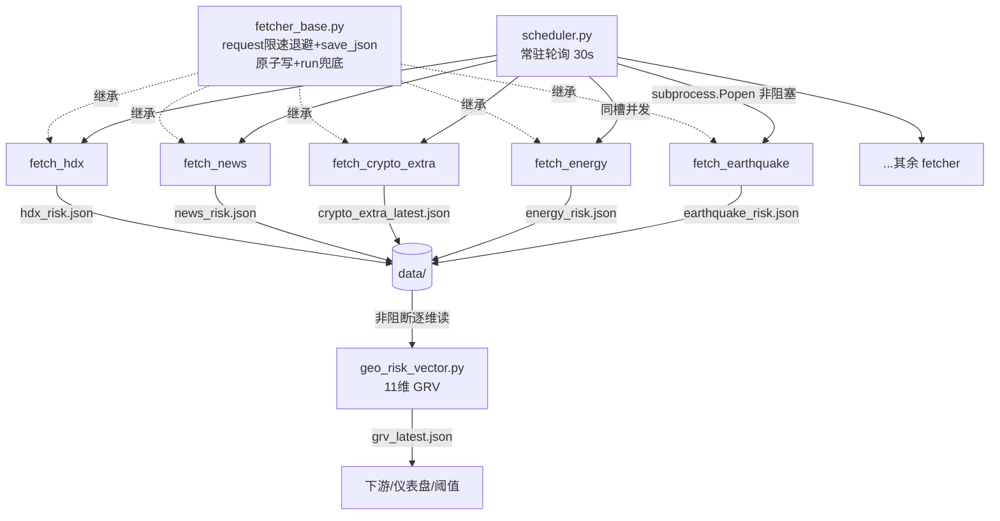
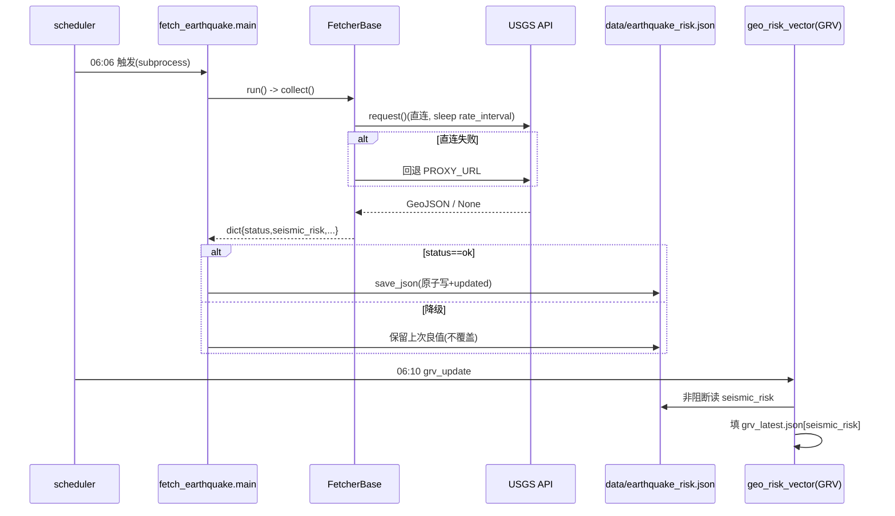
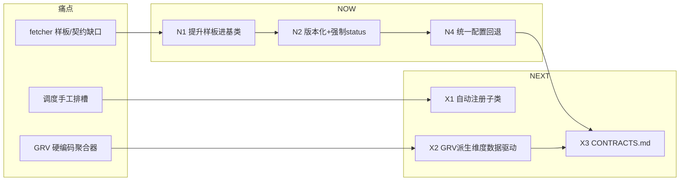

# 架构评估报告：fetcher_base 适配层演进评估

> **评估对象**：world-sim 天枢（macro-scan）观测层 `fetcher_base` 统一适配层
> **评估范围**：P0+P1 数据源接入后的适配层容量、契约治理、跨源关联、调度演进、过度设计红线、分阶段路线图
> **评估方式**：**纯只读代码核实**（已读 `fetcher_base.py` / `geo_risk_vector.py` / `scheduler.py` / `optim_config.py` 及 9 个 fetcher 实现），**未修改任何代码**
> **日期**：2026-07-28
> **结论先行（TL;DR）**：适配层设计**健壮且方向正确**，扩展到 50 源无技术硬瓶颈；真正瓶颈在 **GRV 中央硬编码聚合器** 与 **fetcher 样板/契约治理缺口**，而非 fetcher 数量本身。下一步应"收口基线 + 去样板 + 版本化契约"，而非引入任何框架。

---

## 总评

`fetcher_base` 的"统一 `request()` 限流退避 + `save_json()` 原子写 + `collect()` 异常兜底 + 进程级隔离"设计是**务实且正确的**，已自然成为 9 个 fetcher 的事实标准。它的最大价值是**错误隔离**（任一源崩溃绝不拖垮 scheduler 与 GRV）和**优雅降级**（保留上次良值）。

但当前存在三类"成长痛点"，都不在 fetcher 数量上，而在**治理与样板**：
1. **基类不强制契约**——输出无 `_schema_version`、旧 fetcher 无 `status`，消费端硬编码接受哪些状态。
2. **样板重复**——`main()` / `_load_previous_good()` / `try:except ImportError` 配置回退在 9 个文件中复制粘贴，存在漂移风险。
3. **GRV 中央聚合器逐维硬编码**——每新增一个喂 GRV 的维度都要改 `geo_risk_vector.py` 加一段 try/except，这是比 fetcher 层更痛的扩展瓶颈。

**一句话路线**：now 收口基线（提升样板进基类 + 版本化契约 + 统一 status 枚举），next 让调度自动注册 + GRV 派生维度数据驱动，later 才考虑分组目录。**全程不引入 ETL 框架 / 消息队列 / DAG 编排。**

---

## 0. 核实事实（代码依据）

| 项目 | 代码核实结论 |
|------|------|
| `FetcherBase` 类成员 | `name` / `rate_interval=1.0` / `max_retries=3` / `base_backoff=2.0`；`__init__(data_dir)` 建 logger（按 name 写 `/var/log/macro-scan/<name>.log`） |
| `request()` 行为 | **每次调用前 `time.sleep(rate_interval)`**（固定间隔，非真令牌桶）；429/5xx 指数退避重试（基数 2s，第 n 次等 `2^n`）；4xx 直接返回 `None` 不重试；异常重试；最终失败返回 `None`（**绝不抛**） |
| `save_json()` 行为 | `.tmp` + `os.replace` 原子写；**自动注入 `updated` 时间戳**；不注入 `_schema_version` |
| `run()` 行为 | `try: collect()`，异常返回 `None` |
| 限流粒度 | **每进程**（每个 fetcher 跑成独立 subprocess），**无跨进程/跨 host 全局限速** |
| 采用 base 的 fetcher（共 9 个） | `fetch_crypto` `fetch_crypto_extra` `fetch_earthquake` `fetch_energy` `fetch_fx` `fetch_hdx` `fetch_news` `fetch_sanctions` `fetch_world_macro` |
| **两种子模式并存** | **Pattern A（简化）**：`fetch_crypto` / `fetch_fx` 等——`collect()` 失败返回 `None`、`main()` 仅"有值才存"、**输出无 `status` 字段、无保留良值**；**Pattern B（加固）**：earthquake/energy/news/hdx/crypto_extra/sanctions——输出带 `status` 字典、`main()` 实现保留上次良值、部分喂 GRV |
| 契约版本化现状 | **9 个 fetcher 输出均无 `_schema_version`**；仅 `geo_risk_vector.py`（GRV，值为 `"1.0"`）与 `news_exporter.py` 有 |
| GRV 消费方式 | `geo_risk_vector.py` 逐维独立 `try/except` 读各 landed JSON（seismic/energy/sanctions 等），`status!=ok` 留 `None`，**非阻断**；当前 11 维 |
| scheduler 机制 | 扁平 `JOBS` 列表 `(name, hhmm, wd, dom, cmd)` + `LOG_FILES` 字典；常驻进程每 30s 轮询，**命中 hhmm 的所有 JOBS 同一 tick 各自 `subprocess.Popen` 非阻塞启动**（故同槽可并发多源） |
| 配置 | `optim_config.py` 集中 URL/key（env 可覆盖）；但**每个 fetcher 都重复一份 `try:except ImportError` 回退常量块**（约 15 行 × 9 文件，可能与主配置漂移） |
| 降级链路 | 直连 → `PROXY_URL`（192.168.31.108:7890）回退 → 仍失败则 `unavailable`/保留良值；401 类源（MarketAux/Currents）**先判 key 缺失再决定是否请求**，避免 401 噪声 |

---

## 1. 当前适配层容量（20 / 50 / 100 源）

> 关键澄清：**"源"≠"fetcher 文件"**。现状已践行"归并子源"——`fetch_energy` 包 4 子源、`fetch_news` 包 3、`fetch_crypto_extra` 包 2。故 100 个数据源大概率对应 ~25–40 个 fetcher 文件，而非 100 个文件。**扩展应靠"归并"，而非"平铺"**。

| 维度 | 20 源 | 50 源 | 100 源 |
|------|-------|-------|--------|
| **错误隔离** | ✅ 进程级 + sub-source try/except，强 | ✅ 不变 | ✅ 不变 |
| **限流** | ✅ 每进程 naive sleep 足够 | ⚠️ 多源同 host（如多交易所/多新闻 API）各自 self-limit 但无跨进程协调，需按 host 调 `rate_interval` | ⚠️ 同上；建议补轻量 per-host 限速 |
| **配置爆炸** | ✅ `optim_config` env 可覆盖，可控 | ⚠️ 每源加常量 + 每 fetcher 重复 ImportError 回退块（漂移风险） | ⚠️ 回退块复制 9+ 次，维护负担显著 |
| **调度耦合** | ✅ 手工时间槽轻松 | ✅ scheduler 同槽可并发，槽稀缺**非瓶颈**；但手动排 GRV feeder 时序易错 | ⚠️ `JOBS`/`LOG_FILES` 膨胀到 ~200 条，手工维护成负担 |
| **GRV 聚合器** | ✅ 11 维可接受 | ⚠️ 每新维度改 GRV 加硬编码块 | 🔴 **最痛**：中央硬编码聚合器成为真正瓶颈 |
| **样板重复** | ⚠️ 6 处 `main`/preserve 复制 | ⚠️ 随 fetcher 数线性增长 | ⚠️ 严重 |
| **契约治理** | ⚠️ 无版本、两子模式并存 | 🔴 无版本 + 消费端硬编码 status → 改名/新状态静默失效 | 🔴 放大 |

**瓶颈排序（由痛到轻）**：
1. 🔴 **GRV 中央硬编码聚合器**（每新维度改 GRV + 加 dict 字段 + 加 as-of 读）—— 这是扩展的真正天花板，比 fetcher 层严重得多。
2. 🟠 **fetcher 样板重复**（`main` / `_load_previous_good` / `ImportError` 回退）—— 维护债。
3. 🟠 **契约未版本化 + 基类不强制 `status` + 两子模式不一致**（旧 `fetch_crypto`/`fetch_fx` 甚至无 `status`）—— 治理缺口。
4. 🟡 **调度手工排槽**（次要，同槽并发已缓解槽稀缺）。
5. 🟡 **限流非全局**（轻微，按 host 调 `rate_interval` 即可）。

**具体风险点清单**：
- **R1（契约漂移）**：`fetch_crypto`/`fetch_fx` 输出无 `status`，GRV 无法非阻断消费；若未来想接 GRV 需 retrofit。
- **R2（静默失效）**：GRV 用 `.get(字段, None)` 读 fetcher 输出，**字段改名/删除 → 静默得 `None`**，无报错、无告警。
- **R3（样板漂移）**：9 个 fetcher 各抄一份 `ImportError` 回退常量；若 `optim_config` 默认值改，回退副本可能不同步 → 行为分歧。
- **R4（限流误标）**：docstring 写"令牌桶"，实为固定 `time.sleep`；易误导后续维护者以为有全局配额保护。
- **R5（时序脆弱）**：GRV feeder（earthquake 06:06 / energy 06:08）靠"手动排在 grv_update 06:10 前"保证当日落盘，属隐式时序耦合，fetcher 数增多后易漏排。
- **R6（日志混写）**：earthquake 占 4 个时间槽但同名 → 全写 `earthquake.log`，跨槽日志交错难排障（次要）。

---

## 2. 契约 schema 版本化

**现状**：fetcher 输出仅有 `status` + `updated`（save_json 注入）+ 源特有字段；**无 `_schema_version`**；GRV 输出有 `"1.0"` 但 fetcher 侧没有。

**兼容特性分析**：
- **加字段**：向后兼容 ✅（GRV `.get` 默认值）。
- **删/改字段名**：🔴 GRV 静默得 `None`（R2）。
- **新增 `status` 取值**：🔴 消费端硬编码接受哪些状态，新值被当作"非 ok"忽略，无提示。
- **GRV 新旧互读**：因字段用 `.get` 容错，基本安全。

**治理建议（轻量，不造轮子）**：
| 手段 | 推荐度 | 说明 |
|------|--------|------|
| 基类 `save_json` 自动注入 `_schema_version`（从类属性 `schema_version="1.0"` 读） | ✅ 强推 | 一行改动，所有输出立刻有版本 |
| 基类集中定义 `STATUS` 枚举（OK/PARTIAL/KEY_MISSING/SKIPPED/UNAVAILABLE） | ✅ 强推 | 消除各 fetcher 字面量漂移 |
| 基类强制 `status` 字段（缺失则告警/默认 unavailable） | ✅ 推 | 收口 Pattern A/B 分歧 |
| 一份 `CONTRACTS.md` 人工登记各 fetcher 字段 + 版本 + GRV 消费方 | ✅ 推 | 个人 NAS 够用，零运行时成本 |
| 中心 schema registry + 运行时 JSON Schema 校验 | ❌ 反对 | 过度设计，违反轻量本质 |
| 自动代码生成 schema | ❌ 反对 | 收益不抵复杂度 |

**推荐方案**：**"每 fetcher 自描述版本 + 基类强制 `status`/`updated`/`_schema_version` + 一份 `CONTRACTS.md` 登记"**，不走中心 registry。演进规则写在 `CONTRACTS.md`：主版本号变更=不兼容（需消费端同步改），次版本=加字段（向后兼容）。

---

## 3. 跨源关联层（cross-source correlation）

**现状**：扁平——每 fetcher 独立落盘，GRV 各自非阻断读。无任何跨源编排。

**三选项对比**：

| 方案 | 说明 | 评价 |
|------|------|------|
| A. 保持扁平 | 各自落盘 + 消费者各自读 | ✅ 隔离强、零编排、最贴合 NAS 轻量本质 |
| B. GRV 内"派生维度" | 在 GRV 里**只读组合**已有 landed 文件（如 `financial_stress = f(crypto_vol, fx)`、`compound_shock = f(seismic, energy)`） | ✅✅ **推荐**：不新增管道/进程，复用非阻断读 |
| C. 独立 correlation 引擎 | 新一层拉多源算关联 | ❌ 过度设计，引入依赖/时序/失败传播 |

**推荐：保持扁平落盘，但把"跨源关联"收敛为 GRV 的只读派生维度（方案 B）**。理由：
- 复合冲击（earthquake × energy → 电网+地震叠加外生冲击）本质是**对已有非阻断读值的组合运算**，不需要新管道。
- `fetch_crypto_extra` 已落盘但**未接 GRV**（在"待接字段"清单）——正确做法是在 GRV 内新增一个派生维度去读它，而非建独立层。
- 方案 B 的代价仅是 GRV 内加一段组合代码；且应**数据驱动**（维度名→reader 函数表），避免再走硬编码。

**落地原则**：派生维度一律**只读 landed 文件 + 非阻断**；任何"需要先算 A 再算 B"的硬依赖都不在本层做（保持扁平）。

---

## 4. 调度演进

**现状**：扁平 `JOBS` + 时间槽；常驻进程轮询；同 hhmm 多源同 tick 并发（subprocess 隔离）。

**评估**：
- ~30 源内：手工排槽**完全够用**，无需改动。
- 50+ 源：`JOBS` 膨胀到 ~150 条，手工增删易错（尤其 GRV feeder 时序 R5）。
- 失败重试：当前落到 `unavailable` 后等次日同槽——对**日频**足够；无需复杂重试编排。

**建议**：
| 演进 | 说明 | 是否破契约 |
|------|------|-----------|
| 保留扁平配置结构 | 不换外部调度器（celery/airflow 一律不要） | 否 |
| fetcher **自声明** `schedule`（hhmm）+ `feeds_grv` 标志 | scheduler 启动时**自动发现并注册** `FetcherBase` 子类，减少手改 `JOBS` | 否 |
| GRV feeder 失败时轻量补偿 | 仅对 `feeds_grv=True` 的源，GRV 启动前若其输出缺失/过期，scheduler 触发一次重跑 | 否 |
| **不**做依赖/DAG 编排 | 时序仍靠时间槽偏移，文档化"GRV feeder 须排在其前" | 否 |

**红线**：不为单点源做复杂编排；不引入消息队列做重试；不把 scheduler 换成重量级工作流引擎。

---

## 5. 过度设计红线（明确"不要做"）

| # | 不要做 | 理由 |
|---|--------|------|
| 1 | ❌ 造通用 ETL / 数据采集框架 | 当前每源几十行已最优；框架徒增抽象与维护 |
| 2 | ❌ 引入消息队列（Kafka/RabbitMQ/Celery） | NAS 单机、日频、进程隔离已足够；MQ 是分布式复杂度 |
| 3 | ❌ 中心 schema registry + 运行时 JSON Schema 校验 | 个人系统，`.get` 容错 + `CONTRACTS.md` 文档已够 |
| 4 | ❌ DAG / 依赖编排引擎（Airflow 类） | 时序靠时间槽即可；DAG 引入失败传播与设计负担 |
| 5 | ❌ 插件自动发现（entry points / 动态 import 包）到"自动加载任意目录" | 保留显式 fetcher 文件 + 自声明 schedule 即可，不必全动态 |
| 6 | ❌ 配置 UI / Web 管理台 | env + `optim_config.py` 已覆盖；UI 是多余面 |
| 7 | ❌ 把 sub-source 拆成独立 fetcher 文件 | 反向扩展（energy 4合1 是对的）；拆细反而增 JOBS/样板 |
| 8 | ❌ 为 fetcher 层补重型 CI / 单测基建之外的工程化 | NAS 内部系统，轻量优先 |
| 9 | ❌ 跨进程全局限速中间件（Redis/文件锁） | 按 host 调 `rate_interval` 足够；中间件过度 |

**坚持的轻量本质**：每源一个文件 + 相关源归并 + 进程隔离 + 非阻断读 + 保留良值 + 原子写。

---

## 6. 具体演进建议（分阶段路线图）

> 工作量：小（<0.5d）/ 中（0.5–2d）/ 大（>2d）。"破契约"指是否改动既有 fetcher 输出/消费约定。

### NOW（接完 P0+P1 立刻补，收口基线）

| # | 建议 | 理由 | 工作量 | 破契约 |
|---|------|------|--------|--------|
| N1 | **把 `main()` + `_load_previous_good()` + 保留良值逻辑提升进 `FetcherBase`**（子类只需定义 `collect()` 和"何为好"的判定） | 消除 6 处样板复制（R3 漂移根因）；新增源一行继承即可 | 小 | 否（纯基类内聚） |
| N2 | **基类 `save_json` 自动注入 `_schema_version`**（读类属性）；**基类强制 `status` 字段**（缺失告警兜底为 unavailable） | 收口 Pattern A/B 分歧（R1）；所有输出立刻带版本（§2） | 小 | 轻微（旧 `fetch_crypto`/`fetch_fx` 需补 `status`，向后兼容） |
| N3 | **基类集中 `STATUS` 枚举 + `feeds_grv` / `schedule` 类属性占位** | 统一状态字面量，为 next 阶段自动注册铺路 | 小 | 否 |
| N4 | **统一配置回退**：删除各 fetcher 的 `try:except ImportError` 重复常量块，改为"导入失败即统一回退 `optim_config` 默认值一次"或集中 `load_config()` | 消除 9×15 行漂移风险（R3） | 中 | 否 |
| N5 | **修正 docstring**："令牌桶"→"固定间隔限速（per-process）"，并补一句"非全局、非真令牌桶" | 避免误导（R4） | 极小 | 否 |

### NEXT（1–2 个月内）

| # | 建议 | 理由 | 工作量 | 破契约 |
|---|------|------|--------|--------|
| X1 | **scheduler 自动注册 `FetcherBase` 子类** + 读各 fetcher 自声明 `schedule`/`feeds_grv` | 解决 50+ 源手工排槽负担；GRV feeder 时序可由 `feeds_grv` 标志自动约束（R5） | 中 | 否 |
| X2 | **GRV 派生维度数据驱动**：维度名→reader 函数表；接 `crypto_extra`（金融压力）、`hdx`（人道冲击）为只读派生维度；复合冲击 `seismic×energy` 在 GRV 内算 composite | 解 GRV 硬编码瓶颈（🔴#1）；落实 §3 方案 B | 中 | 否（GRV 内部重构，输出字段增/改需同步 `CONTRACTS.md`） |
| X3 | **每 fetcher 输出补 `_schema_version="1.0"` 起步 + 落地 `CONTRACTS.md` 字段登记** | 契约治理闭环（§2） | 小 | 轻微（加字段，向后兼容） |
| X4 | **轻量 per-host 限速约定**：为同 host 多源（交易所/新闻 API）文档化 `rate_interval` 取值；可选补进程间协调 | 缓解 50+ 源同 host 限流（§1） | 小 | 否 |

### LATER（未来，仅在确需时）

| # | 建议 | 理由 | 工作量 | 破契约 |
|---|------|------|--------|--------|
| L1 | 若 fetcher 文件真到 80+：**按主题分子目录**（energy/geo/news/…）+ 更细 intraday 槽 | 仅组织层面，不引入外部编排 | 大 | 否 |
| L2 | 可选：把 GRV 派生维度**抽出为独立 `derived_risk.py`**（仍只读 landed 文件，非管道） | 仅当派生逻辑变复杂时；保持非阻断 | 中 | 否 |
| L3 | 可选：fetcher 输出加 `freshness_sla` 字段，GRV 据其判"过期"而非仅看 `status` | 提升新鲜度治理 | 小 | 轻微 |

**优先级结论**：本系统实际瓶颈在 **GRV 聚合器（LATER 之前先靠 X2 解）** 与 **样板/契约（NOW 全解）**，不在 fetcher 数量。NOW 三件事（N1–N4）应在下一轮迭代优先做完。

---

## 附 A：当前架构拓扑（mermaid）



## 附 B：调用流示意（以 earthquake 为例，mermaid sequence）



## 附 C：扩展瓶颈与路线图（mermaid）



---

## 摘要（≤200 字，单独返回 team-lead）

**关键发现**：fetcher_base 已支撑 9 个 fetcher，错误隔离与降级健壮；但存三痛点——GRV 中央聚合器逐维硬编码（真正扩展瓶颈）、fetcher 样板/配置回退重复、契约未版本化且旧 fetcher 无 status。调度同槽可并发，槽稀缺非瓶颈。

**主要建议**：NOW 收口基线（样板进基类 + `_schema_version` + 统一 STATUS 枚举 + 去 ImportError 回退）；NEXT 让调度自动注册子类、GRV 派生维度数据驱动（只读组合，不建独立层）。

**风险**：GRV 字段改名会静默失效；限流仅 per-process 非全局；切勿引入 ETL/消息队列/DAG。

---

## 附录 D：N1–N4 接口约定（2026-07-28 与工程师对齐；NOW 阶段已于 2026-07-28 实施完成）

> 本附录原为本评估交付后的设计决议记录。⚠️ **已实施更正**：NOW 阶段在 2026-07-28 由主理人（Qi）直接实现，实现时以源码逐字核实，**原 D.2 表的"4/6 接受 ok/partial、基类默认 ok/partial"判断有误**——真实情况恰相反（见下方更正表）。本附录已据实修订，原"多数 ok/partial"表述作废，以"更正后"为准。

**D.1 时机决议（已落地）**：N1–N4 原议定"部署后独立迭代落地"，实际在 2026-07-28 作为 NOW 阶段一次性收口完成（`fetcher_base.py` 重写 + 9 个 fetcher 改造 + VERSION 3.5.64→3.5.65 + CHANGELOG 记录）。验收由主理人亲写 `_now_smoke.py`（伪造 requests 不触网）跑 24 项断言全 PASS。

**D.2 `_is_good` 谓词（关键：以实际代码为准，切勿静默改行为）**

> ⚠️ **更正说明**：评估初稿声称"4/6 接受 ok/partial、仅 hdx/sanctions 是 ok-only"，但实施时逐字读 6 个 fetcher 的 `_load_previous_good` 源码，确认**真实语义相反**——仅 `energy`/`news` 接受 ok/partial，其余 4 个（earthquake/crypto_extra/hdx/sanctions）为 **ok-only**。下表为更正后的权威契约（已据以实现并通过验收）。

核实 6 个 fetcher 的 `_load_previous_good` 真实判定（逐字读源码，非记忆）：

| fetcher | 真实"良值"判定（代码核实） | 基类默认 / 覆写 |
|---------|--------------------------|----------------------|
| earthquake | `status == "ok"` | **ok-only**（基类默认，无需覆写）|
| crypto_extra | `status == "ok"` | **ok-only**（基类默认，无需覆写）|
| hdx | `status == "ok"` | **ok-only**（基类默认，无需覆写）|
| sanctions | `status == "ok"` | **ok-only**（基类默认，无需覆写）|
| energy | `status in (ok,partial) and grid_carbon_risk is not None` | **覆写**为 ok/partial + 字段非空 |
| news | `status in (ok,partial)` | **覆写**为 ok/partial |

> ✅ **正确结论**：少数（2/6）接受 ok/partial，仅 `energy`/`news` 为 ok/partial，其余 4 个（earthquake/crypto_extra/hdx/sanctions）为 **ok-only**。故基类默认 `_is_good` 应为 `status == "ok"`（ok-only），**不是** `status in (ok,partial)`。若默认写成 ok/partial，会悄悄把 earthquake/crypto_extra/hdx/sanctions 从"仅 ok 算良值"放宽为"partial 也算"，**改变现有降级行为**（恰是本评估 R2/R3 警示的"静默行为变化"，方向正相反——初稿险些引入该回归）。

基类接口（**已按此落地**）：

```python
# FetcherBase
class Status:
    OK = "ok"; PARTIAL = "partial"; UNAVAILABLE = "unavailable"
    # ... 其余枚举略

def _is_good(self, data: dict) -> bool:
    """判定历史输出是否可当良值保留。默认仅接受 ok（ok-only）；子类按需覆写。"""
    return data.get("status") == Status.OK

def load_previous_good(self) -> dict | None:
    if not self.output_file:
        return None
    path = os.path.join(self.data_dir, self.output_file)
    if not os.path.exists(path):
        return None
    try:
        with open(path, encoding="utf-8") as f:
            data = json.load(f)
        return data if self._is_good(data) else None
    except Exception:
        return None
```

子类覆写示例（已落地）：

```python
# energy：ok/partial + 主信号非空
def _is_good(self, data):
    return data.get("status") in (Status.OK, Status.PARTIAL) \
        and data.get("grid_carbon_risk") is not None

# news：ok/partial（不要求 news_risk 非空）
def _is_good(self, data):
    return data.get("status") in (Status.OK, Status.PARTIAL)

# earthquake / crypto_extra / hdx / sanctions：保持基类默认 ok-only，无需覆写
```

**D.3 N2 状态向后兼容（已落地，与草案不同）**：草案称"缺失 status 按有数据即 ok 推导"，**实际实现更保守**：基类 `save_json` 统一注入 `_schema_version`（读类属性默认 `"1.0"`），并对**仍缺失** `status` 的输出补 `Status.UNAVAILABLE` + warning（兜底，防下游读到无状态文件）。同时 `fetch_crypto`/`fetch_fx`/`fetch_world_macro` 这三个旧 Pattern A（无 status）的 `collect` 已显式补 `"status": "ok"` 返回，走统一落盘——故现网无残留无状态文件。

**D.4 N3 配置回退（已落地）**：各 fetcher 顶部 `try:except ImportError` 常量块已抽为基类 `@staticmethod load_config_with_fallback(primary, fallbacks)`，优先 `import optim_config` 全量取，ImportError 则回退 `fallbacks`（支持 `(默认值, env_var)` 元组），消除 9× 重复漂移。

**D.5 N4（已落地）**：`request()` docstring "令牌桶"改为"固定间隔限速（per-process，非真令牌桶、非全局）"。
